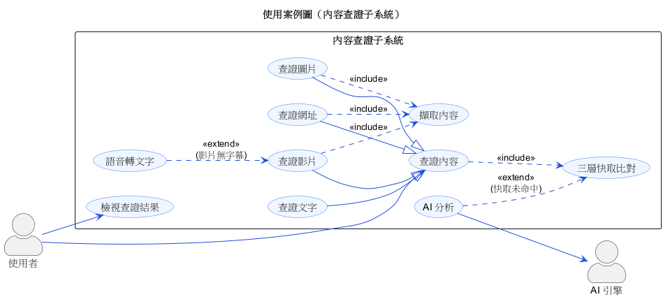
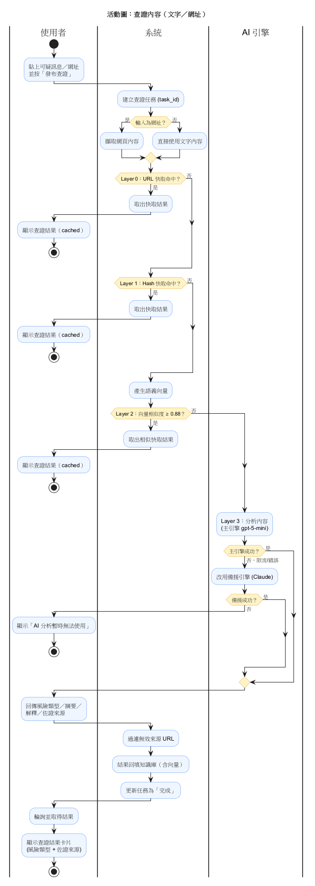
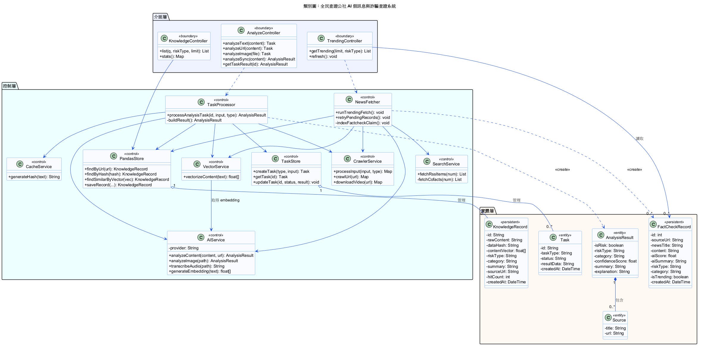

# 物件導向軟體設計 — 期末專題文件

> 專題名稱：**全民查證公社 — AI 假訊息與詐騙查證系統**
> 本資料夾收錄期末專題所需繳交的全部文件（對應課本第四～八章），並附本說明檔。

---

## 一、軟硬體專題內容簡介

「全民查證公社」是一套 **AI 假訊息與詐騙查證系統**。使用者把可疑的**文字／網址／圖片／影片**貼進系統，系統會判定它是 **詐騙（SCAM）／假訊息（MISINFO）／安全（SAFE）**，並附上佐證來源。系統另提供「今日熱門」自動蒐集查核新聞，以及可瀏覽／搜尋的查證資料庫。

### 系統提供的主要功能
1. **內容查證**：文字、網址、圖片、影片四種輸入，輸出風險判定與佐證。
2. **三層快取**：URL → 內容 Hash → 語義向量，重複／相似查詢免再次呼叫 AI，省成本。
3. **今日熱門趨勢**：自動抓取 MyGoPen／台灣事實查核中心／Cofacts 的查核新聞。
4. **查證資料庫**：瀏覽、搜尋、依風險類型篩選已查證內容。
5. **管理與回饋**：管理員可人工覆寫判定；使用者可提交回饋。

### 技術架構
- **前端**：React 19 + Vite + Tailwind CSS
- **後端**：FastAPI（Python）+ Uvicorn
- **AI 引擎**：學校中繼閘道（gpt-5-mini 主、Claude 備援），向量 embedding 走 CGU Gateway
- **資料**：SQLite（熱門記錄）＋ Parquet（三層快取知識庫，含向量）
- **效能驗證**：150 筆標註資料評測，整體 accuracy 96%、偽陰性（漏報）為 0

完整原始碼與系統說明見專案主 repo 根目錄之 `README.md` 與 `CLAUDE.md`。

---

## 二、繳交文件對照表

| # | 教授要求 | 對應課本 | 本資料夾文件 |
|:-:|---------|:------:|------|
| 1 | 完整詞彙表（詞彙／定義／備註） | 第四章 | [`1_詞彙表.md`](1_詞彙表.md) |
| 2 | 依 N 種功能提供 N 張使用案例圖 | 第五章 | [`2_使用案例圖/`](2_使用案例圖)（1 張整體 + 4 張子系統） |
| 3 | 每個使用案例的正常＋例外情節 | 第六章 | [`3_使用案例描述.md`](3_使用案例描述.md) |
| 4 | 每個使用案例的活動圖 | 第七章 | [`4_活動圖/`](4_活動圖) |
| 5 | 整個系統的類別圖 | 第八章 | [`5_類別圖/`](5_類別圖) |

---

## 三、各文件說明

### 1. 詞彙表（第四章）— `1_詞彙表.md`
記錄系統領域的重要名詞，欄位為 **詞彙／定義（解釋）／備註**。另附**事件表**（事件名稱／觸發器／來源／活動／回應／目的地），做為推導使用案例的依據。

### 2. 使用案例圖（第五章）— `2_使用案例圖/`
依系統功能分為 5 張圖，示範了 actor（使用者／管理員／時間）、`<<include>>`、`<<extend>>` 與一般化關係：

| 檔案 | 內容 |
|------|------|
| `usecase-0-整體.puml` | 整體使用案例圖（所有角色與主要功能） |
| `usecase-1-內容查證.puml` | 查證文字/網址/圖片/影片（一般化）＋三層快取/擷取/語音轉文字（include/extend） |
| `usecase-2-熱門趨勢.puml` | 瀏覽/更新熱門、由「時間」觸發自動抓取、索引假訊息 |
| `usecase-3-查證資料庫.puml` | 瀏覽/搜尋/篩選/統計資料庫 |
| `usecase-4-管理與回饋.puml` | 角色一般化（管理員 is-a 使用者）、人工覆寫、回饋 |

### 3. 使用案例描述／情節（第六章）— `3_使用案例描述.md`
8 個使用案例，每個都有**一張正常情節**與**一張以上例外情節**。採課本表格式（左欄 Actor 動作、右欄系統回應），並以 **TUCBW／TUCEW** 標示開始與結束。

### 4. 活動圖（第七章）— `4_活動圖/`
以泳道（swimlane）分隔不同角色，對應使用案例描述的流程：

| 檔案 | 對應 |
|------|------|
| `activity-1-內容查證.puml` | UC-1 三層快取 → AI 分析 → 回填（含備援與失敗路徑） |
| `activity-2-影片查證.puml` | UC-3 字幕優先，無字幕改用語音轉文字 |
| `activity-3-自動抓取查核新聞.puml` | UC-7 抓取 → 分類 → 索引 → AI 重試 |

### 5. 類別圖（第八章）— `5_類別圖/class-diagram.puml`
整個系統的類別圖，依分析類別分為**介面層（boundary）／控制層（control）／實體層（entity・persistent）**，含屬性能見度（`+ - #`）、多重性（`1`、`0..*`）、**關聯／聚合（空心菱形）／組合（實心菱形）／相依** 等關係，並對應實際後端類別（AIService、CrawlerService、PandasStore、FactCheckRecord…）。

---

## 四、圖片預覽

### 使用案例圖（內容查證子系統）


### 活動圖（內容查證）


### 類別圖（整個系統）


---

## 五、如何重新產生圖（PlantUML）

所有圖以 PlantUML（`.puml`）原始檔撰寫，可重新產生 PNG／SVG：

```powershell
# 需先安裝 Java，並下載 plantuml.jar（放專案根目錄）
# 產生 PNG
java -jar plantuml-mit-1.2026.5.jar -charset UTF-8 "assets/期末專題文件/**/*.puml"
# 產生 SVG（論文放大不失真）
java -jar plantuml-mit-1.2026.5.jar -tsvg -charset UTF-8 "assets/期末專題文件/**/*.puml"
```

也可用 VS Code 的 **PlantUML 擴充套件** 即時預覽（`Alt+D`）。
