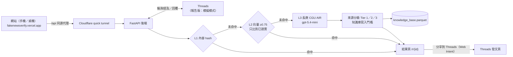

# 進度報告簡報大綱

| 項目 | 內容 |
|------|------|
| 對應票 | O-20（依賴 O-17 `docs/demo/storyboard.md`） |
| 版本／日期 | v1.0／2026-09-15 |
| 報告性質 | **進度報告**（非期末）；日期在 2026-09-21～09-23 之間，確切日期未定（`docs/rebuild/owner_decisions_day0.md`） |
| 長度 | 12 張，約 9 分 20 秒（含播放 2:55 影片）；現場不播完整影片時見第 8 張證據欄 |
| 範圍依據 | `docs/rebuild/03_tickets.md` §0.5 報告週切片 A；`docs/rebuild/01_spec.md` §1 成功定義；`docs/rebuild/00_consensus.md`；`docs/test/TP-FNV-2026-01.md` §1–3 |
| 寫作規則 | 每張 ≤3 個重點、講者備註 1–2 句；數字只取自已存在的檔案，未實測者一律寫 `{待填：來源檔}`；UI 截圖取自 O-18 影片素材（截圖檢核 O-24 排在報告後） |

## 報告主軸：對應課程專題目標

課程要看的是三件事：**整合**多種技術、處理**劣構問題**、走完一次**完整設計循環**（需求分析 → 設計 → 實作 → 測試驗證 → 修正 → 展示）。第 2 張講劣構問題、第 3 張講設計循環，其餘每張標題後以〔 〕標出屬於循環的哪一段，讓評審一路看得到對應。

| # | 標題 | 循環階段 | 時間 |
|---|------|----------|------|
| 1 | 全民查證公社：AI 假訊息與詐騙查證系統 | — | 0:15 |
| 2 | 為什麼假訊息查證是「劣構問題」 | 需求分析 | 0:40 |
| 3 | 走完一次完整設計循環 | 全部 | 0:40 |
| 4 | 系統架構：一條查證管線、兩個入口 | 設計 | 0:45 |
| 5 | 報告週範圍：先做影片看得到的 | 設計／修正 | 0:30 |
| 6 | 來源分級：只有「已做出判定」的來源才算數 | 設計 → 修正 | 0:40 |
| 7 | Threads 機器人：開發模式與上線條件 | 實作 | 0:30 |
| 8 | Demo 影片 | 展示 | 3:05 |
| 9 | 測試計畫 TP-FNV-2026-01 與目前證據 | 測試驗證 | 0:35 |
| 10 | 評測結果：前一版模型 | 測試驗證 | 0:35 |
| 11 | 成本與風險 | 修正 | 0:35 |
| 12 | 下一步 | 下一輪循環 | 0:30 |
| | | 合計 | 約 9:20 |

---

### 第 1 張｜全民查證公社：AI 假訊息與詐騙查證系統（進度報告）

**重點**
1. 原專題名稱「AI為核心的假訊息驗證系統」，重做版品牌「全民查證公社」
2. 網站 https://fakenewsverify.vercel.app ｜ Threads 機器人 @factcheck_tw_bot
3. 團隊 5 人、指導教授；報告日期 `{待填：docs/rebuild/owner_decisions_day0.md 報告日期列}`

**講者備註**：一句話介紹產品：貼上訊息，或在 Threads 標記機器人，就能拿到 AI 判定和已做出判定的查核來源。

**證據／畫面**：品牌字卡（與影片鏡 11 同版型）；團隊與指導教授名單取自 `docs/2026.4.19 forIEET_軟硬體專題學生自評表_20230317_1.pdf`（負責人確認仍正確；分工表 O-10 排在報告後，封面可不放分工）。

### 第 2 張｜為什麼假訊息查證是「劣構問題」〔需求分析〕

**重點**
1. 沒有單一標準答案：同一則 SIM 卡謠言，ETtoday 的報導被標「假訊息」、華視的報導被標「安全」→ 判定對象必須是「被查核的主張」，不是報導本身
2. 來源本身會髒：AI 會引用求證平台上「有人問、還沒判定」的貼文；2026-09-15 稽核：熱門牆 63 筆有 31 筆是 Google News 轉址，知識庫 237 筆沒有一筆做過來源分級
3. 限制一直在變：2026-09-14 三個 AI 服務（CGU、myai168 的 OpenAI 與 Claude）同時失效、Meta 開發模式只讀得到測試者的貼文、原排程一週 152 小時做不完 → 每一項都得重新取捨

**講者備註**：這個題目沒有標準答案、資料會髒、外部條件一直變，所以我們把「怎樣才算可信」本身當成需求來分析，而不是只接一個 AI API。

**證據／畫面**：`CLAUDE.md` §9（查核報導標籤不一致的 bug 與三道防線）；`code/backend/data/check_before.txt`（稽核數字）；`docs/rebuild/00_consensus.md` §4（2026-09-14 三個 provider 全失效：CGU 401、myai168 400／402）、§9；`docs/rebuild/03_tickets.md` §0.5（152 小時）。

### 第 3 張｜走完一次完整設計循環〔全部〕

**重點**
1. 需求分析 → 設計：grill 共識（`00_consensus.md`）→ 規格 v1.3（FR-01～FR-19、測試通過準則）→ mockup（9 張畫板＋強調色比較）；規格經兩輪審查、共 45＋21 條意見
2. 實作 → 測試驗證：109 張票（primitives → screens → 後端／資料／Threads），已完成 `{待填：git log 中「實作票」批次 commit 張數加總，2026-09-15 為 43 張}`；測試計畫書、pytest＋CI、150 筆評測
3. 修正 → 展示：資料清洗 dry-run → 人工審閱 → 套用；3 分鐘影片；整合 React／Vercel、FastAPI、向量檢索、LLM 閘道、Threads API、Cloudflare Tunnel

**講者備註**：這是第二次跑完循環——2026 年上半年的第一版做出可用的 MVP，這次針對第一版暴露的問題重做，每一步都留下文件可以回溯。

**證據／畫面**：循環圖（6 格箭頭，每格標代表檔案：`00_consensus.md`、`01_spec.md`、`docs/rebuild/mockup/`、`03_tickets.md`、`docs/test/TP-FNV-2026-01.md`、`docs/demo/storyboard.md`）；`git log --oneline` 截圖；規格審查紀錄見 `01_spec.md` 文末變更紀錄（v1.1：45 條、v1.3：21 條）。

### 第 4 張｜系統架構：一條查證管線、兩個入口〔設計〕

**重點**
1. 網站：Vercel 前端（手機優先）→ `/api` 同源代理 → Cloudflare quick tunnel → FastAPI 後端（負責人電腦）
2. 三層快取：① 內容 hash → ② 向量相似度（`text-embedding-3-small`，門檻 0.75，只比對已證實的判定）→ ③ 長庚 CGU AIR `gpt-5.4-mini`；結果經來源分級後回填知識庫
3. Threads：後端輪詢提及 → 走同一條管線 → 回覆燈號＋查核來源＋結果頁連結；模擬模式只換掉 Threads 用戶端（讀本機 JSON、寫 `replies.jsonl`）

**講者備註**：網站和機器人共用同一條管線，快取先擋掉重複的問題，真的沒看過才花 AI 額度。

**證據／畫面**：下方架構圖（mermaid 可直接轉圖）；0.75 門檻依據 `CLAUDE.md` §3 實測（同一謠言改寫版 0.79～0.82、不同謠言 ≤0.68、不同主題 ≤0.52）。

### 第 5 張｜報告週範圍：先做影片看得到的〔設計／修正〕

**重點**
1. 報告前完成：文字／網址查證、結果頁 `/r/{id}`、分享到 Threads、熱門牆、知識庫、來源分級與資料清洗、Threads 模擬模式閉環
2. 報告後：Threads 實機串接（Meta App、測試者、token）、`/bot` 狀態頁、CGU 模型重跑評測與績效量測、UI 截圖檢核與無障礙、圖片查證（P1）
3. 明確不做：影片查證、FB／IG、把使用者原文送 Google 搜尋、帳號登入、Threads Webhook（成本、隱私或需要企業驗證）

**講者備註**：原排程一週 152 小時做不完，我們選擇「只做影片看得到的切片」，這是循環中「修正範圍」的決策，每一項延後都有對應的票。

**證據／畫面**：`docs/rebuild/03_tickets.md` §0.5「報告週要做／報告後才做」截圖；`docs/rebuild/00_consensus.md` §2「做／不做」。

### 第 6 張｜來源分級：只有「已做出判定」的來源才算數〔設計 → 修正〕

**重點**
1. Tier 1 查核機構（台灣事實查核中心、MyGoPen、有 RUMOR／NOT_RUMOR 回覆的 Cofacts、`*.gov.tw`、WHO／CDC）；Tier 2 主流媒體查核報導；Tier 3 其他——對外只顯示 Tier 1／2
2. 找不到 Tier 1／2 → 結果頁明示「尚無查核機構證實」、不給綠燈；知識庫頁與向量命中只收已證實的判定
3. 清洗前：知識庫 237 筆未分級、熱門牆 63 筆含 31 筆 Google News 轉址 → 清洗後：`{待填：D-05 apply 後 scripts/check_db.py 輸出}`

**講者備註**：查證平台最怕引用「還沒查證」的來源，所以我們寧可說「尚無查核機構證實」，也不硬給一個看起來有來源的答案。

**證據／畫面**：影片鏡 8 截圖（「尚無查核機構證實」橫幅）、鏡 5 截圖（來源列「查核機構」小標）；`code/backend/data/check_before.txt`；`code/backend/data/clean_sources_report.txt`（2026-09-15 dry-run 參考值：知識庫已證實 136／237、熱門牆 63 → 32，**低於 OP-9 門檻 150**，以 D-05 定案數字為準，不要直接上投影片）。

### 第 7 張｜Threads 機器人：開發模式與上線條件〔實作〕

**重點**
1. 使用方式：在可疑貼文底下回覆並標記 @factcheck_tw_bot → 機器人回覆燈號、一句摘要、查核來源、結果頁連結（≤500 字）
2. 目前進度：模擬模式閉環可展示，處理流程與正式串接相同、只換 Threads 用戶端；實機串接需 Meta App、測試者邀請、60 天 token 與發佈／錯誤處理程式，排在報告後
3. 上線條件：未審核前只讀得到測試者的公開貼文；公開給所有人需通過 Meta App Review 與企業驗證（論文列為上線條件）

**講者備註**：影片裡的機器人是模擬模式，字幕和這張都明講；實機串接還差 Meta 端設定與發佈、錯誤處理的程式，都排在報告後。

**證據／畫面**：影片鏡 4 截圖（終端機 log＋`replies.jsonl` 回覆內容）；`docs/rebuild/01_spec.md` §7.2 開發模式說明、§7.7 回覆模板；`code/backend/scripts/threads_sim_mentions.example.json`（模擬輸入格式）。

### 第 8 張｜Demo 影片（2:55）〔展示〕

**重點**
1. Threads 模擬閉環：標記機器人 → 命中快取的紅燈回覆 → 手機結果頁 → 分享回 Threads
2. 三層快取實證：同一則謠言換個說法命中「語意相似」；全新訊息才交給 AI 即時判讀
3. 誠實呈現：模擬模式全程標示、「尚無查核機構證實」、評測只引用前一版模型

**講者備註**：接下來播三分鐘影片，請留意字幕標示的模擬模式，以及找不到查核來源時系統怎麼表態。

**證據／畫面**：`demo_v0.3.0.mp4`（O-19 成品，本機＋雲端各一份）；腳本 `docs/demo/storyboard.md`。現場時間不足或影片另交時，改播鏡 3–8（0:18–2:10，約 1:52），總長約 8:15。

### 第 9 張｜測試計畫 TP-FNV-2026-01 與目前證據〔測試驗證〕

**重點**
1. 依課程範本分五類，每項都有通過準則：操作 9、功能 16、介面 8、績效 7、品質 6，共 46 項（P0 30 項）
2. 報告前的證據：pytest `{待填：GitHub Actions 最新 run}` 全綠（前後端 CI）；模擬模式一輪（OP-3，`{待填：T-11 驗收時 test_threads_bot.py --poll 輸出}`）；清洗審閱（QA-5／OP-9，`{待填：docs/test/clean_sources_review.md}`）
3. 報告後執行：CGU 模型重跑評測（QA-1a）、快取延遲與命中率（PF-1／PF-2）、UI 截圖檢核（UI-1／2／4／8）、發佈前操作測試（OP-1／7／8），並補計畫書第 4–6 節

**講者備註**：測試準則在規格階段就先訂好，不是做完才補；目前功能測試每次提交都由 CI 自動跑。

**證據／畫面**：`docs/test/TP-FNV-2026-01.md` §3 表格截圖；GitHub Actions run 截圖（`{待填：CI run 連結}`；參考：2026-09-15 commit `25277c4` 為後端 331 passed、前端 unit 260 passed，報告時以最新 run 為準）。

### 第 10 張｜評測結果：前一版模型〔測試驗證〕

**重點**
1. 資料集：150 筆人工標註（SCAM／MISINFO／SAFE 各 50），刻意放入「像詐騙的合法官方訊息」當難題
2. `gpt-5-mini`（myai168 閘道，2026-06）：accuracy 96.0%、macro-F1 0.960；FN＝0（沒有風險訊息被判成安全）、FP＝5
3. 錯誤分析：6 筆錯誤全被判成 SCAM（5 筆反詐宣導或政府公告、1 筆假訊息），信心都 ≥0.9 → 模型信心未校準；換 CGU `gpt-5.4-mini` 的重跑排在報告後，以 FN＝0 為閘門

**講者備註**：這是換閘道前的舊模型數字，不當成新模型的成績；新模型重跑後會把兩組數字並列。

**證據／畫面**：`assets/confusion_matrix.png`；`code/backend/data/eval_report.csv`、`eval_binary.csv`（TP 100、FP 5、FN 0、TN 45）、`eval_errors.csv`；git commit `9d63eef`（2026-06-06）。註：spec §10.5 與計畫書 QA-1b 寫「2026-07」，投影片以 git 紀錄為準。

### 第 11 張｜成本與風險〔修正〕

**重點**
1. 成本：新學期 CGU AIR 額度 USD 10（另有本地模型 1,000 萬 tokens），不另購 API；用量 `{待填：docs/test/cgu_usage.txt}`；評測與批次一律關閉 web_search
2. 風險：CGU 是唯一 AI 來源；後端跑在個人電腦＋quick tunnel；資料清洗可能過度降級，讓知識庫與向量命中縮水
3. 對策：AI 失敗回固定 fallback、不寫入知識庫；模擬模式可離線展示、影片預錄；清洗先 dry-run、人工抽查 ≥9/10 才套用並自動備份

**講者備註**：三個風險都準備了「壞了還能 demo」的退路，這也是模擬模式被列為必做的原因。

**證據／畫面**：`docs/rebuild/00_consensus.md` §4（額度）；`docs/rebuild/01_spec.md` §12 R1、R12、R15；`code/backend/data/clean_sources_report.txt`（dry-run 已證實 136 筆、低於門檻 150，是 R15 正在發生的證據）；參考值：2026-07 舊金鑰三輪批次查證共 USD 0.127（`CLAUDE.md` §8，非本學期額度）。

### 第 12 張｜下一步〔下一輪循環〕

**重點**
1. Threads 實機串接：Meta App 與測試者、token、兩段式發佈與錯誤分流 → 實機端到端回覆驗證 → `/bot` 狀態頁
2. 驗證補齊：CGU `gpt-5.4-mini` 重跑 150 筆並與舊數字並列、快取延遲與命中率量測、UI 截圖檢核與無障礙、測試計畫書第 4–6 節定稿
3. 上線前待決：低信心紅燈是否降為黃燈（D-6）、後端是否移到雲端（報告後評估，含 Supabase 選項）、Meta App Review

**講者備註**：下一輪循環從實機串接開始，完成後把新評測與測試結果填進計畫書第 6 節。

**證據／畫面**：`docs/rebuild/03_tickets.md` §0.5「報告後才做」清單；`docs/rebuild/01_spec.md` §13 D-6；`docs/rebuild/owner_decisions_day0.md`（Supabase 報告後決定）。

---

## 待填欄位總表（報告前由負責人補齊）

| 待填 | 來源檔 | 產出票 | 用在 |
|------|--------|--------|------|
| 報告日期 | `docs/rebuild/owner_decisions_day0.md` | 負責人 | 第 1 張 |
| 已完成票數 | `git log --oneline`（「實作票」批次 commit 訊息） | — | 第 3 張 |
| 清洗後筆數（知識庫已證實、熱門牆 Google News） | D-05 apply 後 `scripts/check_db.py` 輸出 | D-05 | 第 6 張、影片鏡 10 |
| 清洗審閱紀錄 | `docs/test/clean_sources_review.md` | D-05（QA-5） | 第 9 張 |
| pytest 數與 CI 連結 | GitHub Actions 最新 run | O-26 | 第 9 張、影片鏡 10 |
| 模擬輪詢輸出 | `test_threads_bot.py --poll` 主控台輸出 | T-11（OP-3） | 第 9 張 |
| CGU 用量 | `docs/test/cgu_usage.txt` | O-02 | 第 11 張 |

沒有實測值的格子**整句刪掉**，不估計、不沿用舊值冒充新值。

## 附錄：課程核心能力對應（Q&A 備用，不做成投影片）

依 `docs/2026.4.19 forIEET_軟硬體專題學生自評表_20230317_1.pdf` 的九項核心能力：

| 核心能力 | 本次重做的證據 | 對應投影片 |
|----------|----------------|------------|
| 1 運用資工、數學、科學及工程知識 | 三層快取與向量相似度門檻實測校準；React、FastAPI、LLM 閘道、Threads API 整合 | 第 4 張 |
| 2 發掘、分析及處理系統運作問題 | 劣構問題分析；查核報導標籤不一致 bug；AI 服務全失效後切換到新學期 CGU 金鑰 | 第 2 張 |
| 3 設計與執行實驗、分析數據 | 150 筆評測、混淆矩陣與錯誤分析 | 第 10 張 |
| 4 運用適當工具與現存模組 | Git／GitHub Actions、Vercel、cloudflared、CGU AIR 閘道 | 第 4、9 張 |
| 5 規劃測試環境、執行測試與結果分析 | TP-FNV-2026-01 五類 46 項；109 張票與報告週切片 | 第 5、9 張 |
| 6 撰寫與運用設計文件 | 共識 → 規格 → mockup → 票 → 測試計畫書 → 影片腳本 | 第 3 張 |
| 7 有效溝通與合作 | 5 人分工（`{待填：docs/test/team.md}`，O-10 報告後） | 第 1 張 |
| 8 資訊倫理與社會責任 | 來源分級、「尚無查核機構證實」、隱私政策與資料刪除頁、SSRF 防護、使用者原文不送搜尋引擎 | 第 6 張 |
| 9 永續發展（SDG） | SDG 16（具公信力的資訊查證）、SDG 9 | 第 2 張 |

## 與 O-20 票面的差異

| 票面 | 本大綱 | 原因 |
|------|--------|------|
| 3–5 個重點、備註每張 ≤60 秒 | ≤3 個重點、備註 1–2 句 | 負責人指示 |
| 評測「新舊並列」、成本 `/me/usage` | 只列前一版模型評測；成本無實測值時整句刪 | 切片 A：O-22 重跑、O-02 用量紀錄未完成，不得虛構數字 |
| 截圖路徑 `docs/test/screens/*` | 取自 O-18 影片素材 | O-24 截圖檢核排在報告後 |
| 10 個主題（問題與定位 → … → 成本 → 風險與下一步） | 12 張：加封面與「設計循環」、問題改寫為「劣構問題」、成本併入風險、下一步獨立一張 | 需對應課程專題目標，且進度報告結尾要交代下一輪 |
