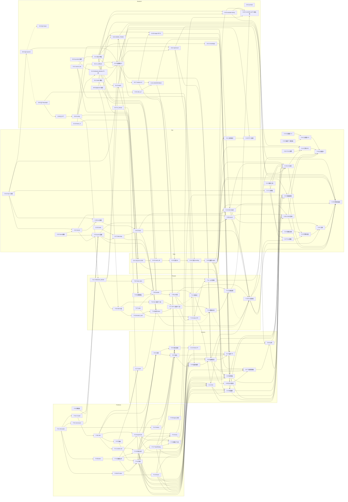

# 03 · 重做實作票券（Tickets）

## 0. 文件資訊

| 項目 | 內容 |
|---|---|
| 版本 | v1.1（v1.0 四條 lane 合併版＋審查意見修訂：快取命中補 tier、部署鏈、同意閘門、時程重排、第一批刪減） |
| 日期 | 2026-09-15（spec Day 0） |
| 上游 | `docs/rebuild/00_consensus.md`（決策；§9 來源品質為負責人明確要求）→ `docs/rebuild/01_spec.md`（v1.3：FR-01～19、§5 API、§6 資料模型、§7 Threads、§8 UX、§10 測試、§11 時程、§13 D-items）→ `docs/rebuild/02_mockup_brief.md`（token、元件解剖、artboard、§7 grill 結論） |
| 設計畫布 | https://claude.ai/artifact/A4UtUPgSwRCfHAmAKM6TKh（工作檔 `docs/rebuild/mockup/*.dc.html`） |
| 實作者 | 負責人一人 + Claude Code 寫程式；組員承接非程式線 |
| 交付假設 | 進度報告 + 3 分鐘 demo 影片 2026-09-22（D-1 待確認） |
| 票數 | 109 張：P- 19、S- 14、B- 26、D- 5、T- 17、O- 28 |
| 工時 | 全部 197.5h；P0 179.5h；本週已排程 179.5h（全為 P0：Claude 152.5h、負責人 17h、組員 10h），另計負責人驗收 19h；第一批刪減移出 5.5h（不排）與報告後 14.5h |

**全票共通規則**

1. 每張票完成時 app 必須可啟動，且 `cd code/backend && .\venv\Scripts\python -m pytest tests -q` 全綠；動到前端的票另需 `cd code/frontend && npm run build` 成功、`npm run lint` 零 error。
2. 標記規則（`_title_says_false`／`_title_indicates_debunk`／`_is_real_claim`／`_save_rss_record` 判斷樹）任何票都**不得改動**，只能包 `to_thread` 或補寫欄位（CLAUDE.md §9）。
3. 前端**只讀**後端 `frame_type`／`frame_label`，不自行由 `risk_type` 推燈色（spec §7.8）；文案一律取自 `src/i18n.js`（§8.7 逐字）；紅黃綠只出現在燈號區塊、判定 chip、燈號點。
4. 視覺依 brief §7：方向 A；強調色 `--c-accent` 預設 `#111111`（負責人未從 `AccentOptions.dc.html` 選色前不改，換色＝改一行）；可點 chip 視覺 28px、外層 hit area ≥44px；`label_source` 在熱門牆與知識庫一律 13px 次文字（覆寫 spec 8.3 S4「label_source chip」一詞）；`similar_news` 區隱藏（D-18）。token 名沿用 brief §2（`--c-red` 等），UI-3 的 grep 以此為準，不用 spec 的 `c-verdict-*`。
5. 截圖一律存 `docs/test/screens/{S1..S7}_{state}_{375|1280}_{light|dark}.png`（寬度統一 spec §10.6 的 375）。**v1.1 起 P／S 票驗收裡的「截圖檢核」條目只要求：該狀態可用 `VITE_FIXTURES=1` 或真後端重現、檔名與對照的 mockup 列入 `docs/test/ui_checklist.csv`；實際拍攝與勾核集中由 O-24（組員 D）一次完成**，負責人不在各票逐張截圖。
6. 前端純 JS 模組以 Node 內建 `node --test` 測（`npm run test:unit` = `node --test`，不帶 glob 參數，Node 20 與 22+ 行為一致），不新增測試依賴；唯一新增前端依賴為 `react-router-dom`（D-13）。
7. 開發時 `VITE_FIXTURES=1 npm run dev` 由 P-10 提供 fixture 模式（`/r/fx-{state}` 讀 `src/dev/fixtures/result_fx-{state}.json`），各畫面票只新增自己的 fixture JSON。
8. Windows 主控台 cp950：腳本輸出不放 emoji；`requirements.txt` 只能 ASCII（CLAUDE.md §7）。
9. 需要 push 的驗收（CI 綠、Vercel 部署後 curl）一律掛在 O-26 之後；票本身只要求本機可判定的部分，未取得 O-03 推送權限時不擋票完成。
10. **不得動 `code/backend/.env`**：任何「全新環境」驗收（例如 `start.bat` 自動產生 `ADMIN_TOKEN`）一律在 `git worktree add` 或另一份 clone 的暫存目錄執行。

**合併時做過的去重與衝突處理（供審閱）**

| 重複／衝突 | 處理 |
|---|---|
| CI 加前端 build：P lane P-02 與 B lane B-08 | 保留 P-02（含移除測試數字）；B-08 縮為 `.gitignore`＋停止追蹤 runtime 檔 |
| `vercel.json`：P lane P-04 與 T lane O-08 | 保留 P-04（Day 1 建檔、含 regex 自測）；O-08 只負責跑 tunnel、換主機一行與 runbook |
| `/health` 與 `/api/health` 路徑不一致（dev proxy 只轉 `/api`） | B-22 同時註冊 `/api/health` 別名；前端與 vercel.json 一律走 `/api/health` |
| 設定鍵：B lane B-09 與 T lane T-01 都加 `THREADS_MODE`／`BOT_HANDLE` 等 | Threads 相關鍵與 `threads_mode_effective` 全歸 T-01；B-09 只留 `PUBLIC_BASE_URL`／`ADMIN_TOKEN`／`BRAND_NAME`／`CONTACT_EMAIL`／`WEB_SEARCH_ALLOWED_DOMAINS`／`AI_TIMEOUT_SECONDS`；T-01 依賴 B-09 以免同檔衝突 |
| `.gitignore` Threads 檔：B-08 與 T-02 | 全部併入 B-08；T-02 只留 `.dockerignore` |
| CLAUDE.md 同步：P-05、P-07、B-25 各改一段 | 集中到 B-25（後端＋Threads＋前端＋`legacy/` 一次同步，QA-4）；P-05／P-07 只改 README 與程式 |
| 輸入卡：P lane InputCard／validateInput 與 S lane S-01 各做一份 | 保留 P-16（元件＋單元測試）；S-01 改為組裝首頁 |
| 圖片上傳：P lane 舊 P-18 與 S lane S-13 | 併入 S-13（P1，報告後） |
| S lane 假設的 `[P:apiClient fixture 模式]`、`[P:Disclosure]`、`[P:StickyActionBar]`、`[P:SearchInput]` 在 P lane 不存在 | 新增 P-10（fixture 模式）；Disclosure 併入 P-17；sticky 動作列由 S-08 自做；搜尋列由 S-10 自做 |
| `POST /api/threads/poll` 加管理 token 會破壞 `test_api.py` 斷言（B-20 原標 FN-1 例外） | B-20 改為「`THREADS_MODE=off` 先回 200 `threads_disabled`、其餘才驗 token」，不需改 `test_api.py`；T-10 延續同順序 |
| ConfirmDialog／Disclosure 原排 Day 4，但 S-03／S-05（Day 3）要用 | P-17 前移到 Day 3 |
| `/oauth/callback` 頁（S-12，spec 排 Day 2）依賴路由骨架（原排 Day 3） | P-07 與 S-12 前移到 Day 2.5（T-15 當天要用；未上線時可從網址列手動複製 `code`） |
| 缺少執行型票：150 筆評測、PF-2 量測、截圖檢核表、發佈前操作測試 | 新增 O-22～O-25 |
| FR-03 前端 S-13 沒有對應後端票 | 新增 B-26（P1，報告後） |

**v1.1 審查修訂摘要**

| 類別 | 變更 |
|---|---|
| 來源品質（共識 §9） | B-13／D-03 把 `tier`／`tier_label` 寫進每個來源項目；B-15 快取命中時補分級並把 Tier 3 移到 `related_discussions`（新增 `test_cache_hit_sources_have_tier`）；D-01 讓 `news_fetcher._analyze_record` 寫知識庫前先過 `filter_valid_sources` → `grade_sources` |
| 同意閘門 | FN-1 兩項例外（B-03、B-22）、第二批刪減、mockup 偏離、`start.bat` tunnel 選項降級併入 O-01（Day 0 必答，附未回覆時的預設）；B-04／B-05 對 B-03 改為軟依賴 |
| 部署鏈 | 新增 O-26「push 並確認 Vercel 部署與 CI 綠」；O-07／O-08／T-15 改依賴 O-26；P-02／P-04／P-06／S-08／S-12 的部署類驗收移到 O-26／O-28／T-15 |
| Threads | T-15 拆為 T-15「取得 token」（P0，T-16 硬依賴）與 T-17「OP-5 探測回寫」（P1，第一批已砍）；T-12／T-13 對 T-17 改軟依賴；T-13／T-14 不擋 T-16；T-09／T-10 補過期 token 的 `token_invalid`；T-11 補離線預熱與斷網驗收 |
| 時程 | 第一批刪減已套用（P-19、B-24、T-04、T-17 不排；B-25、O-10 報告後）；B-12 提前 Day 1；D-01～D-04 移到 Day 2 尾段／晚上，Day 2.5 上午只留 D-05；P-08、P-13、T-05、T-06、T-07 提前到 Day 2.5 背景；O-22 移到 Day 5 深夜；O-25 改在 O-21 之後；總覽表加「負責人驗收」欄 |
| 拆票 | O-19 拆出 O-27（live 補錄）；O-24 拆出 O-28（UI-6／UI-8／真手機 3 秒可讀性與分享實測） |
| 其他 | B-20 驗收不再刪 `.env`、補 `label_source="admin"`；B-16 分享文案參數化與 `threads_sim` 來源測試；B-12 逐條列 FN-12 必測案例；B-26 補 FR-03 驗收 3、4；B-05 清 Dockerfile；B-08 保存 OP-7 舊檔快照；P-06 `test:unit` 改 `node --test`；P-07 舊 App 暫掛 `/`、`og.png` 佔位；D-05 筆數改相對值；O-22 驗收不寫死日期 |

**負責人同意閘門（O-01 回覆）**：B-03（`test_processor_flow.py`：FR-01 移除 keyword 爬取與原斷言直接矛盾）、B-22（`test_api.py::test_health_and_root` 整包相等 → 只比 `status`）兩項 FN-1 例外由 O-01 取得同意並回寫 spec §10.2 FN-1。**預設**：Day 1 開工前未回覆，視為同意（FR-01、§5.1 皆為 P0 且與原斷言邏輯互斥，沒有不改斷言的可行解）；負責人事後否決時回滾該 commit，並把 B-03／B-22 標為「未達標」。

---

## 1. 總覽表

排序：排程先後，同日內依賴順序。「負責人驗收」＝負責人在旁檢查該票驗收條目的估時（Claude 以 pytest 自行判定者記 0h；需手動操作或看畫面者記 0.5h；負責人本身執行的票記 0h，時數已在「負責」欄）。依賴欄「（軟：X）」表示 X 完成則套用、未完成不擋。

| ID | 標題 | 優先級 | 依賴 | 預估 | 負責人驗收 | 排程 | 負責 |
|---|---|---|---|---|---|---|---|
| O-01 | 回覆 Day 0 必答待決事項（D-1／D-3／D-5、FN-1 例外同意、第二批刪減與偏離確認） | P0 | 無 | 1h | 0h | Day 0 | 負責人 |
| O-02 | 記錄 CGU AIR 用量基準值並建立每日紀錄列 | P0 | 無 | 0.5h | 0h | Day 0 | 負責人（Claude 可代跑） |
| O-03 | 讓 soymilk0211 取得 GitHub repo 推送權限 | P0 | 無 | 0.5h | 0h | Day 0 | 負責人 |
| O-05 | 建立專題 Gmail 並定案 CONTACT_EMAIL | P0 | 無 | 0.5h | 0h | Day 0 | 負責人 |
| O-04 | 建立 Vercel 專案並取得 PUBLIC_BASE_URL | P0 | O-01、O-03 | 1h | 0h | Day 0 | 負責人 |
| P-01 | 驗證 Vite 8 beta 能否 build，失敗即降回 Vite 7 定版 | P0 | 無 | 1h | 0h | Day 1 | Claude |
| B-01 | 加入 FR-19 來源 prompt 逐字規則 | P0 | 無 | 0.5h | 0h | Day 1 | Claude |
| B-12 | 建立 source_tier.py 來源分級（Tier 1／2／3 與 Cofacts 回覆查詢） | P0 | 無 | 3h | 0h | Day 1（提前；純函式、離線測試） | Claude |
| P-02 | 在 CI 加入前端 build job 並移除寫死測試數 | P0 | P-01 | 0.5h | 0h | Day 1 | Claude |
| P-03 | 建立三個純 HTML 靜態頁（隱私政策／資料刪除／取消授權） | P0 | 無 | 1.5h | 0.5h | Day 1 | Claude |
| P-04 | 新增 vercel.json（/api 同源代理＋SPA fallback，排除 *.html） | P0 | P-01 | 0.5h | 0h | Day 1 | Claude |
| P-05 | 封存 fake-news-detector.html 與 _run_detector.bat 到 legacy/ | P0 | 無 | 0.5h | 0.5h | Day 1 | Claude |
| P-06 | 建立繁中文案表模組 src/i18n.js | P0 | P-02 | 1h | 0h | Day 1 | Claude |
| B-02 | 為 test_ai_provider.py 加上 --web-search／--allowed-domains 旗標 | P0 | 無 | 1h | 0.5h | Day 1 | Claude |
| B-03 | 移除文字輸入的關鍵字爬取 | P0 | O-01 | 1.5h | 0h | Day 1 | Claude |
| B-04 | 清除 Serper、TRENDING_KEYWORDS、Google News 與 googlesearch 依賴 | P0 | 無（軟：B-03） | 1.5h | 0h | Day 1 | Claude |
| B-05 | 移除 Playwright／yt-dlp 爬取管線與依賴 | P0 | 無（軟：B-03） | 2h | 0h | Day 1 | Claude |
| B-06 | 移除 STT、Gemini embedding 備援、死設定鍵與 seed_data.py | P0 | B-05 | 1.5h | 0.5h | Day 1 | Claude |
| B-07 | 把 news_fetcher 的阻塞呼叫改成 asyncio.to_thread | P0 | 無 | 1h | 0h | Day 1 | Claude |
| B-08 | 保存 OP-7 舊檔快照、修正 .gitignore 資料路徑並停止追蹤 runtime 檔 | P0 | 無 | 0.5h | 0.5h | Day 1（第一件） | Claude |
| O-26 | push 並確認 Vercel 部署 P-03／P-04（Ready）與 CI 綠 | P0 | O-03、O-04、P-02、P-03、P-04 | 0.5h | 0h | Day 1 | 負責人 |
| O-06 | 設定機器人帳號顯示名稱、簡介並確認為公開 | P0 | O-01、O-04 | 0.5h | 0h | Day 1 | 負責人 |
| O-07 | 建立 Meta App 並完成 Threads use case、四權限與三個 URL 設定 | P0 | O-05、O-26 | 2h | 0h | Day 1 | 負責人（可轉交組員 A） |
| O-08 | 啟動 cloudflared quick tunnel 並把主機寫入 vercel.json | P0 | O-04、O-26 | 1h | 0h | Day 1 | 負責人 0.5h／Claude 0.5h |
| B-09 | 依 7.11 更新 config 與 .env.example（非 Threads 鍵），並調整 timeout、CORS | P0 | B-06 | 1h | 0h | Day 2 | Claude |
| T-01 | 新增 THREADS_MODE 與 Threads 設定鍵，取代 ENABLE_THREADS_BOT | P0 | B-09 | 1.5h | 0h | Day 2 | Claude |
| B-10 | 建立 verdict.frame_of 八列紅黃綠映射並改寫框色契約測試 | P0 | 無 | 1.5h | 0h | Day 2 | Claude |
| B-11 | 統一 is_fallback 並加上 ai_unavailable 旗標與通用錯誤文案 | P0 | B-10 | 1.5h | 0h | Day 2 | Claude |
| B-13 | 在 PandasStore.save_record 實作寫入門檻並補齊新欄位預設 | P0 | B-12 | 3h | 0h | Day 2 | Claude |
| B-14 | 擴充 tasks.parquet 欄位、上限 5,000 與修剪規則 | P0 | 無 | 1.5h | 0h | Day 2 | Claude |
| B-15 | 在任務處理器接上來源分級、verdict 與結果 v2 欄位 | P0 | B-03、B-11、B-13、B-14 | 4h | 0.5h | Day 2 | Claude |
| B-16 | 新增 GET /api/result/{id}，並讓舊結果端點在處理中回 202 | P0 | B-15、B-09 | 3h | 0.5h | Day 2 | Claude |
| B-17 | 改版 /api/analyze：result_id、URL 驗證、task_type 與錯誤格式 | P0 | B-15 | 2h | 0h | Day 2 | Claude |
| B-18 | 建立 safe_url.py（SSRF 防護）並接到 crawler 與 url_validator | P0 | B-05 | 2.5h | 0h | Day 2 | Claude |
| B-19 | 把網址爬取失敗改成 UNVERIFIABLE、加入 blocked_url 422 並剔除同網域來源 | P0 | B-17、B-18 | 2.5h | 0.5h | Day 2 | Claude |
| T-02 | 讓 ThreadsService 從 data/threads_token.json 載入 token 並計算剩餘天數 | P0 | T-01、B-08 | 1.5h | 0h | Day 2 | Claude |
| T-03 | 新增 scripts/threads_auth.py 完成 OAuth code → 短效 → 長效 token 交換 | P0 | T-02 | 2h | 0h | Day 2 | Claude |
| O-09 | 邀請 Threads Tester 並確認全部帳號接受且公開 | P0 | O-06、O-07 | 1h | 0h | Day 2 | 負責人（可轉交組員 A） |
| D-01 | 為 fact_check_records 冪等 ALTER 新欄位、回填 label_source，並讓 _analyze_record 走來源驗證與分級 | P0 | B-07、B-12、B-13 | 3h | 0.5h | Day 2 尾段 | Claude |
| D-02 | 讓 check_db.py 印出 verified 分佈，作為清洗前後比對基準 | P0 | B-13、D-01 | 0.5h | 0h | Day 2 尾段 | Claude |
| D-03 | 撰寫清洗腳本的知識庫規則 1、2（含 Cofacts 快取與 --retry-cofacts） | P0 | D-02、B-12 | 2h | 0h | Day 2 晚上 | Claude |
| D-04 | 撰寫清洗腳本的熱門規則 3、4，並加上 --apply 備份與冪等（晚上跑 dry-run） | P0 | D-03、B-18 | 2h | 0h | Day 2 晚上 | Claude |
| D-05 | 通過負責人審閱閘門後套用清洗並提交乾淨的種子 | P0 | D-04 | 1.5h | 0h | Day 2.5（上午主線） | 負責人 1h／Claude 0.5h |
| P-07 | 以 react-router-dom 建立路由骨架（舊 App 暫掛 `/`） | P0 | P-06 | 1.5h | 0.5h | Day 2.5（背景平行） | Claude |
| S-12 | 建立 /oauth/callback 授權碼顯示頁 | P0 | P-06、P-07 | 1h | 0.5h | Day 2.5（背景平行，T-15 前） | Claude |
| T-15 | 取得 Threads 長效 token 並記錄 OP-4 | P0 | T-03、O-07、O-09、S-12、O-26 | 1h | 0h | Day 2.5 | 組員 A（負責人可自跑） |
| P-09 | 建立 API client 模組（相對 /api、逾時、錯誤正規化、fallback 辨識、結果輪詢） | P0 | P-01 | 2h | 0h | Day 2.5（背景平行） | Claude |
| P-10 | 為 API client 加入 VITE_FIXTURES 開發用 fixture 模式 | P0 | P-09 | 1h | 0h | Day 2.5（背景平行） | Claude |
| P-11 | 建立前端判定映射 util（只讀 frame_type／frame_label） | P0 | P-06 | 1.5h | 0h | Day 2.5（背景平行） | Claude |
| P-12 | 建立 localStorage 查證歷史 helper | P0 | P-01 | 1h | 0h | Day 2.5（背景平行） | Claude |
| T-06 | 依 7.7 重寫 format_verdict_reply 與 threads_len 長度計數 | P0 | B-10、B-15、B-09 | 2.5h | 0h | Day 2.5（背景平行，自 Day 5 提前） | Claude |
| T-07 | 新增 Threads state 原子寫入與 threads_replies.jsonl 紀錄模組 | P0 | 無 | 1.5h | 0h | Day 2.5（背景平行，自 Day 5 提前） | Claude |
| P-08 | 建立 index.css token 系統與深淺色主題切換 | P0 | P-01 | 2.5h | 0.5h | Day 2.5（背景平行，自 Day 3 提前） | Claude |
| P-13 | 建立基礎元件：Icon、Card、Button、Skeleton、Banner | P0 | P-08 | 2h | 0h | Day 2.5（背景平行，自 Day 3 提前） | Claude |
| T-05 | 抽出 ThreadsClient Protocol 並實作 FakeThreadsService 模擬模式 | P0 | T-01 | 2h | 0h | Day 2.5（背景平行，自 Day 5 提前） | Claude |
| B-21 | 讓知識庫 API 支援 offset 分頁、verified 過濾與四格統計 | P0 | B-13 | 2h | 0h | Day 3 上午（自 Day 2 滑入） | Claude |
| B-22 | 為 /health 加入 ai_available、threads_mode、scheduler 區塊與 /api/health 別名 | P0 | B-11、T-01、O-01 | 1h | 0.5h | Day 3 上午（自 Day 2 滑入） | Claude |
| P-14 | 建立應用外殼：頂欄、手機分頁列／桌機導覽、頁尾、後端不可用橫幅 | P0 | P-07、P-09、P-13、B-22 | 2.5h | 0.5h | Day 3 | Claude |
| P-15 | 建立判定相關元件：Chip、VerdictBlock、DotRow、SourceRow | P0 | P-11、P-13 | 2.5h | 0.5h | Day 3 | Claude |
| P-16 | 建立 InputCard（分段模式 tab＋文字／網址輸入＋字數＋inline 驗證） | P0 | P-06、P-13 | 3h | 0.5h | Day 3 | Claude |
| P-17 | 建立 Toast、EmptyState、ConfirmDialog、Disclosure | P0 | P-14 | 3h | 0.5h | Day 3 | Claude |
| S-01 | 組裝首頁（標題、輸入卡、範例 chip、Threads 說明卡、inline 驗證） | P0 | P-06、P-14、P-15、P-16 | 2.5h | 0.5h | Day 3 | Claude |
| S-02 | 接通首頁送出流程並以新首頁取代舊 App | P0 | S-01、P-10、P-12、B-17、B-19 | 3h | 0.5h | Day 3 | Claude |
| S-03 | 顯示首頁「最近查證」5 筆與清除 | P0 | S-01、P-12、P-15、P-17 | 2h | 0.5h | Day 3 | Claude |
| S-04 | 建立結果頁輪詢骨架（載入、超時、404、失敗、網路錯誤） | P0 | S-02、P-10、P-13、P-14、B-16 | 3.5h | 0.5h | Day 3 | Claude |
| S-05 | 渲染結果頁成功內容（燈號區、信心與快取 chip、摘錄、摘要、來源、頁尾） | P0 | S-04、P-15、P-17、B-15、B-16 | 3.5h | 0.5h | Day 3 | Claude |
| O-11 | 產出 PF-2 用的 20 筆改寫版謠言 | P0 | D-05 | 1.5h | 0h | Day 3 | Claude 1h／負責人審 0.5h |
| O-14 | 撰寫測試計畫書 TP-FNV-2026-01 第 1–3 節 | P0 | 無 | 3h | 0.5h | Day 3 | Claude |
| O-17 | 撰寫 3 分鐘 demo 影片拍攝腳本與旁白稿 | P0 | O-01 | 1.5h | 0.5h | Day 3 | Claude |
| B-20 | 以 ADMIN_TOKEN 保護管理端點、覆寫寫入 label_source=admin，並讓 start 腳本自動產生金鑰 | P0 | T-01、B-13、B-14 | 2.5h | 0.5h | Day 4（自 Day 2 移出；T-10 Day 5 才用） | Claude |
| S-06 | 呈現結果頁 AI 不可用灰卡與 UNVERIFIABLE 黃框 | P0 | S-05、B-19 | 2h | 0.5h | Day 4 上午（自 Day 3 滑入） | Claude |
| P-18 | 落實 a11y 基準並建立自動檢查 | P0 | P-15、P-16、P-17 | 1.5h | 0.5h | Day 4 | Claude |
| B-23 | 為 evaluate.py 加入 --timing、gold 標記與報告欄位 | P0 | B-11、B-13 | 1.5h | 0h | Day 4 | Claude |
| S-07 | 加上「尚無查核機構證實」橫幅與來源 tier chip | P0 | S-05、S-06、P-15、D-05 | 1.5h | 0.5h | Day 4 | Claude |
| S-08 | 實作結果頁動作列：分享到 Threads、複製連結、再查一則 | P0 | S-07、P-17、B-16 | 2.5h | 0.5h | Day 4 | Claude |
| S-09 | 建立熱門牆 /trending（篩選、未查證 chip、label_source 文字、狀態） | P0 | P-10、P-14、P-15、B-22、D-01、D-05 | 3.5h | 0.5h | Day 4 | Claude |
| S-10 | 建立知識庫 /knowledge（搜尋、統計、篩選、載入更多、狀態） | P0 | P-10、P-14、P-15、B-21、D-05 | 3.5h | 0.5h | Day 4 | Claude |
| O-12 | 準備 demo 可疑貼文 2 則並預先確認判定 | P0 | O-09、B-15、D-05 | 1h | 0h | Day 4 | Claude 0.5h／負責人 0.5h |
| O-13 | 準備並試錄螢幕錄影工具 | P0 | 無 | 0.5h | 0h | Day 4 | 負責人（spec 原指派組員 B） |
| O-15 | 撰寫測試計畫書 TP-FNV-2026-01 第 4–5 節 | P0 | O-14（軟：O-10） | 3h | 0.5h | Day 4 | Claude |
| O-23 | 量測 PF-1 快取命中延遲與 PF-2 向量命中率並彙整 perf_log.csv | P0 | O-11、B-15 | 1h | 0.5h | Day 4 | Claude |
| T-08 | 依 7.5 重寫單則 mention 處理 handle(m) | P0 | T-05、T-06、T-07、B-11、B-14 | 3h | 0h | Day 5 | Claude |
| T-09 | 為 run_threads_poll 加入互斥鎖、since 游標與本地上限 | P0 | T-08 | 2h | 0h | Day 5 | Claude |
| T-10 | 擴充 GET /api/threads/status、新增 /replies、poll 改 202 | P0 | T-07、T-09、B-20 | 2h | 0.5h | Day 5 | Claude |
| T-11 | 更新 test_threads_bot.py 的 --poll 輪詢狀態與 --reset-sim 重播（含離線預熱） | P0 | T-05、T-10 | 1.5h | 0.5h | Day 5 | Claude |
| S-11 | 建立機器人狀態頁 /bot（只讀、模式徽章、上次輪詢、最近回覆、2 秒刷新） | P0 | P-10、P-14、P-15、P-17、T-10 | 3h | 0.5h | Day 5 | Claude |
| O-20 | 撰寫進度報告簡報大綱 | P0 | O-17 | 2h | 0.5h | Day 5 | Claude |
| O-18 | 以模擬模式錄製完整閉環保底素材 | P0 | O-12、O-13、O-17、S-08、S-09、S-10、S-11、T-11、D-05 | 2h | 0h | Day 5 晚上 | 負責人 |
| O-22 | 執行 150 筆評測（QA-1a／QA-1b／PF-1 未命中／PF-5）並記錄數字 | P0 | O-02、B-23、D-05、O-18 | 1.5h | 0h | Day 5 深夜背景（O-18 錄完後） | 負責人 0.5h／Claude 1h |
| T-12 | 實作兩段式發佈＋FINISHED 狀態檢查＋pending_publish 防重複 | P0 | T-08（軟：T-17） | 2.5h | 0h | Day 6 上午 | Claude |
| T-13 | 依 HTTP 狀態碼分流 Threads API 錯誤並實作 backoff | P0 | T-09、T-12（軟：T-17） | 2.5h | 0h | Day 6 上午（sim 測試過即可，不擋 T-16） | Claude |
| T-14 | 為 mentions 讀取加入分頁容忍與回覆配額護欄 | P0 | T-09、T-13 | 1.5h | 0h | Day 6 上午（sim 測試過即可，不擋 T-16） | Claude |
| T-16 | 執行 Day 6 live 端到端回覆驗證並量測 PF-3a | P0 | T-12、T-15、S-05、O-08、O-09、O-12（軟：T-13、T-14） | 1.5h | 0h | Day 6 上午 | 負責人 0.5h＋組員 A／B 1h |
| O-27 | 隨 T-16 補錄 live 片段並記入素材紀錄 | P0 | T-16、O-13 | 0.5h | 0h | Day 6 上午 | 負責人 |
| O-24 | 建立截圖檢核表並集中拍攝 UI-1／UI-2／UI-4 截圖 | P0 | P-18、S-08、S-09、S-10、S-11、D-05 | 4h | 0h | Day 6 下午 | 組員 D 3.5h／Claude 0.5h |
| O-28 | 完成 UI-6 文案檢查、UI-8 抽查與真手機 3 秒可讀性／分享實測 | P0 | S-08、S-09、S-10、S-11、D-05、O-08 | 2h | 0h | Day 6 下午 | Claude 0.5h／組員 D 1.5h |
| O-19 | 剪輯、配旁白、上字幕完成 ≤3:00 影片 | P0 | O-18、O-20、O-27 | 3h | 0.5h | Day 6 下午 | 組員 B（負責人看成品 0.5h） |
| O-16 | 填寫測試計畫書第 6 節測試結果並匯出 docx | P0 | O-15、O-22、O-24、O-28、T-16 | 2h | 0h | Day 6 下午 | Claude 1.5h／負責人 0.5h |
| O-21 | 彩排 demo 兩次（live 與 sim 各一） | P0 | O-12、O-19、T-16 | 1.5h | 0h | Day 6 下午 | 負責人 |
| O-25 | 執行發佈前操作測試（OP-1／OP-7／OP-8／QA-3）並凍結程式 | P0 | O-21、O-08、O-24、O-28、B-08、B-20、B-22、D-05、T-16 | 1h | 0h | Day 6 晚上 | 負責人 |
| T-04 | 為 scripts/test_threads_bot.py 加入 OP-5 live 探測子命令 | P1 | T-02 | 2h | 0h | 不排（第一批已砍） | Claude |
| T-17 | 執行 Threads live 探測清單（OP-5）並回寫規格值 | P1 | T-04、T-15 | 1.5h | 0h | 不排（第一批已砍） | 組員 A |
| P-19 | 建立開發用元件總表路由 /_primitives | P1 | P-15、P-16、P-17 | 1h | 0h | 不排（第一批已砍） | Claude |
| B-24 | 將 WEB_SEARCH_ALLOWED_DOMAINS 帶入 web_search filters（視 D-16） | P1 | B-02、B-09 | 1h | 0h | 不排（第一批已砍） | Claude |
| O-10 | 提供組員姓名與分工（測試計畫書 §5） | P1 | 無 | 0.5h | 0h | 報告後（第一批已砍） | 負責人 |
| B-25 | 將重做後的後端、Threads、前端變更同步到 CLAUDE.md、README 與 .env.example | P1 | B-23、D-05、P-18、T-14 | 2h | 0.5h | 報告後第一件（第一批移出） | Claude |
| B-26 | 新增 POST /api/analyze/image（magic bytes、10 MB 上限、bytes hash、KB 列與暫存刪除） | P1 | B-13、B-17 | 3.5h | 0.5h | 報告後 | Claude |
| S-13 | 加入首頁圖片上傳模式（拖曳、預覽、驗證、送出） | P1 | S-02、S-05、P-16、B-26 | 4h | 0.5h | 報告後 | Claude |
| S-14 | 建立我的紀錄頁 /history（全部歷史、清除、不可用） | P2 | S-03 | 2.5h | 0.5h | 不排 | Claude |

---

## 2. 依賴圖

實線＝硬依賴；虛線＝軟依賴（完成則套用，未完成不擋）。標「砍」者為第一批刪減、本週不排。

---

## 3. 關鍵路徑與每日工時加總

### 3.1 關鍵路徑

**主線（決定影片成品能否在 Day 6 完成）**：

`B-12（Day 1）→ B-13 → B-15 → B-16 →（與前端線會合）S-04 → S-05 → S-06（Day 4 上午）→ S-07 → S-08 → O-18 → O-19`

- 同意閘門：`O-01 → B-03 → B-15`、`O-01 → B-22 → P-14`。O-01 未回覆時依第 0 節預設視為同意，不擋主線。
- 前端線會合進 S-04 的前段：`P-01 → P-08 → P-13（Day 2.5 背景）→ P-16 → S-01 → S-02 → S-04`（Day 3）。
- Threads 線會合進 O-18：`B-09 → T-01 → T-05（Day 2.5 背景）→ T-08 → T-09 → T-10 → T-11 → O-18`（Day 5）；S-11 也在 Day 5 會合進 O-18。
- live 分支（可降級，不擋成品）：`O-03 → O-04 → O-26 → O-07 → O-09 → T-15（取得 token）→ T-16 → O-27 → O-19`，T-12 為 T-16 硬依賴，T-13／T-14 為軟依賴。T-15／T-16 失敗時，O-19 用 Day 5 的 sim 素材加字幕「模擬模式：介面與流程與正式相同」（spec §11 風險緩衝）。
- 資料閘門（負責人審閱）：`B-12 → B-13 → D-01 → D-02 → D-03 → D-04（Day 2 晚上跑 dry-run）→ D-05（Day 2.5 上午審閱＋apply）`，D-05 未放行則 O-11／O-12／O-18／O-22／O-24／O-28／O-25 與 S-07／S-09／S-10 的真後端驗收全部卡住（demo 貼文需 `verified=true` 且 `sources[0].tier==1`，R16）。

**浮動最少的一天**：Day 3。S-01～S-05 必須在 Day 3 結束前做完，S-06 在 Day 4 上午補上，Day 4 才能接 S-07／S-08 並讓 Day 5 晚上錄 sim 素材。

### 3.2 每日工時加總

「Claude」＝ Claude Code 產出程式與文件的估時；「負責人」＝只有負責人能做的帳號、審閱、錄影；「驗收」＝負責人在旁檢查 Claude 票的時間（第 1 節「負責人驗收」欄加總）；「組員」＝指派組員。「串行最長鏈」＝當日必須依序完成、無法平行的最長 Claude 票鏈。旗標規則：Claude > 8h、負責人＋驗收 > 3h、或串行最長鏈超過當日容量（1 天 8h、半天 4h）時標 ⚠。容量欄依 spec §11：Day 2.5、Day 4 只有半天。

| Day（日期） | 容量 | Claude | 負責人 | 驗收 | 組員 | 合計 | 串行最長鏈 | 旗標 | 當日票 |
|---|---|---|---|---|---|---|---|---|---|
| Day 0（9/15 二） | 1 天 | 0h | 3.5h | 0h | 0h | 3.5h | — | ⚠ 負責人 3.5h | O-01、O-02、O-03、O-05、O-04 |
| Day 1（9/16 三） | 1 天 | 18h | 3.5h | 2.5h | 0h | 24h | B-05→B-06 3.5h | ⚠ Claude 18h、⚠ 負責人＋驗收 6h | P-01、B-01、B-12、P-02～P-06、B-02～B-08、O-26、O-06、O-07、O-08 |
| Day 2（9/17 四） | 1 天 | 35h | 1h | 2h | 0h | 38h | B-13→B-15→B-17→B-19 11.5h | ⚠ Claude 35h、⚠ 鏈 11.5h | B-09～B-11、B-13～B-19、T-01～T-03、O-09、D-01～D-04 |
| Day 2.5（9/18 五 上午） | 半天 | 19h | 1h | 1.5h | 1h（組員 A） | 22.5h | P-08→P-13 4.5h | ⚠ Claude 19h（背景平行）、⚠ 鏈 4.5h | D-05（主線）、P-07、S-12、T-15、P-09～P-13、T-05～T-07 |
| Day 3（9/18 五 下午＋9/19 六 上午） | 1 天 | 34h | 0.5h | 6h | 0h | 40.5h | P-16→S-01→S-02→S-04→S-05 15.5h | ⚠ Claude 34h、⚠ 負責人＋驗收 6.5h、⚠ 鏈 15.5h | B-21、B-22、P-14～P-17、S-01～S-05、O-11、O-14、O-17 |
| Day 4（9/19 六 下午） | 半天 | 23h | 1h | 4.5h | 0h | 28.5h | S-06→S-07→S-08 6h | ⚠ Claude 23h、⚠ 負責人＋驗收 5.5h、⚠ 鏈 6h | B-20、S-06、P-18、B-23、S-07～S-10、O-12、O-13、O-15、O-23 |
| Day 5（9/20 日） | 1 天 | 14.5h | 2.5h | 2h | 0h | 19h | T-08→T-09→T-10→S-11 10h | ⚠ Claude 14.5h、⚠ 負責人＋驗收 4.5h、⚠ 鏈 10h | T-08～T-11、S-11、O-20、O-18（晚上）、O-22（深夜背景） |
| Day 6（9/21 一） | 1 天 | 9h | 4h | 0.5h | 9h（組員 A／B／D） | 22.5h | 上午 T-12→T-16→O-27 4.5h | ⚠ Claude 9h、⚠ 負責人＋驗收 4.5h | T-12～T-14、T-16、O-27（上午）；O-24、O-28、O-19、O-16、O-21（下午）；O-25（晚上） |
| **本週合計** | 6.5 天 | **152.5h** | **17h** | **19h** | **10h** | **198.5h** | | | |
| 第一批已砍（不排） | — | 4h | — | — | 1.5h | 5.5h | | | T-04、T-17、P-19、B-24 |
| 報告後／不排 | — | 12h | 0.5h | 2h | — | 14.5h | | | O-10、B-25、B-26、S-13、S-14 |

**判讀**

1. **已套用第一批刪減**（不影響 4.2 P0 通過準則）：P-19、B-24、T-04、T-17 不排；B-25（CLAUDE.md 同步，報告後第一件）與 O-10（人名後補，O-15 以角色 A–D 代替）移到報告後。本週排程全為 P0，共 179.5h＋負責人驗收 19h。負責人可在 O-01 否決任一項並恢復排程。
2. **串行鏈仍超過容量，平行化解不了**：Day 2 11.5h、Day 3 15.5h、Day 4 6h（半天）、Day 5 10h。能不能做完只取決於 Claude Code 的實際壓縮比——**Day 1 收工時以實際耗時／估時算壓縮比**，低於 3 倍即啟動第二批刪減。
3. **第二批刪減（會動到 P0 驗收深度，負責人在 O-01 預先表態）**：S-10 知識庫「載入更多」與四格統計簡化為單次 `limit=60`；S-09 篩選 chip 只留「全部／未查證」；S-11 `/bot` 只做 sim 徽章＋回覆列表；UI-1 截圖從約 100 張縮為淺色 375 寬（O-24 另記「深色與 1280 未完成」為未達標項）。未經負責人同意不套用：這些是 spec §10「4.2 通過準則」的 P0 驗收深度。
4. **負責人時間**：驗收已靠共通規則 5 把截圖集中到 O-24（組員 D），S 票只剩手動互動檢查。Day 3（6.5h）與 Day 4（5.5h）仍超標；若當天超時，S 票手動檢查改為每天抽 2 張完整走、其餘只看 fixture 狀態頁。
5. **Day 2.5 上午主線只剩 D-05**（負責人審閱 → `--apply` → 二次 apply → commit）；P-07、S-12、P-08～P-13、T-05～T-07 都是不碰資料的背景平行工作，不擋閘門。D-01～D-04 已移到 Day 2 尾段與晚上，dry-run 報告在 Day 2.5 開工前就緒。
6. **Day 6 負責人由 v1.0 的 9h 降到 4.5h**：剪輯 O-19 交組員 B、截圖 O-24／O-28 交組員 D、live 補錄拆為 O-27（0.5h）、評測 O-22 移到 Day 5 深夜背景跑。T-13／T-14 只需 sim 測試通過，不擋 T-16；Day 6 上午只保證 T-12＋T-16。

### 3.3 負責人不在時可立刻開工的清單

以下票完全本機、離線、不需負責人同意或帳號，Claude Code 可依序直接做完並以 pytest／`npm` 判定通過（push 相關驗收在 O-26 之後補）：

1. **P-01**（`npm ci`＋`npm run build`）
2. **B-01**（FR-19 prompt 規則＋新測試）
3. **B-12**（`source_tier.py` 純函式＋離線測試）
4. 接著：B-10 → B-11、B-14、T-07、B-08、P-03、P-05、B-07、B-13（B-12 後）、P-02／P-04／P-06（本機驗收部分）、B-05、B-04（grep 驗收待 B-03 完成後補驗）。

不在清單內的原因：B-02、O-02 會打 CGU 花費；B-03、B-22 需 O-01 同意；O-03～O-09 需要帳號操作。

---
## 4. Primitives 票（P-）

本線負責所有畫面共用的底層。Day 1 先收掉會卡部署的事（Vite 定版、CI build、`vercel.json`、三個靜態頁、`legacy/` 封存、文案表）；Day 2.5 趁清洗審閱空檔在背景做不碰資料的模組（路由骨架、API client、fixture、判定映射、歷史、token、基礎元件）；Day 3 做外殼與其餘共用元件，S1／S2 在 P-14＋P-16＋P-17 完成後開工；Day 4 補 a11y 基準。

### P-01 驗證 Vite 8 beta 能否 build，失敗即降回 Vite 7 定版
- 優先級：P0
- 依賴：無
- 對應：FR-15、spec §8.1、§13 D-13、§12 R13、測試 QA-3
- 範圍：`code/frontend/package.json`、`code/frontend/package-lock.json`
- 做什麼：
  1. 在 `code/frontend` 以 Node 20 執行 `npm ci && npm run build`，記錄成功／失敗與錯誤訊息。
  2. 若失敗：`vite` 改為 `^7`（最新穩定版）、刪除 `overrides` 區塊、確認 `@vitejs/plugin-react` 的 peer 範圍涵蓋所選 Vite，重新產生 lockfile。
  3. 若成功：仍移除 `overrides`，將 `vite` 釘在實際通過的精確版本（避免 beta 浮動）。
  4. 把結果（採用版本、是否降版）回填到 spec §13 D-13 的「預設」欄旁與 commit 訊息。
- 驗收：
  - `cd code/frontend && npm ci && npm run build` 退出碼 0，`dist/index.html` 存在。
  - `node -e "const p=require('./package.json');process.exit(p.overrides?1:0)"` 退出碼 0。
  - `npm ls vite` 無 `invalid`／`UNMET PEER` 字樣。
- 預估：1h
- 排程：Day 1

### P-02 在 CI 加入前端 build job 並移除寫死測試數
- 優先級：P0
- 依賴：P-01
- 對應：FR-15、spec §9 可維護列、測試 QA-3
- 範圍：`.github/workflows/ci.yml`
- 做什麼：
  1. 新增 job `frontend`：`actions/setup-node@v4`（`node-version: 20`、`cache: npm`、`cache-dependency-path: code/frontend/package-lock.json`），`working-directory: code/frontend`，執行 `npm ci`、`npm run build`。
  2. 移除檔頭註解中寫死的測試數字（「29 tests」），workflow 名稱改為中性（如 `ci`）。
  3. 保留既有 backend job 不動（`.gitignore` 由 B-08 處理）。
- 驗收（本機，現在可判定）：
  - `npx --yes @action-validator/cli .github/workflows/ci.yml` 退出碼 0，且 `grep -n "frontend:" .github/workflows/ci.yml` 有輸出。
  - `grep -nE "[0-9]+ tests" .github/workflows/ci.yml` 無輸出。
  - 在 `code/frontend` 以 Node 20 跑 job 步驟：`npx --yes node@20 --version` 顯示 v20，`npm ci && npm run build` 退出碼 0。
- 驗收（O-03 完成、O-26 push 後補驗，不擋本票）：`gh run list --workflow ci.yml --limit 1` 顯示 `completed success`，且 `gh run view <id>` 內含 `frontend` 與 `test` 兩個 job 皆綠。
- 預估：0.5h
- 排程：Day 1

### P-03 建立三個純 HTML 靜態頁（隱私政策／資料刪除／取消授權）
- 優先級：P0
- 依賴：無
- 對應：FR-13、spec §8.3 S7、§8.7（`privacy_*`、`deletion_*`、`deauthorize_*`、`footer`）、§5.6、§11 C4、測試 UI-6
- 範圍：`code/frontend/public/privacy.html`、`code/frontend/public/data-deletion.html`、`code/frontend/public/deauthorize.html`
- 做什麼：
  1. 三頁皆 `<html lang="zh-Hant">`、`<meta name="viewport">`、唯一 `<h1>`、最大寬 640px、內嵌同一組最小 CSS（brief §2 淺色 token＋`@media (prefers-color-scheme: dark)` 深色值），**不含任何 `<script>`、不載 Tailwind、不載外部字型**。
  2. `privacy.html`：`privacy_title`、`privacy_collect`、`privacy_not`、`privacy_ai` 逐字；另依 FR-13 內容要點補「存多久（知識庫無限期、任務紀錄 5,000 筆滾動）」「Threads 只存公開貼文的 post_id／username／permalink」「開發模式說明」三段（8.7 未收錄，文字需負責人過目），並含聯絡信箱 `{{CONTACT_EMAIL}}`（O-05 定案後取代）。
  3. `data-deletion.html`：`deletion_title`＋`deletion_body` 逐字，信箱保留 `{{CONTACT_EMAIL}}` 佔位符。
  4. `deauthorize.html`：`deauthorize_title`＋`deauthorize_body` 逐字。
  5. 三頁底部皆有回首頁 `/` 與互連另兩頁的純 `<a>` 連結。
- 驗收：
  - `npm run build` 後 `ls dist/privacy.html dist/data-deletion.html dist/deauthorize.html` 三檔皆在。
  - `grep -c "<script" dist/privacy.html dist/data-deletion.html dist/deauthorize.html` 每檔皆為 0。
  - `grep -l "{{CONTACT_EMAIL}}" dist/privacy.html dist/data-deletion.html` 兩檔皆列出（O-05 完成前）。
  - `npx vite preview --port 4173` 後 `curl -s http://localhost:4173/data-deletion.html | grep -c "7 日內"` ≥1。
  - 截圖檢核：瀏覽器 360px 寬開三頁，無橫向捲動；系統深色時為深色底。
- 預估：1.5h
- 排程：Day 1

### P-04 新增 vercel.json（/api 同源代理＋SPA fallback，排除 *.html）
- 優先級：P0
- 依賴：P-01
- 對應：FR-04 驗收 2、FR-13、spec §8.2、§9 部署列、§13 D-5、§11 C5、測試 OP-8
- 範圍：`code/frontend/vercel.json`（全專案唯一一份；O-08 只改主機名）
- 做什麼：
  1. 依 spec 8.2 寫入 `rewrites`：`{"source":"/api/(.*)","destination":"https://<TUNNEL_HOST>/api/$1"}`、`{"source":"/((?!.*\\.html$).*)","destination":"/index.html"}`；`<TUNNEL_HOST>` 先放 `REPLACE-ME.trycloudflare.com`，O-08 拿到 quick tunnel 網址後改這一行。
  2. 健康檢查統一走 `/api/health`（B-22 在後端註冊別名），不另寫 `/health` rewrite；檔內以 `_comment` 欄位註明此約定與 O-08 換主機步驟。
  3. 確認 `vite.config.js` 的 dev proxy（`/api` → 8000）維持不變，`VITE_API_BASE_URL` 留空＝同源。
- 驗收：
  - `node -e "const r=new RegExp('^/((?!.*\\\\.html$).*)$');if(r.test('/privacy.html')||!r.test('/r/abc'))process.exit(1)"` 退出碼 0。
  - `node -e "JSON.parse(require('fs').readFileSync('vercel.json','utf8'))"` 退出碼 0（本機 JSON 合法）。
  - 部署後的 curl 驗收（`/r/any-id` = 200、`/privacy.html` 含「隱私政策」）移到 O-26；`/api/health` = 200（OP-8）移到 O-08／O-25。
- 預估：0.5h
- 排程：Day 1

### P-05 封存 fake-news-detector.html 與 _run_detector.bat 到 legacy/
- 優先級：P0
- 依賴：無
- 對應：共識 §5、FR-15、測試 QA-4
- 範圍：`legacy/fake-news-detector.html`、`legacy/_run_detector.bat`、`legacy/README.md`（新增）、`start.bat`、`start.sh`、`README.md`（跨 lane 不可避免：啟動腳本與根 README 提及舊檔；CLAUDE.md 由 B-25 同步）
- 做什麼：
  1. `git mv fake-news-detector.html legacy/`、`git mv _run_detector.bat legacy/`。
  2. 新增 `legacy/README.md` 一段：「已封存、不再維護；前端唯一介面為 `code/frontend`」。
  3. 刪除 `start.bat`、`start.sh` 對查核儀的提及與啟動提示。
  4. 更新根 `README.md`：查核儀改列在 `legacy/` 並標「不再維護」。
- 驗收：
  - `git ls-files legacy/` 列出 `legacy/fake-news-detector.html`、`legacy/_run_detector.bat`、`legacy/README.md`。
  - `grep -n "fake-news-detector\|_run_detector" start.bat start.sh` 無輸出。
  - `test ! -e fake-news-detector.html && test ! -e _run_detector.bat` 退出碼 0。
  - 手動：`start.bat` 仍開啟後端 8000 與前端 5173。
- 預估：0.5h
- 排程：Day 1

### P-06 建立繁中文案表模組 src/i18n.js
- 優先級：P0
- 依賴：P-02
- 對應：spec §8.7（全部 key）、§7.7 分享文案、測試 UI-6、QA-3
- 範圍：`code/frontend/src/i18n.js`、`code/frontend/src/i18n.test.js`、`code/frontend/package.json`（加 `test:unit` script）、`.github/workflows/ci.yml`（frontend job 加 `npm run test:unit` 一步）
- 做什麼：
  1. 以 `export const STRINGS = {...}` 逐字收錄 8.7 所有 key（成對 key 拆開，如 `tab_text`／`tab_url`／`tab_image`、`result_step_1..3`、`chip_cache_url|hash|vector`、`label_source_ai|rule|gold|admin`；表內括號註解不收入字串），外加 7.7 的 `share_text_*` 五則。
  2. `export const BRAND = import.meta.env?.VITE_BRAND_NAME || "全民查證公社"`、`BOT_HANDLE = "factcheck_tw_bot"`；`t(key, params)` 以 `{name}` 置換（`{BRAND}`、`{BOT_HANDLE}` 自動帶入），缺 key 時開發環境 `console.warn` 並回傳 key。
  3. 另開 `EXTRA` 區塊收 8.7 未定義但畫面需要的字串（篩選 chip「全部」、燈號點文字「詐騙／假訊息／安全／未查證」、`back`「← 返回」、首頁區塊標題「最近查證」、範例區標題「試試看」、Threads 說明卡標題（依 `Main.dc.html`）），檔內註明「待負責人確認，非 8.7 逐字」。
  4. `package.json` 加 `"test:unit": "node --test"`（不帶 glob 參數：Node 20 不支援 glob 參數、ubuntu sh 不展開 `**`；無參數時 Node 20 與 22+ 皆遞迴找 `*.test.js` 並排除 `node_modules`）；CI frontend job 在 build 後執行它。
- 驗收：
  - `cd code/frontend && npm run test:unit` 通過；測試內含 8.7 key 清單的逐項存在與非空斷言、`t("err_rate",{n:30})` = 「查證太頻繁，請 30 秒後再試。」、`t("page_title_suffix")` = 「｜全民查證公社」。
  - Node 版本一致：`cd code/frontend && npx --yes node@20 --test` 的通過測試數與本機 `npm run test:unit` 相同（CI 用 Node 20，防本機 Node 24 遮蔽問題）。
  - `node -e "import('./src/i18n.js').then(m=>{const s=JSON.stringify(m.STRINGS);process.exit(/[\u{1F300}-\u{1FAFF}]/u.test(s.replace(/[🔴🟡🟢]/gu,''))?1:0)})"` 退出碼 0（除 🔴🟡🟢 分享文案外無 emoji）。
  - `npm run build` 退出碼 0；（O-26 push 後補驗）CI frontend job 含 `test:unit` 步驟且綠。
- 預估：1h
- 排程：Day 1

### P-07 以 react-router-dom 建立路由骨架（舊 App 暫掛 `/`）
- 優先級：P0
- 依賴：P-06
- 對應：FR-04 驗收 2、4，spec §8.2、§8.6（lang、唯一 h1）、§13 D-13、附錄 A8、測試 UI-1、UI-6、mockup `Bot.dc.html`（頂欄「← 返回」）
- 範圍：`code/frontend/package.json`、`code/frontend/index.html`、`code/frontend/public/og.png`（新增，佔位圖）、`code/frontend/src/main.jsx`、`code/frontend/src/routes.jsx`（新增）、`code/frontend/src/pages/{Result,Trending,Knowledge,Bot,OAuthCallback,NotFound}.jsx`（新增佔位頁）、`code/frontend/src/lib/useDocumentTitle.js`（新增）；`App.jsx`／`App.css`／`mockData.js` 本票**保留**
- 做什麼：
  1. 安裝 `react-router-dom`（唯一新增依賴）；`main.jsx` 改用 `createBrowserRouter`＋`RouterProvider`，`routes.jsx` 定義 `/`、`/r/:id`、`/trending`、`/knowledge`、`/bot`、`/oauth/callback`、`*`（NotFound），每條 route 帶 `handle: { topbar: "brand" | "back" }`（`/r/:id` 與 `/bot` 為 `back`，對齊 `Bot.dc.html`「← 返回」頂欄）供 P-14 外殼讀取。
  2. `/` 暫時掛舊 `App.jsx`（現有查證、熱門、知識庫功能照常可 demo，Vercel 公開站也不會只剩佔位頁）；舊 App 的刪除與 `/` 換成新首頁由 S-02 完成時執行。
  3. 其餘佔位頁只放唯一 `<h1>`（取 i18n 標題 key，如 `trending_title`、`knowledge_title`、`threads_title`、`oauth_cb_title`、`result_not_found_title`）與一行「此頁由 screens lane 實作」；`Result` 顯示 `useParams().id`；`useDocumentTitle(title)` 設定 `document.title = title + t("page_title_suffix")`。
  4. `index.html`：`lang="zh-Hant"`、`<title>` 為品牌名、通用 OG（`og:title`=品牌名、`og:description`=`home_tagline`、`og:image`=`/og.png`）、移除 `vite.svg` favicon 引用；`public/og.png` 先放一張 1200×630 純色（`#F7F7F5` 底）佔位 PNG，由 mockup 匯出正式圖列為 P1 小項（第 9.3 節）。
- 驗收：
  - `npm run build` 與 `npm run lint` 皆退出碼 0。
  - `grep -c 'lang="zh-Hant"' code/frontend/index.html` = 1；`grep -c 'og:description' code/frontend/index.html` = 1；`grep -c 'og:title\|og:image' code/frontend/index.html` ≥2；`test -f code/frontend/public/og.png` 退出碼 0。
  - 手動（`npm run dev`）：`/` 仍是舊 App 且可送出查證；新分頁直接開 `http://localhost:5173/r/abc` 顯示 abc；`/nope` 顯示 NotFound；新增路由頁面上 `document.querySelectorAll('h1').length === 1`。
- 預估：1.5h
- 排程：Day 2.5（背景平行；提前讓 S-12 `/oauth/callback` 趕上 T-15）

### P-08 建立 index.css token 系統與深淺色主題切換
- 優先級：P0
- 依賴：P-01
- 對應：spec §8.1、§8.6（對比、reduced-motion、focus-visible）、brief §2、§7 第 3 點、測試 UI-4、UI-1、mockup `Primitives.dc.html`「Token 色票」「字級」、`AccentOptions.dc.html`
- 範圍：`code/frontend/src/index.css`（重寫）、`code/frontend/src/lib/theme.js`、`code/frontend/src/lib/theme.test.js`、`code/frontend/src/lib/contrast.test.js`、`code/frontend/src/components/ThemeToggle.jsx`、`code/frontend/index.html`（pre-paint inline script）
- 做什麼：
  1. `index.css` 刪除舊青綠 token，`:root` 寫入 brief §2 淺色值，**例外**：`--c-accent: #111111`（brief §7-3 預設，值只出現在此 token）、`--c-accent-soft: #EFEFEF`、`--c-grey: #4B5563`（#6B7280 在 #F2F4F7 上僅 4.39:1 不達 8.6），另加 `--c-ink-inverse`（主按鈕字色）、`--radius-btn`、字型堆疊與 `.t-h1/.t-h2/.t-body/.t-sub/.t-chip/.t-caption` 字級類別（最小 13px）。
  2. `:root[data-theme="dark"]` 覆寫 spec 8.1 深色值（bg #0F1115、surface #171A21、ink #F3F4F6、ink-2 #9CA3AF、line #2A2F3A、red #F97066、yellow #FDB022、green #32D583，各 `-soft` 為深色低飽和底），深色 `--c-accent` 改 `#F3F4F6`、`--shadow-card: none`；以 Tailwind v4 `@theme inline` 把 token 映射成 `bg-surface`、`text-ink` 等工具類。
  3. 全域：強調色為墨黑時連結加底線（`text-underline-offset: 2px`）；`:focus-visible` 2px `--c-accent` 外框；shimmer 與 fade-in（≤200ms）keyframes；`@media (prefers-reduced-motion: reduce)` 關閉所有動畫；不以 `body { overflow-x: hidden }` 掩蓋溢出。
  4. `theme.js`：`getInitialTheme()`（`localStorage` `fcc_theme` → `prefers-color-scheme`，全部 try/catch）、`applyTheme()`、`toggleTheme()`；`index.html` head 內 inline script 在首繪前設 `data-theme`，避免閃白。`ThemeToggle` 為文字按鈕「深色／淺色」（`theme_dark`／`theme_light`）、`aria-label="切換深淺色"`、≥44px。
  5. `contrast.test.js` 讀 `index.css` 解析兩個主題的 token，計算 WCAG 對比。
- 驗收：
  - `npm run test:unit` 通過，其中 `contrast.test.js` 斷言兩主題：`ink`／`ink-2`／`ink-3` 對 `bg` 與 `surface` ≥4.5；`yellow` 對 `yellow-soft`、`grey` 對 `grey-soft`、`green` 對 `green-soft` ≥4.5；`red` 對 `red-soft` ≥3.0（僅限 24px 粗體大字，檔內註明紅色小字不得放在 red-soft 上）；`theme.test.js` 斷言 storage 拋錯時回傳系統偏好不拋例外。
  - `grep -n "\-\-c-accent:" code/frontend/src/index.css` 恰 2 行（淺色 1、深色 1），`#111111` 作為強調色只出現在淺色那一行。
  - 截圖檢核（UI-4）：系統深色首訪 → 深色；按切換 → 淺色，重新整理仍為淺色；清除 localStorage 後回到系統偏好。
- 預估：2.5h
- 排程：Day 2.5（背景平行，自 Day 3 提前；舊 App 仍掛 `/`，token 換掉後外觀可能走樣但可操作，屬預期）

### P-09 建立 API client 模組（相對 /api、逾時、錯誤正規化、fallback 辨識、結果輪詢）
- 優先級：P0
- 依賴：P-01
- 對應：FR-01、FR-02、FR-04（輪詢 2 秒／90 秒）、FR-06、FR-07、FR-11、spec §5.3、§5.5、§5.7、§8.3 S1 429、§9 可靠性列（tunnel 100s）、測試 QA-3
- 範圍：`code/frontend/src/lib/api.js`、`code/frontend/src/lib/api.test.js`
- 做什麼：
  1. `BASE = import.meta.env?.VITE_API_BASE_URL || ""`（空＝同源 `/api`）；`request(path, {method, body, timeoutMs, signal})` 以 `AbortSignal.timeout`＋外部 signal 合併，GET 預設 15s、POST 預設 30s（皆 <100s tunnel 上限）；`id` 一律 `encodeURIComponent`。
  2. 錯誤統一丟 `ApiError { kind: "network"|"timeout"|"http", status, code, message, retryAfter }`：讀 5.7 `{detail, code}`；`validation_error` 的 `detail` 為陣列時取 `message` 或第一筆 `msg`；429 讀 `Retry-After` 秒數；network／timeout 時 `window.dispatchEvent(new Event("fcc:backend-down"))`，任一成功回應派發 `fcc:backend-up`（node 環境無 window 時略過）。
  3. 端點函式：`analyzeText(content)`、`analyzeUrl(content)`、`analyzeImage(file)`（multipart，60s，P1 用）、`getResult(id)`、`getTrending({limit, risk_type})`、`getKnowledge({q, risk_type, limit, offset})`、`getKnowledgeStats()`、`getHealth()`（打 `/api/health`，B-22 別名）、`getThreadsStatus()`、`getThreadsReplies(limit)`。
  4. `isFallback(result)`：`result.ai_unavailable === true` 為主；`summary` 以「AI 分析暫時無法使用」開頭為舊資料相容（前綴常數 `FALLBACK_PREFIX` 只在本檔定義一次，註明 spec 5.5 的辨識點清單）；畫面層一律只讀 `ai_unavailable`。
  5. `pollResult(id, {intervalMs=2000, maxMs=90000, onUpdate, signal})`：`completed`／`failed` 即停；超過 `maxMs` 回 `{timedOut: true, last}`；404 直接拋 `code:"result_not_found"`；可中止。
- 驗收：
  - `npm run test:unit` 通過，`api.test.js`（以假 `globalThis.fetch`）至少涵蓋：`getResult("a/b")` 請求 URL 為 `/api/result/a%2Fb`；永不回應的 fetch＋`timeoutMs:50` → `kind:"timeout"`；fetch 拋 `TypeError` → `kind:"network"`；422 陣列 detail → `message` 為字串；404 → `code:"result_not_found"`；429＋`Retry-After: 30` → `retryAfter === 30`；`isFallback` 對 `{ai_unavailable:true}`、僅前綴、一般結果分別為 true／true／false；`pollResult` 第三次 `completed` 時停止且 `onUpdate` 呼叫 3 次；`maxMs` 到期回 `timedOut`。
  - 後端啟動時：`npm run dev` 後 `curl -s -o /dev/null -w "%{http_code}" http://localhost:5173/api/trending` = 200（dev proxy 仍通）。
- 預估：2h
- 排程：Day 2.5（背景平行）

### P-10 為 API client 加入 VITE_FIXTURES 開發用 fixture 模式
- 優先級：P0
- 依賴：P-09
- 對應：spec §8.4（逐格截圖需可重現狀態）、§5.3、§5.7、測試 UI-1
- 範圍：`code/frontend/src/lib/api.js`、`code/frontend/src/lib/fixtures.js`（新增）、`code/frontend/src/lib/api.test.js`、`code/frontend/src/dev/fixtures/README.md`（新增）
- 做什麼：
  1. `import.meta.env.DEV && import.meta.env.VITE_FIXTURES === "1"` 時 `request()` 不發 fetch，改由 `fixtures.js` 以 `import.meta.glob("../dev/fixtures/*.json")` 讀檔；loader 以參數注入，方便 `node --test`。
  2. 路徑對應規則：`/api/result/fx-{state}` → `result_fx-{state}.json`；`/api/trending` → `trending_ok.json`（頁面網址帶 `?fixture=empty` 改讀 `trending_empty.json`）；`/api/knowledge` → `knowledge_page{offset/30+1}.json`（`?fixture=empty` → `knowledge_empty.json`）；`/api/knowledge/stats` → `knowledge_stats.json`；`/api/threads/status` → `threads_status_{?fixture 值，預設 sim}.json`；`/api/threads/replies` → `threads_replies.json`；`/api/health` → `health_ok.json`；POST `/api/analyze/*` → 頁面網址 `?fixture=` 指定檔，預設 `analyze_text_ok.json`。
  3. fixture JSON 可帶 `_status`（HTTP 狀態）與 `_headers`（如 `Retry-After`），走與真實回應相同的 `ApiError` 正規化，讓 404／422／429 可重現。
  4. production build 不含任何 fixture（整段以 `import.meta.env.DEV` 包住）；README 列出上列對應規則，各畫面票只新增自己的 JSON。
- 驗收：
  - `npm run test:unit` 通過，新增案例：注入 loader 後 `getResult("fx-pending")` 回傳檔案內容；fixture 帶 `_status:429`、`_headers:{"Retry-After":"30"}` 時丟 `ApiError` 且 `retryAfter === 30`。
  - `npm run build` 後 `grep -rl "result_fx-" code/frontend/dist/assets` 無輸出。
  - `VITE_FIXTURES=1 npm run dev` 開 `/r/fx-anything`（檔案不存在時回 404 狀態）時 Network 面板無 `/api` 請求。
- 預估：1h
- 排程：Day 2.5（背景平行）

### P-11 建立前端判定映射 util（只讀 frame_type／frame_label）
- 優先級：P0
- 依賴：P-06
- 對應：spec §7.8、§5.3（verification_status 例外）、§8.3 S2 狀態 4／5／7／10、S3、S4、FR-06 驗收 6、FR-16、brief §3.7、§3.8、§7-4、測試 UI-8、UI-3
- 範圍：`code/frontend/src/lib/verdict.js`、`code/frontend/src/lib/verdict.test.js`
- 做什麼：
  1. `toneOf(frame_type)`：`red|yellow|green|grey` → 回傳 `{tone, fg:"var(--c-red)", soft:"var(--c-red-soft)"}` 等；未知值 → `grey`。**結果頁不從 `risk_type` 重算燈色**。
  2. `listVerdict(item)`（熱門／知識庫／最近查證，這些資料無 `frame_type`）：`verified === false`、`risk_type ∈ {PENDING, UNVERIFIABLE, UNKNOWN}` 或缺值 → `{tone:"grey", label: chip_pending}`；`SCAM` → 紅「詐騙」、`MISINFO` → 紅「假訊息」、`SAFE` → 綠「安全」；最近查證若有 `frame_type` 則優先用 `toneOf`。
  3. `showNoSourceBanner(result)` = `verification_status === "unverified"`（缺鍵視為 unverified）且 `risk_type !== "UNVERIFIABLE"` 且非 `ai_unavailable`；`showSources(result)` 在 UNVERIFIABLE／ai_unavailable 時為 false；`canShare(res)` = `res.share != null`。
  4. 小工具：`cacheChipKey(cache_layer)` → `chip_cache_url|hash|vector` 或 `chip_live`；`labelSourceKey(label_source)` → `label_source_*`；`tierCaption(tier)` → `tier_1_chip`／`tier_2_chip`，tier 3 或缺值回 `null`（呼叫端不渲染）。
- 驗收：
  - `npm run test:unit` 通過，表格測試 ≥14 組，含：`toneOf("banana")` → grey；`listVerdict({risk_type:"MISINFO", verified:false})` → grey 未查證；`listVerdict({risk_type:"SAFE", verified:true})` → green 安全；`showNoSourceBanner({risk_type:"SAFE", verification_status:"unverified"})` → true；同條件但 `risk_type:"UNVERIFIABLE"` → false；`ai_unavailable:true` → false；缺 `verification_status` 的 SCAM → true；`tierCaption(3)` → null。
  - `grep -n "risk_type" code/frontend/src/lib/verdict.js` 的命中行只出現在 `listVerdict` 與 `showNoSourceBanner`／`showSources` 內（code review 勾核）。
- 預估：1.5h
- 排程：Day 2.5（背景平行）

### P-12 建立 localStorage 查證歷史 helper
- 優先級：P0
- 依賴：P-01
- 對應：FR-08、spec §8.3 S1 元件 4、§12 R7、測試 UI-1（S1 空／列表）
- 範圍：`code/frontend/src/lib/history.js`、`code/frontend/src/lib/history.test.js`
- 做什麼：
  1. key `fcc_history_v1`；`addEntry({id, input_type, preview, created_at})`：preview 截 80 字、同 id 去重後放最前、上限 50 筆，`risk_type`／`frame_type` 初始 `null`。
  2. `updateEntry(id, {risk_type, frame_type})`（結果頁完成後回寫）、`listRecent(limit = 5)`、`clearAll()`、`isAvailable()`。
  3. 所有讀寫包 try/catch；JSON 損毀或非陣列 → 視為空陣列並覆寫；storage 以參數注入（預設 `globalThis.localStorage`）方便測試。
  4. 匯出 `relativeTime(iso, now)` 供「最近查證」顯示（剛剛／N 分鐘前／N 小時前／M/D）。
- 驗收：
  - `npm run test:unit` 通過，涵蓋：加入 51 筆只留 50 且最新在前；重複 id 不重複；preview 81 字截為 80；`updateEntry` 後 `listRecent()[0].frame_type` 更新；storage `getItem` 拋錯時 `listRecent()` 回 `[]`、`isAvailable()` 回 false 且不拋；損毀 JSON 回 `[]`。
- 預估：1h
- 排程：Day 2.5（背景平行）

### P-13 建立基礎元件：Icon、Card、Button、Skeleton、Banner
- 優先級：P0
- 依賴：P-08
- 對應：brief §3.3、§3.4、§3.10、§3.11、§3.12，spec §8.1（圖示、動效）、§8.6、測試 UI-1、UI-3、mockup `Primitives.dc.html`「3.3 卡片」「3.4 按鈕」「3.10 骨架」「3.11 橫幅」「3.12 圖示」
- 範圍：`code/frontend/src/components/Icon.jsx`、`code/frontend/src/components/Card.jsx`、`code/frontend/src/components/Button.jsx`、`code/frontend/src/components/Skeleton.jsx`、`code/frontend/src/components/Banner.jsx`
- 做什麼：
  1. `Icon name=`：返回箭頭、外連、複製、分享、搜尋、chevron、資訊 i、清除 ✕、勾 ✓、驚嘆 !、查證／熱門／知識庫三個分頁圖示；線性 SVG、stroke 1.75、預設 20px、`currentColor`、`aria-hidden`。
  2. `Card`：`--c-surface` 底、1px `--c-line`、12px 圓角、16 內距、`--shadow-card`；可 `as="a"|"button"`。
  3. `Button variant="primary|secondary|text"`：primary 全寬 48 高、`--c-ink` 底 `--c-ink-inverse` 字 16/500；secondary 白底線框；text 為 `--c-accent` 字；皆 ≥44px、`loading` 時 disabled＋spinner＋文字由呼叫端傳入（如 `btn_analyzing`）、`aria-busy`；可 `as="a"`（分享用 `target="_blank" rel="noopener"`）。
  4. `Skeleton lines={3}`：`--c-line` 底 8px 圓角條、寬度錯落、shimmer（reduced-motion 關閉）、容器 `aria-busy="true"`。
  5. `Banner tone="warning"`：全寬 `--c-yellow-soft` 底、14px `--c-yellow` 字、左側「!」圖示；支援 `title`＋`body` 兩行（供 `no_verified_source_*`）與單行（`backend_down`）；`role="status"`。
- 驗收：
  - `npm run build` 與 `npm run lint` 退出碼 0。
  - `grep -rn "c-red\|c-green" code/frontend/src/components/{Icon,Card,Button,Skeleton}.jsx` 無輸出（導覽／按鈕不用紅黃綠，UI-3）。
  - 手動檢查：暫時掛在 `import.meta.env.DEV` 限定的 `/_dev` 暫存路由（`/` 仍是舊 App），以 375px 淺／深兩主題目視，與 `Primitives.dc.html` 3.3／3.4／3.10／3.11 對照尺寸（按鈕 48 高、卡片圓角 12、橫幅 14px 字）一致；Tab 鍵聚焦按鈕時可見焦點環。
- 預估：2h
- 排程：Day 2.5（背景平行，自 Day 3 提前）

### P-14 建立應用外殼：頂欄兩變體、手機底部分頁列／桌機頂部導覽、頁尾、後端不可用橫幅
- 優先級：P0
- 依賴：P-07、P-09、P-13、B-22
- 對應：spec §8.2、§8.5、§8.6（nav、aria-current、safe-area）、§8.3 S1「後端不可用」、FR-13 驗收（全站頁尾）、brief §3.1、§3.2、測試 UI-1、UI-2、UI-4、mockup `Primitives.dc.html`「3.1 頂欄」「3.2 底部分頁列」「頁尾」
- 範圍：`code/frontend/src/components/shell/AppShell.jsx`、`code/frontend/src/components/shell/TopBar.jsx`、`code/frontend/src/components/shell/TabBar.jsx`、`code/frontend/src/components/shell/DesktopNav.jsx`、`code/frontend/src/components/shell/Footer.jsx`、`code/frontend/src/components/shell/useBackendStatus.js`、`code/frontend/src/routes.jsx`（包進 AppShell layout）
- 做什麼：
  1. `AppShell`：以 `useMatches()` 讀 route `handle.topbar`；內容欄 `max-width: 640px` 置中、左右 16px；手機內容底部預留 88px（sticky 動作列＋分頁列）；`<main>` 包 `<Outlet/>`。
  2. `TopBar`（手機，56 高、底線 1px）：`brand` 變體左側品牌名連回 `/`；`back` 變體左側「← 返回」（`history.state?.idx > 0` 時 `navigate(-1)`，否則回 `/`，照顧從 Threads 直接開 `/r/{id}` 的情況）；右側 `ThemeToggle`。
  3. `TabBar`（<768px）：`<nav aria-label>` 固定底部、3 格「查證／熱門／知識庫」（`nav_home`／`nav_trending`／`nav_knowledge`）、圖示 20px＋13px 字、當前格 `--c-accent` 字＋上緣 2px 線＋`aria-current="page"`、`padding-bottom: env(safe-area-inset-bottom)`；`/r/:id` 時「查證」為當前；`/bot` 依 P-07 `handle` 使用 `back` 變體頂欄（對齊 `Bot.dc.html`）。`DesktopNav`（≥768px）：品牌＋3 分頁＋「機器人」（`nav_bot`）＋ThemeToggle，取代 TopBar 與 TabBar。
  4. `Footer`：`隱私政策 · 資料刪除 · 本站判讀由 AI 產生，僅供參考`，前兩者為純 `<a href="/privacy.html">`／`<a href="/data-deletion.html">`（不可用 router Link），另加「機器人」連 `/bot`（手機唯一入口）。
  5. `useBackendStatus`：掛載時呼叫一次 `getHealth()`，並監聽 `fcc:backend-down`／`fcc:backend-up`；down 時在頂欄下方顯示 `Banner`（`backend_down`）。所有畫面的「後端不可用」橫幅由此統一顯示。
- 驗收：
  - `npm run build` 與 `npm run lint` 退出碼 0。
  - 手動（Chrome DevTools 360×780）：在 `/`、`/r/x`、`/trending`、`/knowledge`、`/bot` 執行 `document.documentElement.scrollWidth <= 360` 皆為 true（UI-2）；分頁列 `document.querySelectorAll('[aria-current="page"]').length === 1`。
  - 關閉後端後重新整理 `/`：3 秒內出現「暫時連不上伺服器，請確認網路或稍後再試。」；啟動後端再重新整理即消失。
  - 截圖檢核：375／1280 × 淺／深共 4 張，對照 `Primitives.dc.html` 3.1／3.2／頁尾（頂欄 56 高、分頁列當前格上緣線、1280 無底部分頁列）；直接開 `/r/x` 按「← 返回」回到 `/`。
- 預估：2.5h
- 排程：Day 3

### P-15 建立判定相關元件：Chip、VerdictBlock、DotRow、SourceRow
- 優先級：P0
- 依賴：P-11、P-13
- 對應：spec §8.3 S2 元件 1／4、S3、S4、S6，FR-06 驗收 2、FR-16、§8.6（觸控不依賴 hover）、brief §3.6–§3.9、§7-4、測試 UI-1、UI-3、UI-8、mockup `Primitives.dc.html`「3.6 chip」「3.7 燈號區塊」「3.8 燈號點列」「3.9 來源列」、`Result.dc.html`、`Trending.dc.html`
- 範圍：`code/frontend/src/components/Chip.jsx`、`code/frontend/src/components/VerdictBlock.jsx`、`code/frontend/src/components/DotRow.jsx`、`code/frontend/src/components/SourceRow.jsx`
- 做什麼：
  1. `Chip variant="cache|live|confidence|pending|filter|neutral"`：視覺高 28、內距 0 10、13/500、圓角 999；`filter` 另有 `selected`（`--c-ink` 底）；`neutral` 供 tier 小標與 `/bot` 模式徽章；傳 `onClick` 時渲染為 `<button>` 且外層 hit area `min-height: 44px`（透明內距），`aria-pressed`（filter）或 `aria-expanded`（信心／快取點擊展開說明）；無 `onClick` 時為 ``。
  2. `VerdictBlock frameType frameLabel categoryLabel chips`：顏色只經 `toneOf()` 取 CSS 變數；全寬、`-soft` 底、無邊框、上下 24 內距；12px 實心圓點＋`frame_label` 為頁面唯一 `<h1>`（24/700 同色）＋`category_label` 14px `--c-ink-2`；右上 chip 插槽；grey 時以「!」圖示取代圓點；fade-in ≤200ms。
  3. `DotRow item`：8px 圓點＋判定文字（`listVerdict()` 的 label，永遠顯示文字不靠色）＋標題（最多 2 行截斷）＋可選次文字行（機構・日期・`label_source` 13px `--c-ink-3`，不用 chip）；可為 Link（內連 `/r/{id}`）或外連 `<a rel="noopener" target="_blank">`。
  4. `SourceRow source`：`tierCaption()` 為 null 時**不渲染**（防 Tier 3 外露）；否則 13px `--c-ink-2` 小標「查核機構／媒體查核報導」＋標題 16px＋網域 13px `--c-ink-3`（`word-break: break-all`）＋外連圖示；整列 ≥44 高、底線 1px、`rel="noopener" target="_blank"`。
- 驗收：
  - `npm run build` 與 `npm run lint` 退出碼 0。
  - `grep -rln "c-red\|c-yellow\|c-green" code/frontend/src` 的結果只包含 `index.css`、`lib/verdict.js`、`components/VerdictBlock.jsx`、`components/DotRow.jsx`、`components/Banner.jsx`（黃色橫幅）、`components/InputCard.jsx`（inline 錯誤字，P-16）、`pages/bot/`（`last_error` 狀態警示，S-11）；UI-3 以此清單為準。
  - 截圖檢核（375px 淺／深）：四色 VerdictBlock、chip 六種、DotRow 四種燈號、SourceRow tier 1／2 與傳入 tier 3（畫面不出現），與 `Primitives.dc.html` 3.6–3.9 對照一致；DevTools 量測可點 chip 的 button 高 ≥44px。
- 預估：2.5h
- 排程：Day 3

### P-16 建立 InputCard（分段模式 tab＋文字／網址輸入＋字數＋inline 驗證）
- 優先級：P0
- 依賴：P-06、P-13
- 對應：FR-01 驗收 4、FR-02、spec §8.3 S1 元件 2 與「輸入驗證失敗／送出中」、§8.6（tablist、方向鍵）、brief §3.5、測試 UI-1、UI-6、mockup `Main.dc.html`、`Primitives.dc.html`「3.5 輸入卡」
- 範圍：`code/frontend/src/components/SegmentedTabs.jsx`、`code/frontend/src/components/InputCard.jsx`、`code/frontend/src/lib/validateInput.js`、`code/frontend/src/lib/validateInput.test.js`
- 做什麼：
  1. `SegmentedTabs`：分段控制（選中白底黑字＋陰影、未選 `--c-ink-2`），`role="tablist"`／`role="tab"`／`aria-selected`／`aria-controls`，左右方向鍵切換並移動焦點（roving tabindex），每格 44 高。
  2. `InputCard modes mode onModeChange value onChange onSubmit submitting error`：`modes` 預設 `["text","url"]`（`image` 由 S-13 加入；`Main.dc.html` 與 brief §3.5 畫 3 格，本次隱藏圖片 tab 屬偏離 mockup，已列入 O-01 待負責人確認，若負責人要求改顯示停用狀態的第 3 格則加 `disabledModes` prop）；文字模式 `textarea` 自動長高、最少 4 行、右下 `{n}/20000` 細字；網址模式 `<input type="url" inputmode="url">`；placeholder 取 `input_placeholder_text`／`_url`。
  3. `validateInput(mode, value)` 純函式：空白 → `err_empty`；>20000 字 → `err_too_long`；網址模式非 `http(s)://` 或 `new URL()` 無 host → `err_invalid_url`；回傳 i18n key 或 null。
  4. 錯誤以 inline 紅字（13–14px、`aria-live="polite"`、`aria-describedby` 連到輸入框）顯示於輸入框下，**不用 `alert()`**；主按鈕（`btn_analyze`）維持可按，`submitting` 時 disabled＋「查證中…」；副文字 `analyze_note`。
  5. 暴露 `fill(text)`（ref 方法；範例 chip 點擊填入、切到文字模式、不送出）給 S-01 使用。
- 驗收：
  - `npm run test:unit` 通過，`validateInput` 測試涵蓋空白字串、20000／20001 字、`ftp://x`、`https://`（無 host）、`https://example.com` 五組。
  - `grep -rn "alert(" code/frontend/src` 無輸出。
  - 手動：Tab 聚焦到模式 tab 後按 → 切到「網址」、`aria-selected` 隨之改變；空白送出顯示「請先貼上要查證的內容。」且焦點仍可回輸入框；貼入 20001 字顯示 `err_too_long`。
  - 截圖檢核：375px 淺／深與 `Main.dc.html` 輸入卡對照（tab 44 高、textarea 4 行、字數位置）。
- 預估：3h
- 排程：Day 3

### P-17 建立 Toast、EmptyState、ConfirmDialog、Disclosure
- 優先級：P0
- 依賴：P-14
- 對應：FR-05 驗收 3（toast）、FR-08 驗收 2（清除需二次確認）、spec §8.3 S1 空、S2 狀態 2／6／8／9 與 explanation 折疊、S3／S4 空與錯誤、S6 回覆展開、§8.6（dialog focus trap、aria-live、觸控不靠 hover）、brief §3、測試 UI-1
- 範圍：`code/frontend/src/components/Toast.jsx`（含 `ToastProvider`、`useToast`）、`code/frontend/src/components/EmptyState.jsx`、`code/frontend/src/components/ConfirmDialog.jsx`、`code/frontend/src/components/Disclosure.jsx`、`code/frontend/src/components/shell/AppShell.jsx`（掛 `ToastProvider`）
- 做什麼：
  1. `ToastProvider`／`useToast().show(textKeyOrText, {ms: 3000})`：畫面底部、手機位於分頁列與 sticky 動作列之上、`role="status" aria-live="polite"`、同時只顯示一則、reduced-motion 時無位移動畫。
  2. `EmptyState title body action`：幾何記號（✕／!／✓／?，不用 emoji）＋標題 16/500＋說明 14 `--c-ink-2`＋可選 Button；供 `trending_empty`、`filter_empty`、`knowledge_empty`、`knowledge_no_match`、`threads_off`、`result_not_found_*`、`error_timeout`、`error_server` 共用。
  3. `ConfirmDialog open title body confirmText onConfirm onCancel`：原生 `<dialog>`＋`showModal()`（瀏覽器內建 focus trap 與 Esc）、開啟時焦點落在取消鈕、關閉後焦點回到觸發元素；文案預設 `confirm_clear`／`btn_clear_history`。
  4. `Disclosure summary children defaultOpen`：`<button aria-expanded aria-controls>`＋內容區，點擊／Enter 切換（不靠 hover），供 explanation 折疊、`/bot` 回覆全文、長摘錄展開。
- 驗收：
  - `npm run build` 與 `npm run lint` 退出碼 0。
  - 手動：觸發 toast 後 3 秒自動消失，DevTools Accessibility 面板顯示 live region；開 ConfirmDialog 後連按 Tab 焦點不離開對話框、Esc 關閉且焦點回觸發鈕；Disclosure 以鍵盤 Enter 可展開收合且 `aria-expanded` 同步。
  - 截圖檢核：375px 淺／深下 EmptyState（`knowledge_no_match` 帶 `{q}` 置換）、Toast、ConfirmDialog 各 1 張；Toast 未被底部分頁列遮住。
- 預估：3h
- 排程：Day 3

### P-18 落實 a11y 基準並建立自動檢查
- 優先級：P0
- 依賴：P-15、P-16、P-17
- 對應：spec §8.6 全部條目、§8.5（無橫向捲動）、測試 UI-1（8.6 違規定義）、UI-2、UI-5（P1 前置）
- 範圍：`code/frontend/src/lib/a11y.test.js`（新增，靜態掃描）、`code/frontend/src/index.css`、`code/frontend/src/components/**`（只修正掃描出的違規）
- 做什麼：
  1. `a11y.test.js` 以 Node 讀取 `src/**/*.jsx` 與 `index.css` 靜態檢查：無 `font-size` 或 Tailwind `text-[` 小於 13px；無 `title=` 屬性作為唯一說明；無 `onMouseEnter`／`:hover` 作為唯一顯示說明的觸發；`` 必有 `alt`；`<a target="_blank">` 必有 `rel` 含 `noopener`；無 `display:none` 隱藏的 `input[type=file]`（應用 `sr-only`）。
  2. 在 `index.css` 提供 `.sr-only` 工具類，確認 `ThemeToggle` 有 `aria-label`、所有 icon-only 按鈕有可讀文字或 `aria-label`。
  3. 逐一修正掃描結果；確認每頁仍只有一個 `<h1>`（Result 頁由 VerdictBlock 擔任 h1，佔位 h1 已由 S-05 移除）。
- 驗收：
  - `npm run test:unit` 通過（含 `a11y.test.js`），且故意在任一元件加 `text-[11px]` 時測試失敗（驗收時手動試一次後還原）。
  - 手動：鍵盤只用 Tab／Shift+Tab／Enter／方向鍵，可從頂欄走到模式 tab、輸入框、主按鈕、分頁列；每個焦點都有可見外框。
  - DevTools 360×780 全部路由 `document.documentElement.scrollWidth <= 360` 為 true（UI-2）。
- 預估：1.5h
- 排程：Day 4

### P-19 建立開發用元件總表路由 /_primitives
- 優先級：P1
- 依賴：P-15、P-16、P-17
- 對應：brief §4 `Primitives.dc.html`、§6 驗收 5（token 與元件尺寸一致）、測試 UI-1（元件層截圖母版）、mockup `Primitives.dc.html`
- 範圍：`code/frontend/src/pages/PrimitivesGallery.jsx`、`code/frontend/src/routes.jsx`
- 做什麼：
  1. 僅在 `import.meta.env.DEV` 時註冊 `/_primitives` 路由（production build 不含此頁）。
  2. 依 `Primitives.dc.html` 章節順序排出：token 色票、字級、頂欄兩變體、分頁列、按鈕三態（含 loading／disabled）、chip 六種、燈號區塊四色、DotRow、SourceRow、骨架、橫幅、InputCard、EmptyState、Disclosure、Toast 觸發鈕、圖示。
- 驗收：
  - `npm run build` 後 `grep -rl "_primitives" code/frontend/dist/assets` 無輸出。
  - 截圖檢核：`npm run dev` 開 `/_primitives`，900px 寬淺／深兩張，與 `Primitives.dc.html` 並排比對無明顯尺寸或色值差異（差異列入 visual review 清單）。
- 預估：1h
- 排程：不排（第一批已砍，見 3.2 判讀 1）

---
## 5. Screens 票（S-）

本線把 spec §8.3 切成可 demo 的垂直切片：S1 首頁 3 張、S2 結果頁 5 張、S3 熱門牆、S4 知識庫、S6 `/bot`、S7 `/oauth/callback`，另有 P1 圖片上傳與 P2 `/history`。所有畫面只讀後端欄位；「後端不可用」橫幅統一由 P-14 `useBackendStatus` 顯示（API client 派發 `fcc:backend-down`），畫面票只負責保留輸入與提供「重試」。

### S-01 組裝首頁（標題、輸入卡、範例 chip、Threads 說明卡、inline 驗證）
- 優先級：P0
- 依賴：P-06、P-14、P-15、P-16
- 對應：FR-01、FR-02（前端驗證）、FR-08（空狀態）、spec §8.3 S1 元件 1–3 與狀態「空」「輸入驗證失敗」、§8.5、§8.6、§8.7（`home_tagline`／`home_sub`／`btn_analyze`／`analyze_note`／`example_1..3`／`err_empty`／`err_too_long`／`err_invalid_url`／`bot_howto`／`history_empty`）、測試 UI-1、UI-2、UI-6、mockup `Main.dc.html`「S1 首頁」
- 範圍：`code/frontend/src/pages/Home.jsx`（新增）、`code/frontend/src/routes.jsx`（加暫時路由 `/new`）、`code/frontend/src/pages/home/ExampleChips.jsx`（新增）、`code/frontend/src/pages/home/BotHowtoCard.jsx`（新增）
- 做什麼：
  1. 新首頁先掛暫時路由 `/new`（`/` 仍為 P-07 保留的舊 App，S-02 完成時才切換，避免 Day 3 中途公開站沒有可用的查證功能）。標題區（h1 `home_tagline`＋`home_sub`）＋掛上 P-16 `InputCard`（`modes=["text","url"]`；**偏離 mockup**：`Main.dc.html` 與 spec S1 元件 2 畫文字／網址／圖片 3 格，圖片 tab 隱藏至 S-13，待負責人在 O-01 確認），送出時先跑 `validateInput`，錯誤以 InputCard 的 inline 錯誤區顯示。
  2. 無歷史時顯示範例區標題「試試看」（P-06 `EXTRA`）與 3 個範例 chip（`example_1..3`，P-15 `Chip` 外層 44px button）：點擊呼叫 `InputCard.fill()` 填入文字並切到文字 tab、**不自動送出**；下方 `history_empty`。
  3. Threads 說明卡：卡片標題（P-06 `EXTRA`，依 `Main.dc.html`）＋`bot_howto`（`{BOT_HANDLE}`=`factcheck_tw_bot`、`{n}` 讀設定常數）＋開發模式一句。
  4. 主按鈕「開始查證」全寬 48 高；本票只做驗證，送出接線在 S-02。
- 驗收：
  - `cd code/frontend && npm run build` 成功；`npm run lint` 零 error。以下手動檢查皆開 `http://localhost:5173/new`。
  - `rg -n "\p{Han}" code/frontend/src/pages/Home.jsx code/frontend/src/pages/home` 無輸出（所有中文文案走 `i18n.js`）。
  - 手動：空白送出顯示「請先貼上要查證的內容。」；貼 20,001 字顯示「內容超過 20,000 字，請刪減後再試。」；網址模式輸入 `abc` 顯示「這不是有效的網址，請以 http:// 或 https:// 開頭。」；三者皆無瀏覽器 alert。
  - 手動：點範例 chip 後文字框出現 `example_1` 文字、Network 面板無 `/api/analyze` 請求。
  - 在 360px 寬 DevTools Console 執行 `document.documentElement.scrollWidth <= innerWidth` 回 `true`。
  - 截圖檢核（淺色，對照 `Main.dc.html`：h1 24/32、卡片內距 16、範例 chip 外包 44px）：`S1_empty_375_light.png`、`S1_empty_1280_light.png`（8.4「空＝範例 chip」）；`S1_validation_375_light.png`、`S1_validation_1280_light.png`（8.4「錯誤＝inline」，含 `err_empty`）。
- 預估：2.5h
- 排程：Day 3

### S-02 接通首頁送出流程並以新首頁取代舊 App（送出中、導向 /r/{id}、422／429 與後端不可用）
- 優先級：P0
- 依賴：S-01、P-10、P-12、B-17、B-19
- 對應：FR-01、FR-02（422 `invalid_url`／`blocked_url`）、FR-04 驗收 1、FR-08（送出時寫入）、spec §8.3 S1 狀態「送出中」「速率限制／額度用完」「後端不可用」、§5.2、§5.7、§8.7（`btn_analyzing`／`err_blocked_url`／`err_rate`／`quota_exceeded_title`／`quota_exceeded_body`／`backend_down`）、測試 UI-1、mockup `Main.dc.html`「S1 首頁」
- 範圍：`code/frontend/src/pages/Home.jsx`、`code/frontend/src/routes.jsx`（`/` 改掛 Home、移除 `/new`）、刪除 `code/frontend/src/App.jsx`、`src/App.css`、`src/mockData.js`、`code/frontend/src/pages/home/useSubmitAnalysis.js`（新增）、`code/frontend/src/dev/fixtures/analyze_text_ok.json`、`analyze_url_blocked.json`、`analyze_rate_limited.json`（新增）
- 做什麼：
  1. `useSubmitAnalysis`：文字模式呼叫 `analyzeText`、網址模式呼叫 `analyzeUrl`；進行中 InputCard `submitting=true`（按鈕 disabled＋spinner「查證中…」並以 `aria-live="polite"` 宣告）。
  2. 收到 `result_id` 後：`history.addEntry({id, input_type, preview, created_at})`、把完整輸入寫入 `sessionStorage["fcc_input_{id}"]`（try/catch，供 S-04／S-06「重新查證」重送），然後 `navigate("/r/{id}")`。
  3. 錯誤分流：422 `invalid_url` → `err_invalid_url`、422 `blocked_url` → `err_blocked_url`、422 `validation_error` → 顯示回應 `message`；429 `rate_limited` → `err_rate`（`{n}` 取 `retryAfter`）；429 `daily_cap_reached` → 卡片 `quota_exceeded_title/body`（FR-14 為 P1，前端先支援顯示）。
  4. network／timeout 錯誤 → 不另做橫幅（P-14 統一顯示 `backend_down`），輸入內容保留不清空、按鈕恢復可按。
  5. 本票驗收全過後：`routes.jsx` 的 `/` 改掛新 Home、移除暫時路由 `/new`，刪除舊 `App.jsx`／`App.css`／`mockData.js`（自 P-07 移來）。
- 驗收：
  - `npm run build` 成功；`npm run lint` 零 error；`grep -rn "mockData\|App.css" code/frontend/src` 無輸出；`test ! -e code/frontend/src/App.jsx` 退出碼 0；開 `/` 顯示新首頁、`/new` 顯示 NotFound。
  - 後端啟動時：輸入 `example_2` 按送出，DevTools Performance／Network 量測從 click 到 URL 變為 `/r/<uuid>` ≤500 ms（FR-04 驗收 1）；`localStorage.getItem("fcc_history_v1")` 第一筆 `id` 等於該 uuid。
  - `curl -s -X POST http://localhost:8000/api/analyze/url -H "Content-Type: application/json" -d "{\"content\":\"http://127.0.0.1/\"}"` 回 422 `blocked_url`；前端同輸入顯示「這個網址無法查證（內部或保留位址）。」。
  - 停掉後端再送出 → 頁頂出現「暫時連不上伺服器，請確認網路或稍後再試。」，textarea 內容仍在。
  - `VITE_FIXTURES=1 npm run dev`，開 `/?fixture=analyze_rate_limited` 送出（`_headers.Retry-After: 30`）→ 顯示「查證太頻繁，請 30 秒後再試。」。
  - 截圖檢核（淺色，對照 `Main.dc.html` 主按鈕樣式）：`S1_submitting_375_light.png`、`S1_submitting_1280_light.png`（8.4「載入＝送出中」）；`S1_backend_down_375_light.png`、`S1_backend_down_1280_light.png`、`S1_rate_limited_375_light.png`、`S1_rate_limited_1280_light.png`（8.4「錯誤＝橫幅／429」）。
- 預估：3h
- 排程：Day 3

### S-03 顯示首頁「最近查證」5 筆與清除
- 優先級：P0
- 依賴：S-01、P-12、P-15、P-17
- 對應：FR-08（首頁最近 5 筆 P0 部分）、spec §8.3 S1 元件 4 與狀態「空」、§8.6（dialog focus trap）、§8.7（`history_sub`／`history_empty`／`history_unavailable`／`btn_clear_history`／`confirm_clear`）、測試 UI-1、mockup `Main.dc.html`「S1 首頁」（mockup 畫 3 筆，實作依 spec 取 5 筆）
- 範圍：`code/frontend/src/pages/home/RecentHistory.jsx`（新增）、`code/frontend/src/pages/Home.jsx`
- 做什麼：
  1. 讀 `history.listRecent(5)`：P-15 `DotRow`（依 `frame_type`；`null` 時灰點＋`chip_pending`）＋preview＋`relativeTime`＋「查看」→ `/r/{id}`，整列 ≥44px 可點；區塊標題取 `i18n.js` `EXTRA` 的「最近查證」，標題下方顯示 `history_sub`（「紀錄只保存在這個瀏覽器，不需登入，也不會上傳。」，對齊 `Main.dc.html`）。
  2. 有歷史時隱藏範例 chip 與 `history_empty`；無歷史時維持 S-01 空狀態。
  3. 「清除」→ P-17 `ConfirmDialog` 顯示 `confirm_clear`，確認後 `clearAll()` 並回到空狀態；取消不動。
  4. `history.isAvailable()` 為 false → 區塊改顯示 `history_unavailable`，頁面其餘功能照常。
- 驗收：
  - `npm run build` 成功；`npm run lint` 零 error。
  - Console 寫入 7 筆假歷史 `localStorage.setItem("fcc_history_v1", JSON.stringify([...]))` 後重新整理 → 列表恰顯示 5 筆、最新在前；點第一筆「查看」URL 變為 `/r/{該 id}`。
  - 按「清除」→ 對話框出現且 Tab 焦點不離開對話框；按確認後 `localStorage.getItem("fcc_history_v1")` 為 `"[]"` 或 `null`，範例 chip 重新出現。
  - Console 覆寫 `Storage.prototype.getItem = () => { throw new Error() }` 後重新整理 → 顯示「這個瀏覽器無法保存紀錄（可能是無痕模式）。」，輸入卡仍可送出。
  - 截圖檢核（淺色，對照 `Main.dc.html` 最近查證列：8px 圓點＋判定文字不靠色）：`S1_recent_375_light.png`、`S1_recent_1280_light.png`。
- 預估：2h
- 排程：Day 3

### S-04 建立結果頁輪詢骨架（載入、超時、404、失敗、網路錯誤）
- 優先級：P0
- 依賴：S-02、P-10、P-13、P-14、B-16
- 對應：FR-04（驗收 1、2、3）、spec §5.3（`status`／404 `result_not_found`／`error.code`）、§8.3 S2 狀態 1、2、6、9、§8.6（`aria-busy`／`aria-live`）、§8.7（`result_loading`／`result_step_1..3`／`error_timeout`／`error_title`／`error_server`／`error_network`／`btn_retry`／`btn_reanalyze`／`result_not_found_title`／`result_not_found_body`／`btn_home`）、測試 UI-1、FN-3（前端對應）、mockup `ResultStates.dc.html`「載入骨架＋三步指示」
- 範圍：`code/frontend/src/pages/Result.jsx`、`code/frontend/src/pages/result/useResultPolling.js`、`code/frontend/src/pages/result/ResultLoading.jsx`、`code/frontend/src/pages/result/ResultError.jsx`、`code/frontend/src/pages/result/ResultNotFound.jsx`（皆新增，Result.jsx 取代佔位）、`code/frontend/src/dev/fixtures/result_fx-pending.json`、`result_fx-failed.json`、`result_fx-notfound.json`（新增）
- 做什麼：
  1. `useResultPolling(id)` 包 P-09 `pollResult`（2 秒、最長 90 秒）；`completed`／`failed`／404 停止；卸載時中止。
  2. 載入態：P-13 `Skeleton` 3 段＋三步指示「檢查快取 → 讀取內容 → AI 判讀」（每步 2 秒循環，`prefers-reduced-motion` 時靜止）＋`result_loading`；容器 `aria-busy="true"`。
  3. `timedOut` → `error_timeout`＋「重新整理」（重新開始輪詢）；404 → P-17 `EmptyState`（`result_not_found_title/body`＋「回首頁」）。
  4. `status=failed` → `error_title`＋`error_server`（`{code}`=`error.code`）＋「重新查證」：有 `sessionStorage["fcc_input_{id}"]` 時重送同一輸入並導向新 id；沒有（例如從 Threads 連結進來）時導向 `/` 並預填 `input_preview`、不自動送出。network 錯誤 → `error_network`＋「重試」（恢復輪詢）。
  5. `completed` 時 `history.updateEntry(id, {risk_type, frame_type})`，並以 `useDocumentTitle(frame_label)` 設定分頁標題。
- 驗收：
  - `npm run build` 成功；`npm run lint` 零 error。
  - 後端啟動：`curl -s -o NUL -w "%{http_code}" http://localhost:8000/api/result/00000000-0000-4000-8000-000000000000` 回 `404`；瀏覽器開同 id 顯示「找不到這筆查證」與「回首頁」。
  - 首頁送出後在新分頁直接開同一 `/r/{id}` → 完成後兩分頁顯示相同 `frame_label`；重新整理仍相同（FR-04 驗收 2，本機 dev）。
  - `VITE_FIXTURES=1`：`/r/fx-pending` 90 秒後停止輪詢並顯示「處理時間比預期久，你可以稍後再打開這個連結。」；`/r/fx-failed` 顯示「伺服器發生錯誤（analysis_failed），請稍後再試。」。
  - 真後端開一筆 pending 結果，Network 面板 90 秒後不再有新 `/api/result` 請求（或已 completed 提早停止）。
  - 結果完成後 `document.title` 以 `｜全民查證公社` 結尾。
  - 截圖檢核（淺色，對照 `ResultStates.dc.html` 載入卡）：`S2_loading_375_light.png`、`S2_loading_1280_light.png`、`S2_timeout_375_light.png`、`S2_timeout_1280_light.png`（8.4「載入＝骨架＋超時」）；`S2_failed_375_light.png`、`S2_failed_1280_light.png`（8.4「錯誤＝重試」）；`S2_404_375_light.png`、`S2_404_1280_light.png`（8.4「空＝404 版」）。
- 預估：3.5h
- 排程：Day 3

### S-05 渲染結果頁成功內容（燈號區、信心與快取 chip、摘錄、摘要、來源、頁尾）
- 優先級：P0
- 依賴：S-04、P-15、P-17、B-15、B-16
- 對應：FR-04、FR-16（顯示只列 `sources[]`）、spec §5.3、§7.8（前端只讀 `frame_type`／`frame_label`）、§8.3 S2 元件 1–4、7 與狀態 3、4、§8.6（觸控不靠 hover）、§8.7（`chip_live`／`chip_cache_url|hash|vector`／`cache_hint`／`confidence_chip`／`confidence_note`／`section_input`／`section_summary`／`section_explanation`／`section_sources`／`from_threads`／`analyzed_at`／`label_source_*`／`disclaimer_short`）、測試 UI-1、UI-2、UI-4（深色抽查）、mockup `Result.dc.html`「S2 結果頁・假訊息」、`ResultStates.dc.html`「快取命中（查無異常＋語意相似）」
- 範圍：`code/frontend/src/pages/result/ResultSuccess.jsx`、`code/frontend/src/pages/result/InputExcerpt.jsx`、`code/frontend/src/pages/result/SourcesSection.jsx`、`code/frontend/src/pages/result/ResultFooter.jsx`（皆新增）、`code/frontend/src/pages/Result.jsx`（移除佔位 h1）、`code/frontend/src/dev/fixtures/result_fx-red-misinfo.json`（未快取、2 個 Tier 1／2 來源）、`result_fx-green-cache-vector.json`、`result_fx-threads-origin.json`（新增）
- 做什麼：
  1. P-15 `VerdictBlock` 貼頂：圓點＋`frame_label`（頁面唯一 h1）＋`category_label`；chip 列：信心「信心 高／中／低」點擊展開 `confidence_note`；`cached=true` → `cacheChipKey(cache_layer)` 點擊展開 `cache_hint`，否則 `chip_live`。
  2. 「你查的內容」摘錄卡：`input_preview` 超過 3 行以 P-17 `Disclosure` 展開、長網址 `word-break: break-all`；`platform_post` 有值時顯示 `from_threads`（`@{username}`）＋外連 `permalink`（`target="_blank" rel="noopener"`）。
  3. 判讀摘要 `summary` 粗體＋`explanation` 以 `Disclosure` 預設折疊。
  4. 查核來源區：逐項 P-15 `SourceRow`，**只渲染 `result.sources`**，`related_discussions` 與 `similar_news` 一律不渲染（D-18）。
  5. 頁尾細字：`analyzed_at`（`completed_at` 以 Asia/Taipei 格式化）、`label_source_{label_source}`、`disclaimer_short`。
- 驗收：
  - `npm run build` 成功；`npm run lint` 零 error。
  - `rg -n "related_discussions|similar_news" code/frontend/src/pages/result` 無輸出。
  - `rg -n "c-red|c-yellow|c-green|c-verdict" code/frontend/src/pages/result/InputExcerpt.jsx code/frontend/src/pages/result/SourcesSection.jsx code/frontend/src/pages/result/ResultFooter.jsx` 無輸出。
  - 手機觸控模擬（DevTools device toolbar）點信心 chip 展開「模型自評信心，未經機率校準（實際效能請參考評測報告）」，再點收合；以 Elements 量 chip 外層可點區高度 ≥44px。
  - 真後端：同一段文字送兩次，第二次結果頁顯示「快取命中・相同內容」chip（FR-01 驗收 1 的前端呈現）。
  - 360px 寬 Console `document.documentElement.scrollWidth <= innerWidth` 回 `true`（UI-2）；`document.querySelectorAll('h1').length === 1`。
  - 截圖檢核（對照 `Result.dc.html`：燈號區 `--c-red-soft` 底、上下內距 24、來源列 ≥44 高；相似查證區不應出現）：`S2_success_375_light.png`、`S2_success_1280_light.png`（8.4「成功」）；`S2_cache_375_light.png`、`S2_cache_1280_light.png`（8.4「快取命中＝chip」）；深色抽查 `S2_success_375_dark.png`（燈號文字改亮色、底色低飽和、無白底殘留）。
- 預估：3.5h
- 排程：Day 3

### S-06 呈現結果頁 AI 不可用灰卡與 UNVERIFIABLE 黃框
- 優先級：P0
- 依賴：S-05、B-19
- 對應：FR-01 驗收 5、FR-02 驗收 3–5、spec §5.3（`ai_unavailable` 例外、UNVERIFIABLE 例外不觸發橫幅）、§5.5、§8.3 S2 狀態 5、7、10 例外段、§8.7（`frame_grey`／`ai_unavailable_title`／`ai_unavailable_body`／`frame_yellow_unverifiable`／`unverifiable_body`／`unverifiable_threads_hint`／`btn_reanalyze`）、測試 UI-1、mockup `ResultStates.dc.html`「AI 不可用（灰卡＋重新查證）」「無法查證（threads 網址提示）」
- 範圍：`code/frontend/src/pages/result/ResultAiUnavailable.jsx`、`code/frontend/src/pages/result/ResultUnverifiable.jsx`（新增）、`code/frontend/src/pages/Result.jsx`（狀態分派：以 `ai_unavailable` 布林判斷，**不**比對 summary 前綴）、`code/frontend/src/dev/fixtures/result_fx-ai-unavailable.json`、`result_fx-unverifiable.json`、`result_fx-unverifiable-threads.json`（新增）
- 做什麼：
  1. `ai_unavailable=true`：灰色燈號區（「!」記號＋`frame_grey`）＋`ai_unavailable_title/body`＋「重新查證」（沿用 S-04 重送邏輯）；隱藏分享／複製、來源區、橫幅。
  2. `risk_type=UNVERIFIABLE`：黃框 `frame_yellow_unverifiable`＋`unverifiable_body`；`source_url`（或 `input_preview`）主機為 `threads.net`／`threads.com` 時追加 `unverifiable_threads_hint`；來源區整區隱藏、不顯示 `no_verified_source_*` 橫幅；保留分享入口（S-08 接線）。
  3. 兩態都保留「你查的內容」摘錄卡與頁尾。
- 驗收：
  - `npm run build` 成功；`npm run lint` 零 error。
  - `rg -n "AI 分析暫時無法使用" code/frontend/src/pages code/frontend/src/components` 無輸出（畫面層只用 `ai_unavailable` 布林；前綴常數只在 `lib/api.js`）。
  - `VITE_FIXTURES=1`：`/r/fx-ai-unavailable` 無「分享到 Threads」與「複製連結」按鈕（`document.querySelector('[data-testid="share-threads"]') === null`）；`/r/fx-unverifiable` 無「尚無查核機構證實」字樣；`/r/fx-unverifiable-threads` 顯示「Threads 貼文網址目前無法直接讀取，請複製貼文文字後貼上查證。」。
  - 真後端：網址模式送出 `https://www.youtube.com/watch?v=dQw4w9WgXcQ` → 結果頁黃框「無法查證」＋「目前不支援影片…」說明（`explanation` 由 B-19 提供）。
  - 截圖檢核（淺色，對照 `ResultStates.dc.html` 對應兩張卡）：`S2_ai_unavailable_375_light.png`、`S2_ai_unavailable_1280_light.png`（8.4「AI 不可用＝灰卡」）；`S2_unverifiable_375_light.png`、`S2_unverifiable_1280_light.png`（8.4「UNVERIFIABLE＝黃框」，用 threads 提示版）。
- 預估：2h
- 排程：Day 4 上午（自 Day 3 滑入）

### S-07 加上「尚無查核機構證實」橫幅與來源 tier chip
- 優先級：P0
- 依賴：S-05、S-06、P-15、D-05
- 對應：FR-16（顯示規則、無 Tier 1／2 時不得綠燈）、FR-17、spec §5.3（`verification_status` 三值、例外）、§7.8 第 6 列、§8.3 S2 元件 4 與狀態 10、§8.7（`no_verified_source_title`／`no_verified_source_body`／`sources_empty`／`tier_1_chip`／`tier_2_chip`）、測試 UI-1、UI-8、mockup `ResultStates.dc.html`「尚無查核機構證實（SAFE 但 sources=[]）」、`Result.dc.html` 來源列小標
- 範圍：`code/frontend/src/pages/result/NoVerifiedSourceBanner.jsx`（新增）、`code/frontend/src/pages/result/SourcesSection.jsx`、`code/frontend/src/pages/result/ResultSuccess.jsx`、`code/frontend/src/dev/fixtures/result_fx-yellow-unverified-safe.json`、`result_fx-red-unverified-scam.json`（新增）
- 做什麼：
  1. `showNoSourceBanner(result)` 為真時：在燈號區之下、摘要之上顯示 P-13 `Banner`（`no_verified_source_title`＋`no_verified_source_body`），紅／黃燈皆顯示。
  2. 同條件下來源區顯示 `sources_empty`「尚無查核機構證實這則訊息，請自行查證。」，不渲染任何來源列。
  3. 確認每個 `SourceRow` 前的 tier 小標（`neutral` chip，13px、`--c-ink-2`）在真實資料上出現；防禦性略過 `tier` 不在 {1,2} 的項目。
  4. 燈號色一律取後端 `frame_type`，前端不因 `verified` 自行改色（SAFE 未證實的黃燈由後端 B-10 保證）。
- 驗收：
  - `npm run build` 成功；`npm run lint` 零 error。
  - `VITE_FIXTURES=1`：`/r/fx-yellow-unverified-safe` 燈號區為「尚無查核機構證實」黃色、橫幅與 `sources_empty` 同時出現、頁面無綠色計算色（Console：`[...document.querySelectorAll("*")].some(e => getComputedStyle(e).color === "rgb(6, 118, 71)") === false`）。
  - `/r/fx-red-unverified-scam`：燈號區維持紅「詐騙警告」且橫幅照顯示。
  - 在 fixture `result_fx-red-misinfo.json` 手動加入一筆 `tier: 3` 來源 → 畫面仍只列 2 筆且各帶「查核機構」或「媒體查核報導」小標。
  - 真後端（D-05 清洗後資料）抽 3 筆 `/r/{id}`：來源區每列皆有 tier 小標（UI-8 抽查的前 3 筆）。
  - 真後端快取命中路徑（B-15 補分級）：把 O-11／`pf2_paraphrases.csv` 任一改寫句（或知識庫 `verified=true` 列的原文改寫）送出，回應 `cache_layer` 為 `vector`（再送一次原文得 `hash`）；兩筆 `/r/{id}` 的來源區皆 ≥1 列且每列有 tier 小標、未出現空白來源區。
  - 截圖檢核（對照 `ResultStates.dc.html`「尚無查核機構證實」卡）：`S2_unverified_safe_375_light.png`、`S2_unverified_safe_1280_light.png`、`S2_unverified_red_375_light.png`、`S2_unverified_red_1280_light.png`（8.4「未經證實＝橫幅＋黃（SAFE）／紅＋橫幅」）；深色抽查 `S2_unverified_safe_375_dark.png`（黃色文字仍 ≥4.5:1 可讀）。
- 預估：1.5h
- 排程：Day 4

### S-08 實作結果頁動作列：分享到 Threads（Web Intent）、複製連結、再查一則
- 優先級：P0
- 依賴：S-07、P-17、B-16
- 對應：FR-05（驗收 1–5）、spec §5.3 `share`、§7.7 分享文案（前端直接用後端 `share.text`，不自組）、§8.3 S2 元件 6 與狀態 8、§8.5（桌機不 sticky）、§8.7（`btn_share_threads`／`btn_share_opened`／`btn_copy_link`／`btn_copied`／`btn_check_another`／`toast_share`）、測試 UI-1、UI-2、UI-7（P1 觀察）、mockup `Result.dc.html`「動作列 sticky」
- 範圍：`code/frontend/src/pages/result/ResultActions.jsx`、`code/frontend/src/pages/result/buildThreadsIntent.js`（新增）、`code/frontend/src/pages/result/ResultSuccess.jsx`、`code/frontend/src/pages/result/ResultUnverifiable.jsx`、`code/frontend/src/dev/fixtures/result_fx-share-special-chars.json`（新增，`share.text` 含 `&`、`#`、🔴）
- 做什麼：
  1. `buildThreadsIntent(share)` 回 `https://www.threads.com/intent/post?text=${encodeURIComponent(share.text)}&url=${encodeURIComponent(share.url)}`，不帶 `tag`／`reply_control`；`canShare(res)` 為 false 時整個分享鈕不渲染。
  2. 「分享到 Threads」為 P-13 `Button as="a" target="_blank" rel="noopener" data-testid="share-threads"`（非 `window.open`）；點擊後文字 3 秒內變「已開啟 Threads」並以 P-17 toast 顯示 `toast_share`，3 秒後還原。
  3. 「複製連結」：`navigator.clipboard.writeText(share.url ?? location.href)`，成功顯示「已複製」；失敗（拋錯或 API 不存在）改在按鈕下方顯示可選取的 URL 文字（`user-select: all`）。
  4. 「再查一則」→ `/`。手機 sticky 於底部分頁列之上（P-14 已預留底部 88px）；≥768px 改為燈號區下方一般按鈕列。
- 驗收：
  - `npm run build` 成功；`npm run lint` 零 error。
  - `VITE_FIXTURES=1` 開 `/r/fx-share-special-chars`，Console：`const u = new URL(document.querySelector('[data-testid="share-threads"]').href); [u.origin + u.pathname, u.searchParams.get("text"), u.searchParams.get("url")]` 回 `["https://www.threads.com/intent/post", <fixture share.text 逐字>, <fixture share.url 逐字>]`（含 `&`、`#` 未截斷）。
  - `rg -n "window\.open" code/frontend/src/pages/result` 無輸出。
  - 點分享：3 秒內按鈕顯示「已開啟 Threads」並出現「已開啟 Threads，發佈前可自行修改文字」toast。
  - Console 執行 `Object.defineProperty(navigator, "clipboard", { value: undefined })` 後點「複製連結」→ 顯示可選取的完整網址。
  - 375px 寬捲到頁底：動作列可見且未遮住頁尾 `disclaimer_short`（UI-2）；1280px 動作列不 sticky。
  - 真機分享（iOS Safari、Android Chrome 各一台，FR-05 驗收 1）需部署與 tunnel，移到 O-28 執行，不擋本票。
  - 截圖檢核（對照 `Result.dc.html` 動作列）：`S2_shared_375_light.png`、`S2_shared_1280_light.png`（8.4「分享後」，toast 與「已開啟 Threads」同框）。
- 預估：2.5h
- 排程：Day 4

### S-09 建立熱門牆 /trending（篩選、未查證 chip、label_source 文字、狀態）
- 優先級：P0
- 依賴：P-10、P-14、P-15、B-22、D-01、D-05
- 對應：FR-06（驗收 1、2、4、5、6；驗收 3 前端部分：不顯示「立即更新」）、spec §5.1（`/api/trending`、`/health.scheduler`）、§8.3 S3、§8.4 S3 列、§8.7（`trending_title`／`trending_sub`／`scheduler_on`／`scheduler_off`／`trending_updated`／`trending_empty`／`filter_empty`／`chip_pending`／`label_source_*`／`backend_down`／`btn_retry`）、共識 §9、測試 UI-1、UI-8（S3 無 Google News）、mockup `Trending.dc.html`「S3 熱門牆」
- 範圍：`code/frontend/src/pages/Trending.jsx`（取代佔位）、`code/frontend/src/pages/trending/TrendingCard.jsx`、`code/frontend/src/pages/trending/sourceOrgName.js`（新增）、`code/frontend/src/dev/fixtures/trending_ok.json`（6 筆，含 1 筆 `verified=false`、1 筆 UNVERIFIABLE）、`trending_empty.json`、`health_ok.json`（新增）
- 做什麼：
  1. 標題 `trending_title`＋`trending_sub`（`{scheduler_state}` 依 `getHealth().scheduler.enabled` 取 `scheduler_on`（帶 `interval_hours`）或 `scheduler_off`）＋`trending_updated`（列表 `created_at` 最大值）；不渲染任何「立即更新」按鈕。
  2. 篩選 chip（P-15 `filter` 變體）「全部／詐騙／假訊息／安全／未查證」：前三者帶 `risk_type=SCAM|MISINFO|SAFE` 呼叫 `getTrending({limit:20})`；「未查證」不帶 `risk_type`、前端過濾 `risk_type ∈ {PENDING, UNVERIFIABLE} || verified === false`。
  3. 卡片：P-15 `DotRow`（`listVerdict`）＋標題（2 行截斷）＋機構名（`sourceOrgName`：mygopen→MyGoPen、tfc-taiwan→台灣事實查核中心、cofacts→Cofacts，其餘顯示 hostname）＋日期＋`label_source_*` **13px 次文字（非 chip）**；`PENDING`／`UNVERIFIABLE` 或 `verified === false` 一律灰色 `chip_pending`。
  4. 點擊：有 `result_id` → `/r/{result_id}`；否則外連 `source_url`（`target="_blank" rel="noopener"`）。**本次 `result_id` 不回填**（新聞分析不建任務，見 D-01），真實資料一律外連，內連分支只在 fixture 驗證；FR-06 驗收 5 的真實資料版列為未達標說明。
  5. 狀態：載入 6 張骨架；空 `trending_empty`；篩選無結果 `filter_empty`；請求失敗顯示 `backend_down`＋「重試」（不再靜默顯示空狀態）。
- 驗收：
  - `npm run build` 成功；`npm run lint` 零 error。
  - `rg -n "立即更新|refresh" code/frontend/src/pages/Trending.jsx code/frontend/src/pages/trending` 無輸出。
  - 真後端（D-05 後）：`curl -s "http://localhost:8000/api/trending?limit=20" | findstr /C:"news.google.com"` 無輸出，且頁面 Console `document.body.innerHTML.includes("news.google.com") === false`。
  - `VITE_FIXTURES=1`：`verified=false` 那張卡顯示「未查證」灰 chip、卡內無 `rgb(217, 45, 32)`／`rgb(181, 71, 8)`／`rgb(6, 118, 71)` 計算色；切「未查證」篩選恰顯示 2 張；切「安全」且 fixture 無符合項時顯示「這個分類目前沒有資料。」。
  - 停掉後端重新整理 → 顯示「暫時連不上伺服器，請確認網路或稍後再試。」與「重試」，而非「還沒有熱門查核資料。」。
  - 以 Elements 量篩選 chip 外層可點區高度 ≥44px；`label_source` 文字 computed `font-size` 為 `13px`。
  - 截圖檢核（淺色，對照 `Trending.dc.html`：6 張卡、「全部」選中、`label_source` 小字）：`S3_loading_375_light.png`、`S3_loading_1280_light.png`、`S3_success_375_light.png`、`S3_success_1280_light.png`（含未查證 chip）、`S3_empty_375_light.png`、`S3_empty_1280_light.png`、`S3_error_375_light.png`、`S3_error_1280_light.png`。
- 預估：3.5h
- 排程：Day 4

### S-10 建立知識庫 /knowledge（搜尋、統計、篩選、載入更多、狀態）
- 優先級：P0
- 依賴：P-10、P-14、P-15、B-21、D-05
- 對應：FR-07（驗收 1–5）、FR-17（頁面不出現 `verified=false`）、spec §5.1、§8.3 S4、§8.4 S4 列、§8.7（`knowledge_title`／`knowledge_sub`／`knowledge_search_placeholder`／`knowledge_stats`／`knowledge_verified_note`／`knowledge_empty`／`knowledge_no_match`／`hit_count`／`btn_load_more`／`knowledge_end`／`label_source_*`／`frame_*`）、測試 UI-1、FN-8（前端對應）、mockup `Knowledge.dc.html`「S4 知識庫」（mockup 統計 3 格，實作依 spec 4 格；`label_source` 依 brief §7 用 13px 文字）
- 範圍：`code/frontend/src/pages/Knowledge.jsx`（取代佔位）、`code/frontend/src/pages/knowledge/KnowledgeCard.jsx`、`code/frontend/src/pages/knowledge/StatsBar.jsx`、`code/frontend/src/pages/knowledge/SearchBar.jsx`、`code/frontend/src/pages/knowledge/useKnowledgeList.js`（新增）、`code/frontend/src/dev/fixtures/knowledge_page1.json`（30 筆、`total` 45）、`knowledge_page2.json`（15 筆）、`knowledge_empty.json`、`knowledge_stats.json`（新增）
- 做什麼：
  1. 標題＋`knowledge_sub`；`SearchBar`（`type=search`＋送出鈕，Enter 亦送出，≥44px），`q` 以 `URLSearchParams` 編碼；統計列 `knowledge_stats` 四格（詐騙／假訊息／安全／無法查證，讀 `counts`）＋`knowledge_verified_note`。
  2. 篩選 chip「詐騙／假訊息／安全／無法查證」單選、再點取消；切換或搜尋時 `offset` 歸零重抓。
  3. 結果卡：`DotRow`＋`raw_content` 3 行截斷＋`summary` 2 行截斷＋`hit_count`＋`label_source_*` 13px 次文字＋第一個 Tier 1／2 來源網域；有 `last_result_id` → 點擊到 `/r/{id}`，否則以 `Disclosure` 原地展開完整摘要。
  4. 「載入更多」每次 `limit=30&offset={已載筆數}`，以 `id` 去重後附加；載入中按鈕 disabled；已載筆數 ≥ `total` 時改顯示 `knowledge_end`。
  5. 狀態：載入骨架；無資料 `knowledge_empty`；有 `q` 無結果 `knowledge_no_match`（帶 `{q}`）；失敗 `backend_down`＋「重試」。
- 驗收：
  - `npm run build` 成功；`npm run lint` 零 error。
  - 真後端：搜尋 `(` → 畫面顯示結果或 `knowledge_no_match`，Network 回應 200（FN-8 前端對應）；`curl -s "http://localhost:8000/api/knowledge?q=%28"` 回 200。
  - 真後端：統計列四格數字相加等於 `total`（手動加總＋`curl -s http://localhost:8000/api/knowledge/stats` 對照）。
  - `VITE_FIXTURES=1`：首屏 30 張卡 → 按「載入更多」後 45 張、Console `new Set([...document.querySelectorAll("[data-kb-id]")].map(e => e.dataset.kbId)).size === 45`，並顯示「已顯示全部 45 筆」。
  - 真後端（D-05 後）：`.\venv\Scripts\python scripts\check_db.py` 列出的任一 `verified=false` 列之 `raw_content` 片段，在知識庫頁搜尋不到。
  - `label_source` 文字 computed `font-size` 為 `13px`；篩選 chip 可點區 ≥44px。
  - 截圖檢核（淺色，對照 `Knowledge.dc.html`）：`S4_loading_375_light.png`、`S4_loading_1280_light.png`、`S4_load_more_375_light.png`；`S4_success_375_light.png`、`S4_success_1280_light.png`；`S4_empty_375_light.png`、`S4_no_match_375_light.png`、`S4_no_match_1280_light.png`；`S4_filter_unverifiable_375_light.png`；`S4_error_375_light.png`、`S4_error_1280_light.png`。
- 預估：3.5h
- 排程：Day 4

### S-11 建立機器人狀態頁 /bot（只讀、模式徽章、上次輪詢、最近回覆、2 秒刷新）
- 優先級：P0
- 依賴：P-10、P-14、P-15、P-17、T-10
- 對應：FR-10 驗收 3、FR-11（P0 最小版全部）、spec §5.3 `threads/status`／`threads/replies`、§8.3 S6（P0 元件與狀態）、§8.4 S6 列、§8.7（`threads_title`／`threads_mode_live|_sim|_off|_invalid`／`threads_off`／`threads_last_poll`／`dev_mode_notice`／`threads_replies_title`／`threads_replies_empty`／`btn_view_post`／`btn_view_result`／`backend_down`）、測試 OP-3、UI-1、PF-3a（畫面佐證）、mockup `Bot.dc.html`「S6 機器人狀態」
- 範圍：`code/frontend/src/pages/Bot.jsx`（取代佔位）、`code/frontend/src/pages/bot/useBotStatus.js`、`code/frontend/src/pages/bot/ReplyItem.jsx`（新增）、`code/frontend/src/dev/fixtures/threads_status_sim.json`、`threads_status_live_error.json`、`threads_status_off.json`、`threads_replies.json`（新增）
- 做什麼：
  1. `useBotStatus`：每 2 秒 `getThreadsStatus()`（`document.hidden` 時暫停、卸載清 timer）；`last_poll_at` 與上次不同時才重打 `getThreadsReplies(10)`。
  2. 模式徽章（P-15 `neutral` chip）：`live` → `threads_mode_live`、`sim` → `threads_mode_sim`（徽章旁顯示 `sim_mentions_path`）、`off` → `threads_mode_off` 並以 `threads_off` 取代其餘內容；`last_error === "token_invalid"` 時徽章改 `threads_mode_invalid`。
  3. 狀態卡：`threads_last_poll`（時間＋checked／replied／skipped／errors）；`last_error` 非 null 時以紅字顯示（spec 8.3 明定紅色，屬狀態警示）；`dev_mode_notice` 說明框（讀 status 欄位）。
  4. 最近回覆列表：`DotRow`（`frame_type`）＋`source_text_preview`＋`reply_text` 以 `Disclosure` 預設收合（`white-space: pre-wrap` 保留 🔴🟡🟢 與換行）＋「原貼文」外連 `permalink`（`rel="noopener"`）＋「結果頁」內連 `/r/{result_id}`；空列表 `threads_replies_empty`。
  5. 頁面無任何輸入框、無「執行一輪」按鈕、不讀寫任何管理 token；status 請求失敗 → 顯示 `backend_down`，下一次 2 秒輪詢成功即自動恢復。
- 驗收：
  - `npm run build` 成功；`npm run lint` 零 error。
  - `rg -n "X-Admin-Token|ADMIN_TOKEN|<input|btn_run_poll" code/frontend/src/pages/Bot.jsx code/frontend/src/pages/bot` 無輸出。
  - 真後端 `THREADS_MODE=sim`：開 `/bot` 後在終端機執行 `cd code\backend; .\venv\Scripts\python scripts\test_threads_bot.py --poll`，腳本結束後 ≤4 秒畫面列表出現新回覆卡（OP-3），且徽章為「模擬模式」、`curl -s http://localhost:8000/api/threads/status` 的 `mode` 為 `sim`。
  - 真後端 `THREADS_MODE=off`：頁面顯示「機器人尚未啟用。設定 THREADS_MODE 與 token 後重新啟動後端。」，無錯誤畫面。
  - 展開一則回覆後，第一行為 🔴／🟡／🟢＋判定，「結果頁」連結導向 `/r/{result_id}` 可開。
  - Network 面板觀察 10 秒：`/api/threads/status` 約 5 次；`/api/threads/replies` 只在 `last_poll_at` 變動時出現。
  - 截圖檢核（淺色，對照 `Bot.dc.html`：徽章、狀態卡、dev_mode_notice、回覆 2 筆）：`S6_off_375_light.png`、`S6_off_1280_light.png`；`S6_loading_375_light.png`；`S6_sim_375_light.png`、`S6_sim_1280_light.png`、`S6_live_375_light.png`；`S6_last_error_375_light.png`、`S6_last_error_1280_light.png`。
- 預估：3h
- 排程：Day 5

### S-12 建立 /oauth/callback 授權碼顯示頁
- 優先級：P0
- 依賴：P-06、P-07
- 對應：FR-13（S7 區塊）、spec §7.3 步驟 1（前端 `/oauth/callback` 顯示 `code`＋複製鈕）、§8.2、§8.3 S7、§8.7（`oauth_cb_title`／`oauth_cb_body`／`btn_copied`／`error_title`）、測試 OP-4（前端環節）、mockup 無專屬 artboard（對照 `Primitives.dc.html` 3.3 卡片與 3.4 按鈕）
- 範圍：`code/frontend/src/pages/OAuthCallback.jsx`（取代佔位）
- 做什麼：
  1. 讀 `new URLSearchParams(location.search).get("code")`（不含 hash，Meta 追加的 `#_` 自然被排除），顯示 h1 `oauth_cb_title`＋`oauth_cb_body`＋`<code>`（`word-break: break-all`、`user-select: all`）。
  2. 複製鈕 `navigator.clipboard.writeText(code)`，成功顯示「已複製」；失敗保留可選取文字。本票在 token（P-08）與元件（P-13）之前完成，先用原生元素，Day 3 後自動套上 token。
  3. 無 `code` 時顯示 `error_title`，並以純文字列出 `error`／`error_description` 查詢參數（若有）。
  4. 頁面不發任何網路請求、不寫 localStorage／console（授權碼不外流）。
- 驗收：
  - `npm run build` 成功；`npm run lint` 零 error。
  - `rg -n "fetch\(|console\.|localStorage" code/frontend/src/pages/OAuthCallback.jsx` 無輸出。
  - 開 `http://localhost:5173/oauth/callback?code=AQBx_test123#_` → `<code>` 內容恰為 `AQBx_test123`；點複製後 Console `await navigator.clipboard.readText()` 回 `AQBx_test123`；Network 面板除靜態資源外無 `/api` 請求。
  - 開 `/oauth/callback?error=access_denied&error_description=User+denied` → 顯示「出了點問題」與 `access_denied`／`User denied`。
  - 部署後直接開 `{PUBLIC_BASE_URL}/oauth/callback?code=x` 不 404 的檢查移到 T-15 做什麼 1（依 O-26 流程重新部署後驗）。
  - 截圖檢核（淺色，Day 3 套 token 後補拍）：`S7_oauth_callback_375_light.png`、`S7_oauth_callback_1280_light.png`。
- 預估：1h
- 排程：Day 2.5

### S-13 加入首頁圖片上傳模式（拖曳、預覽、驗證、送出）
- 優先級：P1
- 依賴：S-02、S-05、P-16、B-26
- 對應：FR-03（驗收 1、2 的前端呈現）、spec §5.2、§8.3 S1 元件 2 圖片模式、§8.6（`sr-only` input、Enter 開檔）、§8.7（`tab_image`／`upload_hint`／`err_image_type`／`err_image_size`）、測試 FN-2b（前端對應）、UI-5（鍵盤）、mockup 無專屬 artboard（對照 `Primitives.dc.html` 3.5 輸入卡）
- 範圍：`code/frontend/src/components/ImageDropzone.jsx`（新增）、`code/frontend/src/components/InputCard.jsx`、`code/frontend/src/lib/validateInput.js`、`code/frontend/src/lib/validateInput.test.js`、`code/frontend/src/pages/home/useSubmitAnalysis.js`、`code/frontend/src/pages/result/InputExcerpt.jsx`（`input_type="image"` 時顯示「[圖片]」）
- 做什麼：
  1. `InputCard` 的 `modes` 加 `image`；`ImageDropzone` 為可聚焦 `<label tabindex="0">`＋`sr-only` 的 `<input type="file" accept="image/png,image/jpeg,image/webp">`，支援點擊、Enter／Space、拖曳；顯示 `upload_hint`。
  2. 選檔後顯示預覽縮圖（`URL.createObjectURL`，移除或卸載時 `revokeObjectURL`）＋移除鈕（`aria-label` 取 i18n）。
  3. `validateImage(file)`：MIME 不在清單 → `err_image_type`；>10 MB → `err_image_size`；後端 415 `unsupported_media`／413 `payload_too_large` 對應同兩條文案。
  4. 送出以 `analyzeImage(file)`，成功後同 S-02 寫歷史（preview=「[圖片]」）並導向 `/r/{id}`；圖片不寫 sessionStorage（重新查證導回首頁圖片 tab）。
- 驗收：
  - `npm run test:unit` 通過，`validateImage` 含 `image/gif`、10 MB＋1 byte、`image/webp` 5 MB 三組；`npm run build`、`npm run lint` 成功。
  - 鍵盤：Tab 到上傳區按 Enter 開啟檔案選擇器。
  - 選一個 `.gif` → 顯示「只支援 PNG、JPG、WEBP 圖片。」；選 11 MB PNG → 「圖片超過 10 MB，請壓縮後再上傳。」；兩者皆不發請求。
  - 真後端：`curl -s -o NUL -w "%{http_code}" -F "file=@README.md;type=image/png" http://localhost:8000/api/analyze/image` 回 `415`；前端上傳改副檔名的文字檔顯示 `err_image_type`。
  - 真後端：同一張 PNG 上傳兩次，第二次結果頁顯示「快取命中・相同內容」。
  - 截圖檢核（淺色）：`S1_image_empty_375_light.png`、`S1_image_preview_375_light.png`、`S1_image_preview_1280_light.png`、`S1_image_error_375_light.png`。
- 預估：4h
- 排程：報告後（P1，不排入 Day 1–6）

### S-14 建立我的紀錄頁 /history（全部歷史、清除、不可用）
- 優先級：P2
- 依賴：S-03
- 對應：FR-08（`/history` 全頁 P2）、spec §8.3 S5、§8.4 S5 列、§8.7（`history_title`／`history_sub`／`history_empty`／`history_unavailable`／`btn_clear_history`／`confirm_clear`／`nav_history`）、測試（S5 不列入本次 UI-1）、mockup 無
- 範圍：`code/frontend/src/pages/History.jsx`（新增）、`code/frontend/src/routes.jsx`（加 `/history`）、`code/frontend/src/pages/home/RecentHistory.jsx`（加「全部紀錄」連結）
- 做什麼：
  1. 列出 `history` 全部（≤50 筆）：`DotRow`＋preview＋相對時間＋「查看」→ `/r/{id}`；標題 `history_title`＋`history_sub`。
  2. 「清除全部」→ `ConfirmDialog`（`confirm_clear`、focus trap、Esc 關閉並還原焦點）。
  3. 空 → `history_empty`；localStorage 不可用 → `history_unavailable`。
  4. 首頁最近查證區加「全部紀錄」→ `/history`（`nav_history` 分頁格本次仍不顯示）。
- 驗收：
  - `npm run build` 成功；`npm run lint` 零 error。
  - Console 寫入 50 筆假歷史後開 `/history` 恰顯示 50 列；清除確認後顯示「還沒有查證紀錄。到首頁查一則試試。」。
  - 對話框開啟時連按 Tab 焦點不離開對話框；Esc 關閉後焦點回到「清除全部」按鈕。
  - 截圖檢核（淺色）：`S5_list_375_light.png`、`S5_empty_375_light.png`、`S5_unavailable_375_light.png`、`S5_list_1280_light.png`。
- 預估：2.5h
- 排程：不排（P2，spec §4 FR-08 本次不做；有空才做）

---
## 6. Backend 票（B-）與資料品質票（D-）

本線涵蓋 `code/backend` 的後端契約與資料清潔：Day 1 工程清理＋FR-19 prompt＋OP-2 旗標 → Day 2 verdict／來源分級／寫入門檻／`tasks.parquet`／`/api/result`／analyze v2／SSRF／ADMIN_TOKEN／knowledge／health → Day 2 尾段／晚上 `fact_check_records` ALTER＋FR-18 清洗腳本與 dry-run → Day 2.5 上午負責人審閱閘門＋apply＋提交清洗後種子 → Day 3 上午 knowledge／health → Day 4 ADMIN_TOKEN、`evaluate.py --timing`；P1 的 `allowed_domains`（B-24）已砍、文件同步（B-25）移到報告後。Threads 機器人本體在 T-，前端在 P-／S-。

### B-01 加入 FR-19 來源 prompt 逐字規則
- 優先級：P0
- 依賴：無
- 對應：FR-19（prompt 規則段）、spec §4 FR-19、共識 §9 第 4 點、測試 FN-1
- 範圍：`code/backend/app/services/ai_service.py`（系統 prompt「雙重事實查核」段）、`code/backend/tests/test_ai_prompt_rules.py`（新增）
- 做什麼：
  1. 在系統 prompt「雙重事實查核」段後，逐字加入 FR-19 規則：「`sources` 只能列出**已對這則訊息做出判定**的查核機構或媒體查核報導（TFC、MyGoPen、Cofacts 有回覆的文章、政府機關公告、主流媒體的查核報導）。找不到這類來源就回 `sources: []`，不要列出求證平台上尚未回覆的貼文、一般新聞或社群貼文，不要猜測或編造網址。」
  2. 新增 `test_system_prompt_contains_fr19_rule`：用字串比對檢查 prompt 常數含「找不到這類來源就回 `sources: []`」與「已對這則訊息做出判定」。
- 驗收：
  - `cd code/backend && .\venv\Scripts\python -m pytest tests/test_ai_prompt_rules.py -q` 通過
  - `.\venv\Scripts\python -m pytest tests -q` 全綠
- 預估：0.5h
- 排程：Day 1

### B-02 為 test_ai_provider.py 加上 --web-search／--allowed-domains 旗標
- 優先級：P0
- 依賴：無
- 對應：FR-19、spec §10.1、§13 D-16、測試 OP-2、PF-5
- 範圍：`code/backend/scripts/test_ai_provider.py`、`code/backend/app/services/ai_service.py`（`_responses_analyze` 加可選參數 `allowed_domains: list[str] | None`，預設 None，行為不變）
- 做什麼：
  1. 加 `--web-search` 旗標：呼叫 `analyze_content(..., use_web_search=True)`，並印出 `url_citation` 清單。
  2. 加 `--allowed-domains`（逗號分隔，未帶值時預設用 FR-16 `TIER1_DOMAINS` 初版字串）：只在這支腳本把 `filters.allowed_domains` 帶進 `web_search` 工具，印出 HTTP 狀態碼、citation 網域是否全在清單內、`gov.tw` 子網域是否被涵蓋。
  3. 每次執行前後各打一次 `GET {CGU_BASE_URL}/me/usage`（沿用 `scripts/batch_verify_pending.py` 的呼叫），印出前、後、差值與回應 `usage`；只輸出 ASCII 與中文，不用 emoji（cp950）。
  4. 400 或不支援時印出「記錄項：閘道不支援」並以 exit 0 結束（OP-2 規定這只是記錄項，不擋交付）。
- 驗收：
  - `.\venv\Scripts\python scripts\test_ai_provider.py --provider cgu` 印出合法 `risk_type`、非 fallback、`usage`、embedding 維度 1536
  - `.\venv\Scripts\python scripts\test_ai_provider.py --provider cgu --web-search` 與 `... --web-search --allowed-domains` 皆能執行完（200 或「閘道不支援」），三次結果人工寫入 `docs/test/cgu_usage.txt`，三次 `/me/usage` 差合計 ≤ USD 0.06
  - `pytest tests -q` 全綠
- 預估：1h
- 排程：Day 1

### B-03 移除文字輸入的關鍵字爬取
- 優先級：P0
- 依賴：O-01（FN-1 例外同意；未回覆時依第 0 節預設視為同意）
- 對應：FR-01（描述、驗收 3）、FR-15、spec §4、共識 §4、測試 FN-1
- 範圍：`code/backend/app/workers/pandas_task_processor.py`（keyword 分支）、`code/backend/app/services/crawler.py`（刪 `search_keyword_and_crawl` 與 `process_input` 的 keyword 分支）、`code/backend/tests/test_processor_flow.py`
- 做什麼：
  1. 文字輸入走 L1 hash → L2 向量 → L3 AI，完全不呼叫 `crawler.process_input`；`content = input_data`、`url = None`、`similar_news = []`（v1.2 起固定回空，P1 才補近鄰）。
  2. 刪掉 crawler 的 googlesearch 關鍵字路徑；`process_input` 只剩 `"url"` 型別。
  3. ⚠ FN-1 例外（O-01 取得同意並回寫 spec §10.2 FN-1）：`test_processor_flow.py` 原本斷言 `input_type == "keyword"` 以及 similar_news 含爬到的網址，與 FR-01 直接矛盾。改為 `FakeCrawler.process_input` 一被呼叫就 `raise AssertionError`，並斷言 `result["similar_news"] == []`；其餘斷言（`seen_content == USER_TEXT`、`seen_url is None`、`raw_content == USER_TEXT`、`cached is False`）原樣保留。commit 訊息註明「FN-1 例外：FR-01 移除 keyword 爬取」。
  4. 新增 `test_text_input_never_calls_crawler`，驗證 mock 的 `process_input` 呼叫次數為 0（FN-1 新增項）。
- 驗收：
  - `pytest tests/test_processor_flow.py -q` 通過（含 `test_text_input_never_calls_crawler`）
  - `grep -n "keyword" code/backend/app/workers/pandas_task_processor.py` 無結果
  - `pytest tests -q` 全綠
- 預估：1.5h
- 排程：Day 1

### B-04 清除 search_service 的 Serper、TRENDING_KEYWORDS、Google News 與 googlesearch 依賴
- 優先級：P0
- 依賴：無（軟：B-03。與 B-03 不同檔；B-03 卡在負責人同意時可先做，下列 grep 驗收在 B-03 完成後補驗）
- 對應：FR-15、FR-06（描述、驗收 6）、spec §4、共識 §9 第 5 點、測試 FN-1
- 範圍：`code/backend/app/services/search_service.py`（`TRENDING_KEYWORDS`、Google News 查詢、`search_urls`／`_serper_search`／`_google_search`）、`code/backend/requirements.txt`（刪 `googlesearch-python`）、`code/backend/app/config.py`（刪 `SERPER_API_KEY`）
- 做什麼：
  1. 刪除 `TRENDING_KEYWORDS`、`fetch_rss_items` 裡的 news.google.com 四組查詢、`search_urls`／`_serper_search`／`_google_search`。
  2. 在 `fetch_rss_items` 加防禦：`url` 的網域是 `news.google.com` 的項目一律丟棄（FR-06 驗收 6，確保 `_save_rss_record` 不會再寫入）。
  3. 從 `requirements.txt` 移除 `googlesearch-python`（檔案保持純 ASCII），從 config 移除 `SERPER_API_KEY`。
  4. `_strip_html`、`_is_valid_url`、`_fetch_cofacts` 保持原樣（`test_marking_rules.py` 有用到）。
- 驗收：
  - `grep -rn "googlesearch\|serper\|SERPER\|TRENDING_KEYWORDS\|news.google" code/backend/app code/backend/requirements.txt` 只剩 `fetch_rss_items` 的防禦過濾一行
  - `pytest tests/test_marking_rules.py -q` 通過，斷言未修改
  - `pytest tests -q` 全綠；`.\venv\Scripts\python -c "import app.main"` 不報錯
- 預估：1.5h
- 排程：Day 1

### B-05 移除 Playwright／yt-dlp 爬取管線與依賴
- 優先級：P0
- 依賴：無（軟：B-03。兩票同改 `crawler.py`，只需依序合併、非硬依賴；B-03 卡住時本票先刪 Playwright／yt-dlp，B-03 之後再移除 keyword 分支）
- 對應：FR-15、FR-02（驗收 4 的前置）、spec §4、共識 §2「不做」、測試 FN-1
- 範圍：`code/backend/app/services/crawler.py`（`_add_screenshot`、`crawl_closed_platform`、`download_video`／`_download_video_sync`／`_extract_transcript`／`_parse_subtitle_text`／`_stt_from_audio`，以及頂端 import）、`code/backend/requirements.txt`（刪 `playwright`、`yt-dlp`）、`code/backend/Dockerfile`（刪 `RUN pip install playwright && playwright install chromium`）
- 做什麼：
  1. 刪除上述函式與 `playwright`／`yt_dlp` import。
  2. `detect_platform` 保留：影音、FB、IG 網址讓 `process_input` 回 `{"success": False, "error_code": "unsupported_platform"}`，不再下載（UNVERIFIABLE 文案接到 B-19）。
  3. `crawl_url` 刪掉截圖分支；trafilatura 與 `_fallback_crawl` 路徑保留。
  4. 從 requirements 刪 `playwright>=1.40.0`、`yt-dlp`；Dockerfile 刪第 12 行 Playwright 安裝（共識 §2、FR-15：依賴一起移除，建置產物不殘留）。
- 驗收：
  - `grep -n "playwright\|yt_dlp\|screenshot" code/backend/app/services/crawler.py` 無結果
  - `grep -rn "playwright\|yt-dlp" code/backend/Dockerfile code/backend/docker-compose.yml code/backend/requirements.txt` 無結果
  - `.\venv\Scripts\python -c "from app.services.crawler import CrawlerService; import asyncio; print(asyncio.run(CrawlerService.process_input('https://www.youtube.com/watch?v=x','url'))['success'])"` 印出 `False`，且沒有發出網路請求
  - `pytest tests -q` 全綠
- 預估：2h
- 排程：Day 1

### B-06 移除 STT、Gemini embedding 備援、死設定鍵與 seed_data.py
- 優先級：P0
- 依賴：B-05
- 對應：FR-15（第二段）、spec §4、§7.11、測試 FN-1、QA-4
- 範圍：`code/backend/app/services/ai_service.py`（`transcribe_audio`、Gemini 備援）、`code/backend/app/config.py`（`STT_MODEL`、`CGU_STT_MODEL`、`CRAWL_WITH_SCREENSHOT`、`SEARCH_RESULTS_LIMIT`、`GOOGLE_API_KEY`、`EMBEDDING_MODEL`、`DEBUG`、`ENVIRONMENT`）、`code/backend/requirements.txt`（刪 `google-genai`）、刪除 `code/backend/scripts/seed_data.py`
- 做什麼：
  1. 刪除 `AIService.transcribe_audio`，以及 `generate_embedding` 的 Gemini 分支（避免 768 維向量汙染）；CGU 失敗時回 `[]`，向量層自動停用。
  2. 從 `Settings` 刪掉上列 8 個鍵（`extra="ignore"` 會讓舊 `.env` 照常啟動）。
  3. 刪除 `scripts/seed_data.py`，並清掉 requirements 裡的 `google-genai`。
  4. 全 repo 搜尋被刪鍵的程式引用並清乾淨（文件同步留給 B-25）。
- 驗收：
  - `grep -rn "STT_MODEL\|transcribe_audio\|GOOGLE_API_KEY\|EMBEDDING_MODEL\|genai\|CRAWL_WITH_SCREENSHOT\|SEARCH_RESULTS_LIMIT" code/backend/app code/backend/scripts code/backend/requirements.txt` 無結果
  - `code/backend/scripts/seed_data.py` 不存在
  - `.\venv\Scripts\python -m uvicorn app.main:app --port 8000` 可啟動，`curl http://localhost:8000/health` 回 200
  - `pytest tests -q` 全綠
- 預估：1.5h
- 排程：Day 1

### B-07 把 news_fetcher 的阻塞呼叫改成 asyncio.to_thread
- 優先級：P0
- 依賴：無
- 對應：FR-15、spec §4、§9 可觀測、CLAUDE.md §7（async 內不直接做阻塞 IO）、測試 FN-1
- 範圍：`code/backend/app/services/news_fetcher.py`（`_analyze_record`、`run_trending_fetch`）、`code/backend/tests/test_news_fetcher_async.py`（新增）
- 做什麼：
  1. `_analyze_record` 中的 `_pandas_store.find_by_hash`、`_ai.analyze_content`、`_pandas_store.save_record` 改用 `await asyncio.to_thread(...)` 包起來。
  2. `run_trending_fetch` 中的 `_cleanup_legacy_strings()`、`SearchService.fetch_rss_items`、逐筆 `_save_rss_record` 改用 `await asyncio.to_thread(...)`。
  3. 只包呼叫、不動判斷：`_title_says_false`／`_title_indicates_debunk`／`_is_real_claim`／`_save_rss_record` 函式本體與 `test_marking_rules.py` 維持不變。
  4. 新增 `test_run_trending_fetch_offloads_blocking_calls`：monkeypatch `asyncio.to_thread` 記錄被包的函式名稱，mock RSS 回 2 筆，斷言 `fetch_rss_items` 與 `_save_rss_record` 都經過 `to_thread`。
- 驗收：
  - `pytest tests/test_news_fetcher_async.py tests/test_marking_rules.py -q` 通過
  - `git diff code/backend/app/services/news_fetcher.py` 中 `_title_says_false`／`_title_indicates_debunk`／`_is_real_claim` 函式本體零變更（人工檢核）
- 預估：1h
- 排程：Day 1

### B-08 保存 OP-7 舊檔快照、修正 .gitignore 資料路徑並停止追蹤 runtime 檔
- 優先級：P0
- 依賴：無
- 對應：FR-15、spec §6.4、§9 可維護、測試 QA-3、OP-7（快照）
- 範圍：`.gitignore`（CI 的前端 build 由 P-02 負責）、`docs/test/op7_legacy/`（新增、gitignored，本機快照）
- 做什麼：
  0. **Day 1 第一件、任何後端改動前**：把 v1.0 前的 `code/backend/data/tasks.parquet`、`knowledge_base.parquet`、`factcheck.db` 複製到 `docs/test/op7_legacy/`（另傳一份到雲端硬碟）並記錄三檔 SHA-256 到 `docs/test/op7_legacy/README.txt`；O-25 的 OP-7 從這份快照啟動（D-01 會就地 ALTER `factcheck.db`、D-04 的 `.bak` 已是新 schema，事後無法重建舊檔）。
  1. `.gitignore` 的 Data 區改用實際路徑：`code/backend/data/factcheck.db`、`code/backend/data/tasks.parquet`、`code/backend/data/threads_*.json*`、`code/backend/data/threads_sim/`、`code/backend/data/threads_poll.lock`、`code/backend/data/ai_usage.*`、`code/backend/data/clean_sources_*`、`code/backend/data/*.bak-*`、`code/backend/data/uploads/`、`code/backend/data/check_*.txt`、`docs/test/op7_legacy/`。`knowledge_base.parquet` 不忽略，維持作為種子提交。
  2. `git rm --cached code/backend/data/tasks.parquet`（以及 `factcheck.db`，若有被追蹤）；`code/backend/data/fix_labels_report.txt` 等未追蹤報告檔一併列入忽略或刪除。
- 驗收：
  - `git status` 不再顯示 `tasks.parquet` modified；`git check-ignore code/backend/data/tasks.parquet code/backend/data/threads_token.json code/backend/data/threads_sim/replies.jsonl` 三行皆有輸出
  - `git ls-files code/backend/data/knowledge_base.parquet` 仍有輸出
  - `ls docs/test/op7_legacy/tasks.parquet docs/test/op7_legacy/knowledge_base.parquet docs/test/op7_legacy/factcheck.db` 三檔皆在，`git check-ignore docs/test/op7_legacy/factcheck.db` 有輸出
  - `pytest tests -q` 全綠
- 預估：0.5h
- 排程：Day 1（第一件）

### B-09 依 7.11 更新 config 與 .env.example（非 Threads 鍵），並調整 timeout、CORS
- 優先級：P0
- 依賴：B-06
- 對應：spec §7.11、§9 安全：CORS、§9 可靠性（timeout 60 s）、§5.6、測試 QA-4
- 範圍：`code/backend/app/config.py`、`code/backend/.env.example`、`code/backend/app/main.py`（CORS middleware）、`code/backend/app/services/ai_service.py`（`timeout=150` → `settings.AI_TIMEOUT_SECONDS`）
- 做什麼：
  1. `Settings` 新增鍵：`PUBLIC_BASE_URL`、`ADMIN_TOKEN=""`、`BRAND_NAME="全民查證公社"`、`CONTACT_EMAIL`、`WEB_SEARCH_ALLOWED_DOMAINS=""`（P1，B-24 使用）、`AI_TIMEOUT_SECONDS=60`。Threads 相關鍵（`THREADS_MODE`、`THREADS_APP_ID`／`SECRET`、上限鍵、`BOT_HANDLE`、`threads_mode_effective`）一律由 T-01 負責。
  2. `.env.example` 的 AI 段只留 `AI_PROVIDER=cgu`、`CGU_*`、`EMBED_*`、`USE_WEB_SEARCH`、`OPENAI_REASONING_EFFORT`；myai168 五個鍵移到「已停用（保留 provider 程式供日後切回）」註解區；補上本票新增鍵；刪除 `SERPER_API_KEY`、`GOOGLE_API_KEY`、`CGU_STT_MODEL`、`EMBEDDING_MODEL`、`CRAWL_WITH_SCREENSHOT`、`SEARCH_RESULTS_LIMIT` 與 8090 CORS（Threads 段留給 T-01）。
  3. `cors_origins_list` 過濾空字串；`CORSMiddleware(allow_credentials=False)`。
  4. `ai_service` 三處 `timeout=150` 改讀 `settings.AI_TIMEOUT_SECONDS`。
- 驗收：
  - `.\venv\Scripts\python -c "from app.config import settings as s; print(s.BRAND_NAME, s.AI_TIMEOUT_SECONDS, s.ADMIN_TOKEN=='')"` 印出 `全民查證公社 60 True`（主控台亂碼時改寫 UTF-8 檔檢查）
  - `grep -n "timeout=150" code/backend/app/services/ai_service.py` 無結果
  - `grep -n "SERPER\|STT\|8090\|EMBEDDING_MODEL\|CRAWL_WITH_SCREENSHOT\|SEARCH_RESULTS_LIMIT\|GOOGLE_API_KEY" code/backend/.env.example` 無結果（spec §7.11 末句）
  - `pytest tests -q` 全綠
- 預估：1h
- 排程：Day 2

### B-10 建立 verdict.frame_of 八列紅黃綠映射並改寫框色契約測試
- 優先級：P0
- 依賴：無
- 對應：spec §7.8、FR-16（綠燈三條件）、共識 §9 第 2 點、測試 FN-6、FN-1（允許改寫的框色案例）
- 範圍：`code/backend/app/utils/verdict.py`（新增）、`code/backend/tests/test_verdict.py`（新增）、`code/backend/tests/test_ai_service_contract.py`（只改 `test_frame_mapping`）
- 做什麼：
  1. 實作 `frame_of(result) -> (frame_type, frame_label, light)`，依 7.8 表的 8 列順序判斷：`ai_unavailable` → grey「AI 暫時無法使用」；`UNVERIFIABLE` → yellow「無法查證」；`is_risk` 且 SCAM／MISINFO／其他 → red「詐騙警告／假訊息／風險訊息」；SAFE 且 unverified → yellow「尚無查核機構證實」；SAFE 且信心 ≥0.7 → green「查無異常」；其餘 → yellow「尚待確認」。缺 `verification_status` 鍵時視為 `unverified`。
  2. `light` 回傳 🔴／🟡／🟢，grey 回 `None`。門檻常數 `GREEN_MIN_CONFIDENCE = 0.7` 集中放在本檔（D-6）。
  3. `test_verdict.py::test_frame_of_table` 以參數化跑 8 列加 11 組輸入，必含「SAFE, 0.95, unverified → yellow 尚無查核機構證實」、「SAFE, 0.95, verified → green」、「缺鍵 → unverified」。
  4. `test_ai_service_contract.py::test_frame_mapping` 改成呼叫 `frame_of` 驗證 8 列（FN-1 明文允許）。`_ai_result_to_frame` 暫時保留為呼叫 `frame_of` 的薄包裝，B-15 再刪除。
- 驗收：
  - `pytest tests/test_verdict.py tests/test_ai_service_contract.py -q` 通過，`test_frame_of_table` 案例數 ≥19
  - `pytest tests -q` 全綠
- 預估：1.5h
- 排程：Day 2

### B-11 統一 is_fallback 並加上 ai_unavailable 旗標與通用錯誤文案
- 優先級：P0
- 依賴：B-10
- 對應：spec §5.5、共識 §10（fallback 契約）、測試 FN-7
- 範圍：`code/backend/app/utils/verdict.py`（加 `is_fallback`）、`code/backend/app/services/ai_service.py`（`_default_fallback_result`，另加 `AIService.available` 屬性）、`code/backend/app/workers/pandas_task_processor.py`、`code/backend/app/services/news_fetcher.py`、`code/backend/app/workers/threads_bot.py`（只換成 import，其餘由 T-08 重寫）、`code/backend/scripts/evaluate.py`、`code/backend/scripts/test_ai_provider.py`、`code/backend/tests/test_verdict.py`
- 做什麼：
  1. `verdict.is_fallback(result)`：非 dict、`ai_unavailable is True`、summary 以「AI 分析暫時無法使用」開頭、或含「服務異常」，任一成立即為 True。
  2. `_default_fallback_result` 保留 summary 前綴，新增 `ai_unavailable: True`；`explanation` 改為固定文案「AI 服務暫時無法使用（額度用盡或連線問題），請稍後再試。」，上游錯誤原文只寫 `logging`。
  3. 後端與腳本共 6 處自訂判斷改成 `from app.utils.verdict import is_fallback`（前端的辨識點由 P-09 處理）。
  4. `test_verdict.py::test_is_fallback_contract`：fallback 結果同時滿足 `ai_unavailable is True` 與 summary 前綴；`explanation` 不含傳入的錯誤字串；正常結果回 False。`test_ai_service_contract.py::test_fallback_summary_prefix_is_stable` 原樣通過。
- 驗收：
  - `grep -rn "startswith(\"AI 分析暫時無法使用\")" code/backend/app code/backend/scripts` 只剩 `app/utils/verdict.py` 一處
  - `pytest tests/test_verdict.py tests/test_ai_service_contract.py -q` 通過
  - `pytest tests -q` 全綠
- 預估：1.5h
- 排程：Day 2

### B-12 建立 source_tier.py 來源分級（Tier 1／2／3 與 Cofacts 回覆查詢）
- 優先級：P0
- 依賴：無
- 對應：FR-16、共識 §9 第 1 點、spec §9 效能（`tier_ms` 另計）、§13 D-15、測試 FN-12
- 範圍：`code/backend/app/utils/source_tier.py`（新增）、`code/backend/tests/test_source_tier.py`（新增）
- 做什麼：
  1. `TIER1_DOMAINS`（`tfc-taiwan.org.tw`、`mygopen.com`、`gov.tw`、`who.int`、`cdc.gov`）與 `COFACTS_DOMAINS`（`cofacts.tw`、`cofacts.g0v.tw`）；網域比對規則為 `host == d or host.endswith("." + d)`，不用子字串比對（`gov.tw.evil.com` → Tier 3）。`TIER_LABELS = {1:"查核機構", 2:"媒體查核報導", 3:"相關討論（未查證）"}`。
  2. `tier_of(url, title="", meta=None, offline=False) -> int`：Tier 1 網域回 1；Cofacts 網域在 `offline=True` 時直接回 3、不發請求，否則查回覆；其餘有標題時呼叫 `news_fetcher._title_indicates_debunk(title)`，為真回 2（函式內 lazy import 避免循環匯入；不得複製規則）；否則回 3。`news.google.com`、`threads.com`、`facebook.com`、`line.me` 一律回 3。
  3. `cofacts_has_verdict(article_id)`：POST `https://api.cofacts.tw/graphql` 查 `articleReplies.reply.type ∈ {RUMOR, NOT_RUMOR}`，加 `functools.lru_cache(maxsize=512)`；逾時或錯誤視為無回覆（Tier 3）。
  4. `async grade_sources(sources) -> (tiered, related, tier_ms)`：多個 Cofacts 來源用 `asyncio.gather` 包 `to_thread` 並行查詢，整組 `asyncio.wait_for(..., 5)`；輸出每一項帶 `tier` 與 `tier_label`；Tier 3 分到 `related`。
  5. `test_source_tier.py::test_tier_table` 參數化 ≥15 組，每組帶 `pytest.param(..., id=...)`，**必含 FN-12 列出的案例**（id 如下，可用 `-k` 選到）：`gov_tw_evil_com_tier3`（`https://gov.tw.evil.com/x` → 3）、`google_news_rss_tier3`（`https://news.google.com/rss/articles/abc` → 3）、`mygopen_any_title_tier1`（MyGoPen 網址＋無判定詞標題 → 1）、`ettoday_factcheck_title_tier2`（ETtoday＋「查核：網傳…是假的」→ 2）、`ettoday_plain_title_tier3`（ETtoday＋一般新聞標題 → 3）；另加 `test_cofacts_with_reply_mock_tier1`、`test_cofacts_no_reply_tier3`、`test_cofacts_timeout_tier3`、`test_offline_cofacts_no_request`（mock `requests.post` 呼叫次數 0）、`test_graphql_endpoint_url`、`test_tier2_delegates_to_news_fetcher`（mock `_title_indicates_debunk` 被呼叫）。
- 驗收：
  - `pytest tests/test_source_tier.py -q` 通過，全離線（CI 無網路也綠）
  - `pytest tests/test_source_tier.py -q -k "gov_tw_evil_com_tier3 or google_news_rss_tier3 or mygopen_any_title_tier1 or ettoday_factcheck_title_tier2 or ettoday_plain_title_tier3 or cofacts_with_reply_mock_tier1 or cofacts_no_reply_tier3 or cofacts_timeout_tier3 or offline_cofacts_no_request"` 選到 ≥9 個測試且全過（FN-12 必測案例逐條存在）
  - `pytest tests -q` 全綠
- 預估：3h
- 排程：Day 1（提前；純函式、離線測試，負責人不在也能做）

### B-13 在 PandasStore.save_record 實作寫入門檻並補齊新欄位預設
- 優先級：P0
- 依賴：B-12
- 對應：FR-17（計算位置）、spec §6.2、共識 §9 第 3 點、測試 FN-13（i／ii／iii）、FN-11、FN-1、OP-7
- 範圍：`code/backend/app/services/pandas_store.py`、`code/backend/app/services/news_fetcher.py`（`_index_factcheck_claim` 呼叫 `save_record` 時只加傳 `label_source="rule"`）、`code/backend/tests/test_kb_write_gate.py`（新增）
- 做什麼：
  1. `_load_knowledge_base()` 補缺漏欄位與預設：`label_source="ai"`、`origin="web"`、`last_result_id=None`、`source_tier=None`、`verified=False`、`related_discussions=None`；空 DataFrame 的欄位清單同步更新。
  2. `save_record(..., label_source="ai", verified=None, origin="web", last_result_id=None, related_discussions=None)` 內部計算：若 `sources` 為空且 `source_url` 是 Tier 1／2，先補 `{title: raw_content[:40], url}`；逐項已有 `tier` 的直接採用，沒有的用 `tier_of(..., offline=True)`；**把 `tier` 與 `tier_label`（`TIER_LABELS` 查表）寫回每個 source 項目後再存檔**，讓快取命中讀回的來源自帶分級；`source_tier` 取最高等級（Tier 3 或無來源為 None）；`label_source ∈ {rule, gold, admin}` → True，否則 `source_tier ∈ {1,2}`；呼叫端傳入的 `verified` 可覆寫。回傳的 record 帶 `id`。
  3. `find_similar_by_vector` 在既有同維度過濾旁加上 `verified == True` 過濾；`find_by_hash`／`find_by_url` 不過濾（L1 仍命中）。
  4. `test_kb_write_gate.py`：`test_tier1_source_verified_true`、`test_tier3_only_verified_false_and_vector_miss`（相似度 1.0 仍回 None，`find_by_hash` 仍命中）、`test_rule_label_empty_sources_verified_true`、`test_source_url_backfilled_into_sources`、`test_saved_sources_carry_tier_and_label`（存檔後讀回的每個 source 皆有 `tier` 與 `tier_label`）、`test_load_old_parquet_defaults`（舊欄位集合寫出再讀回，新欄位為預設、筆數不變，OP-7）。
  5. `test_cache_and_store.py` 不改任何一行：fixture 的 `165.npa.gov.tw` 經內部計算為 Tier 1，所以 `verified=True`，`test_vector_search_exact_hit` 應照原樣通過。
- 驗收：
  - `pytest tests/test_kb_write_gate.py tests/test_cache_and_store.py -q` 通過；`git diff tests/test_cache_and_store.py` 為空
  - `pytest tests -q` 全綠
- 預估：3h
- 排程：Day 2

### B-14 擴充 tasks.parquet 欄位、上限 5,000 與修剪規則
- 優先級：P0
- 依賴：無
- 對應：FR-04（驗收 2）、spec §6.1、測試 OP-7、FN-3（前置）
- 範圍：`code/backend/app/services/task_store.py`、`code/backend/tests/test_task_store_schema.py`（新增）
- 做什麼：
  1. 新增欄位並在 `_load_tasks()` 補預設：`input_type`（由 `task_type` 推得：`analyze_url`→url、`analyze_image`→image、其餘→text）、`origin="web"`、`threads_mention_id`、`threads_reply_id`、`platform_post`（JSON str）、`ai_unavailable=False`、`label_source="ai"`、`kb_id`、`verified=False`（舊列一律 False，不重算）、`source_tier`、`related_discussions`。
  2. `create_task(task_type, input_data, input_type=None, origin="web", **extra)` 寫入新欄位；`update_task` 允許更新新欄位。
  3. `_MAX_TASKS = 5000`；修剪時只刪 `status in (completed, failed)` 中最舊的，保留 `pending/processing`。
  4. 測試：`test_old_tasks_parquet_loads_with_defaults`（舊 9 欄 parquet → 新欄位為預設、筆數不變）、`test_prune_keeps_pending`（上限 monkeypatch 成 3）、`test_create_task_with_origin_threads`。
- 驗收：
  - `pytest tests/test_task_store_schema.py tests/test_cache_and_store.py::test_task_store_lifecycle -q` 通過
  - `pytest tests -q` 全綠
- 預估：1.5h
- 排程：Day 2

### B-15 在任務處理器接上來源分級、verdict 與結果 v2 欄位
- 優先級：P0
- 依賴：B-03、B-11、B-13、B-14
- 對應：FR-01（驗收 3、5、6）、FR-16（顯示規則）、FR-17、spec §5.3 `result` 區塊、§5.4、§9 可觀測、測試 FN-1、FN-11、FN-13（iv 與 verification_status）、PF-1（log 來源）
- 範圍：`code/backend/app/workers/pandas_task_processor.py`、`code/backend/app/utils/labels.py`（新增，`category_label` 對照表，取自 `ai_service.py` prompt 的 category 清單）、`code/backend/tests/test_kb_write_gate.py`（追加案例）、`code/backend/tests/test_ai_service_contract.py`（`test_build_result_reports_cache_layer` 保留原斷言，只換 import）
- 做什麼：
  1. L3 AI 之後：`filter_valid_sources` → `await grade_sources()`，`sources` 只保留 Tier 1／2（帶 `tier`、`tier_label`），Tier 3 放進 `related_discussions`；呼叫 `save_record(label_source="ai", origin=..., last_result_id=task_id, related_discussions=...)`，回傳的 `id` 當作 `kb_id`。fallback 結果不寫知識庫。
  2. `_build_result` 改用 `verdict.frame_of`，依 5.3／5.4 輸出：`result_id`、`ai_unavailable`、`similar_news=[]`、`category_label`、`label_source`、`analyzed_at`（+08:00 ISO）、`verified`、`verification_status`（rule → verified → unverified 固定順序；UNVERIFIABLE 與 ai_unavailable 固定 unverified）、`source_tier`、`related_discussions`、`kb_id`；不再輸出 `timeline`。快取命中時從 KB 列讀 `verified`／`label_source`／`sources`，並呼叫 `_normalize_cached_sources(row)`：逐項已帶 `tier` 者直接採用（B-13／D-03 寫入，Cofacts 項目沿用清洗快取的結論，不因 offline 被一律判 3）；缺 `tier` 者以 `tier_of(url, title, offline=True)` 補上並附 `tier_label`；Tier 3 移到 `related_discussions`；若補完後 `label_source="ai"` 的列 Tier 1／2 來源為空，本次回應的 `verification_status` 改 `unverified`（rule／gold／admin 列依 5.3 順序不受影響）（不回傳「已證實卻無來源」的組合，spec §5.3「sources[] 每項 tier∈{1,2}」、共識 §9 第 2 點）。刪除 `_ai_result_to_frame`、`_is_fallback` 舊函式，測試 import 改指向 `verdict`。
  3. 每次 `update_task(status="completed")` 同步寫 `ai_unavailable`、`label_source`、`kb_id`、`verified`、`source_tier`、`related_discussions`。
  4. 每筆查證用 `logging` 輸出一行結構化 log：`result_id, origin, cache_layer, provider, elapsed_ms, tier_ms, usd`（spec §9 可觀測列；`usd` 以回應 `usage` 與模型單價估算，無法估算或快取命中時記 `null`；PF-1、PF-2 從這行彙整）。
  5. 追加測試：`test_validator_dead_tier1_verified_false`（FN-13 iv）、`test_result_verification_status_three_values`、`test_result_sources_have_no_tier3`、`test_cache_hit_sources_have_tier`（KB 列 sources 不帶 `tier`、另一列帶 Cofacts `tier:1`，hash 與 vector 命中兩路徑回應的每個 source 皆 `tier∈{1,2}` 且有 `tier_label`，Cofacts 項目仍為 1）、`test_fallback_not_written_and_ai_unavailable_true`。
- 驗收：
  - `pytest tests/test_kb_write_gate.py tests/test_processor_flow.py tests/test_ai_service_contract.py -q` 通過
  - `pytest tests -q` 全綠
  - 本機（寫入的開發資料由 D-05 開頭 `git checkout` 還原種子清掉）`curl -X POST localhost:8000/api/analyze/sync -H "Content-Type: application/json" -d "{\"content\":\"測試文字\"}"`，回應含 `verification_status`、`source_tier`、`related_discussions`、`result_id`，且沒有 `timeline`；後端 log 有一行含 `elapsed_ms`、`cache_layer` 與 `usd`；同一文字再送一次，回應 `cache_layer=="hash"` 且每個 source 帶 `tier`
- 預估：4h
- 排程：Day 2

### B-16 新增 GET /api/result/{id}，並讓舊結果端點在處理中回 202
- 優先級：P0
- 依賴：B-15、B-09（`PUBLIC_BASE_URL`）
- 對應：FR-04（驗收 3、5）、FR-05（`share` 欄位）、spec §5.1、§5.3、§5.7、§7.7 分享文案、測試 FN-3
- 範圍：`code/backend/app/api/result.py`（新增）、`code/backend/app/main.py`（include router）、`code/backend/app/api/analyze.py`（`get_task_result`）、`code/backend/app/utils/share.py`（新增）、`code/backend/tests/test_result_api.py`（新增）
- 做什麼：
  1. `GET /api/result/{id}` 回傳完整 5.3 schema：`input_preview`（前 200 字；url 給完整網址；image 給「[圖片]」）、`platform_post`（JSON 解析，只在 `origin` 為 `threads*` 時有值）、`created_at`／`completed_at`（+08:00），並加 `Cache-Control: max-age=5`。
  2. `status != completed` → `result: null, share: null`；`failed` → `error: {code:"analysis_failed", message:<通用文案>}`；找不到 → 404 `{"detail":"找不到這筆查證","code":"result_not_found"}`；`ai_unavailable` → `share: null`。
  3. `share.py::build_share(result, id)` 依 7.7 的五種分享文案（`share_text_red_scam`／`red_misinfo`／`yellow`／`green`／`yellow_unverified`），`summary` 截到 80 字；`{source_domain}` 只取 Tier 1／2 網域；unverified 的紅燈文案去掉「。查核來源：…」；`url = {PUBLIC_BASE_URL}/r/{id}`。
  4. `GET /api/analyze/task/{id}` 在 pending／processing 時回 202 `{task_id, status}`（不再回 SAFE 佔位）；completed 時回與 `/api/result.result` 相同的結構。
  5. `test_result_api.py`（用 `TaskStore(tmp_path)` fixture 與 monkeypatch）：`test_pending_schema`、`test_completed_schema`、`test_failed_schema_no_raw_exception`、`test_not_found_404_code`、`test_ai_unavailable_grey_share_null`、`test_share_text_unverified_red_has_no_source_tail`、`test_task_endpoint_pending_202`、`test_threads_sim_origin_platform_post`（`create_task(origin="threads_sim", platform_post=<JSON>)` → 200、`origin` 正確、`platform_post` 為物件非 null；另以 `origin="web"` 經 `/sync` 與 `/text` 各建一筆確認皆 200，FN-3 三種來源）；`test_share_text_by_frame` 參數化 6 組：紅詐騙→`share_text_red_scam`、紅假訊息→`share_text_red_misinfo`、黃尚待確認→`share_text_yellow`、黃無法查證（UNVERIFIABLE）→`share_text_yellow`、黃未證實（SAFE unverified）→`share_text_yellow_unverified`、綠→`share_text_green`；同組內另斷言 `len(share.text) ≤ 200`、sources 含 Tier 3 網域時 `{source_domain}` 不採用它。
- 驗收：
  - `pytest tests/test_result_api.py -q` 通過
  - 本機：`curl -i localhost:8000/api/result/not-exist` 回 404，body 含 `"code":"result_not_found"`
  - 本機 FR-04 驗收 5：對一筆 completed id 跑 `for /L %i in (1,1,50) do curl -s -o NUL -w "%{time_total}\n" localhost:8000/api/result/<id>`，p50 <0.3 s（人工彙整）
- 預估：3h
- 排程：Day 2

### B-17 改版 /api/analyze：result_id、URL 驗證、task_type 與錯誤格式
- 優先級：P0
- 依賴：B-15
- 對應：FR-01（驗收 4）、FR-02（輸入段）、spec §5.2、§5.4、§5.7、測試 FN-2a（非網址 422）、FN-3（sync 來源）
- 範圍：`code/backend/app/api/analyze.py`、`code/backend/app/main.py`（`RequestValidationError` handler）、`code/backend/tests/test_analyze_api.py`（新增）
- 做什麼：
  1. `/text` 與 `/url` 回應加上 `result_id`（= `task_id`）；`create_task` 帶 `input_type` 與 `origin="web"`。
  2. `/url` 不再委派 `/text`：`content.strip()` 必須以 `http://` 或 `https://` 開頭，且 `urlparse` 取得到 host，否則 422 `{"detail":"…","code":"invalid_url"}`；`task_type="analyze_url"`、`input_type="url"`，KB `data_type="URL"`。
  3. `AnalysisResult` response_model 補齊 5.4 的全部 v2 欄位（`result_id`、`ai_unavailable`、`similar_news`、`category_label`、`label_source`、`analyzed_at`、`verified`、`verification_status`、`source_tier`、`related_discussions`）。
  4. 全域 422 handler 輸出 `{"detail": <pydantic 陣列>, "code":"validation_error", "message":"<繁中字串>"}`；其他錯誤依 5.7 附上 `code`；500 不回傳例外原文。
  5. `test_analyze_api.py`：`test_text_empty_422_validation_error`、`test_text_over_20000_422`、`test_url_invalid_422_invalid_url`、`test_url_task_type_analyze_url`（mock `enqueue_analysis_task`）、`test_sync_response_has_v2_fields`（mock processor）。
- 驗收：
  - `pytest tests/test_analyze_api.py -q` 通過
  - 本機：`curl -s -X POST localhost:8000/api/analyze/url -H "Content-Type: application/json" -d "{\"content\":\"not a url\"}"` 回 422，含 `"code":"invalid_url"`
  - `pytest tests -q` 全綠
- 預估：2h
- 排程：Day 2

### B-18 建立 safe_url.py（SSRF 防護）並接到 crawler 與 url_validator
- 優先級：P0
- 依賴：B-05
- 對應：FR-02（驗收 2、3）、spec §9 安全：SSRF、共識 §10、測試 FN-2a
- 範圍：`code/backend/app/utils/safe_url.py`（新增）、`code/backend/app/services/crawler.py`（`crawl_url`、`_fallback_crawl`）、`code/backend/app/utils/url_validator.py`（`_is_url_alive`）、`code/backend/tests/test_safe_url.py`（新增）
- 做什麼：
  1. `check_url(url) -> None | raise BlockedURL(reason)`：只允許 http／https；port 只允許 80／443；拒絕 `localhost`、`*.local`；DNS 解析後所有 A／AAAA 位址都不能是 loopback／private／link-local／multicast／reserved（涵蓋 `127/8`、`10/8`、`172.16/12`、`192.168/16`、`169.254/16`、`::1`、`fc00::/7`）。
  2. `safe_get(url, method="GET")`：用 `requests` 並設 `allow_redirects=False`，自己跟隨 ≤3 次轉址且每跳重新 `check_url`；timeout 為 `(10, settings.CRAWLER_TIMEOUT)`，並以牆鐘總時限守住 `CRAWLER_TIMEOUT`；`stream=True` 讀取超過 2 MB 就中止，raise `TooLarge`。
  3. `crawler.crawl_url` 改成先用 `safe_get` 抓 HTML，再交給 `trafilatura.extract`（不再用 `trafilatura.fetch_url` 自行發請求）；`_fallback_crawl` 同樣走 `safe_get`；失敗回 `{"success": False, "error_code": "blocked_url|timeout|too_large|http_error|too_short"}`。
  4. `url_validator._is_url_alive` 改走 `safe_get`（HEAD，405／403 時退回 GET）。`test_url_validator.py` 三個測試的斷言原樣保留。
  5. `test_safe_url.py`：`test_blocks_private_and_protocol_samples`（10 個樣本參數化，mock `socket.getaddrinfo`，並斷言 `requests` 呼叫次數 0）、`test_allows_public_samples`（3 個）、`test_redirect_to_private_blocked`、`test_connect_timeout_is_10s`、`test_total_timeout_uses_crawler_timeout`、`test_response_over_2mb_aborted`（皆為 mock）。
- 驗收：
  - `pytest tests/test_safe_url.py tests/test_url_validator.py -q` 通過；`git diff tests/test_url_validator.py` 為空
  - `grep -n "trafilatura.fetch_url\|requests.get\|requests.head" code/backend/app/services/crawler.py code/backend/app/utils/url_validator.py` 無結果
- 預估：2.5h
- 排程：Day 2

### B-19 把網址爬取失敗改成 UNVERIFIABLE、加入 blocked_url 422 並剔除同網域來源
- 優先級：P0
- 依賴：B-17、B-18
- 對應：FR-02（驗收 2、3、4、6）、spec §5.2、§5.7、測試 FN-2a
- 範圍：`code/backend/app/api/analyze.py`（`/url` 與 `/sync` 的前置檢查）、`code/backend/app/workers/pandas_task_processor.py`（URL 分支）、`code/backend/tests/test_safe_url.py`（追加端點與流程案例）
- 做什麼：
  1. `/url` 與 `/sync`（輸入為網址時）在建立任務前先呼叫 `safe_url.check_url`；被拒回 422 `{"code":"blocked_url"}`，全程不發出 HTTP 請求。
  2. 處理器在網址爬取失敗時（非 2xx、10 s 連線逾時、總逾時、>2 MB、內文 <50 字）：任務 `completed`，`risk_type="UNVERIFIABLE"`，由 `frame_of` 得到 yellow「無法查證」；`explanation`=「無法讀取此網頁內容（{原因}），請改貼文字內容再試」；不呼叫 AI、不寫知識庫；不再 raise 成 500。
  3. `error_code=="unsupported_platform"`（影音、FB、IG）→ 同一條 UNVERIFIABLE 路徑，`explanation`=「目前不支援影片與 Facebook／Instagram 連結，請貼上文字內容」。
  4. 分級前先剔除 `sources[].url` 與輸入網址同網域（含子網域）的項目。
  5. 追加測試：`test_blocked_url_endpoint_422_no_request`、`test_crawl_failure_returns_unverifiable_no_ai`（mock AI 呼叫次數 0）、`test_unsupported_platform_unverifiable_copy`、`test_same_domain_source_removed`。
- 驗收：
  - `pytest tests/test_safe_url.py -q` 通過
  - 本機：`curl -s -X POST localhost:8000/api/analyze/url -H "Content-Type: application/json" -d "{\"content\":\"http://169.254.169.254/latest/meta-data\"}"` 回 422，含 `"code":"blocked_url"`
  - 本機（UNVERIFIABLE 不寫知識庫，不汙染種子）：`curl -s -X POST localhost:8000/api/analyze/sync -H "Content-Type: application/json" -d "{\"content\":\"https://www.youtube.com/watch?v=abc\"}"` 回 200，`risk_type=="UNVERIFIABLE"`、`frame_label=="無法查證"`
- 預估：2.5h
- 排程：Day 2

### B-20 以 ADMIN_TOKEN 保護管理端點、覆寫寫入 label_source=admin，並讓 start 腳本自動產生金鑰
- 優先級：P0
- 依賴：T-01、B-13、B-14
- 對應：spec §5.6、§5.7、§6.2（`label_source="admin"`）、附錄 A11、FR-17 (b)、§9 安全：授權、§11 C10、測試 FN-9、OP-1
- 範圍：`code/backend/app/utils/admin_auth.py`（新增）、`code/backend/app/api/threads.py`（`/poll` 只加前置判斷與 dependency）、`code/backend/app/api/trending.py`（`/refresh`）、`code/backend/app/api/admin.py`（router 層 dependency＋override 寫入）、`start.bat`、`start.sh`、`code/backend/tests/test_admin_auth.py`（新增）
- 做什麼：
  1. `require_admin(x_admin_token: str = Header(None))`：`settings.ADMIN_TOKEN == ""` → 403 `{"code":"admin_disabled"}`；缺少或錯誤 → 401 `{"code":"unauthorized"}`；比對用 `hmac.compare_digest`；token 不寫進 log。
  2. 掛到 `POST /api/trending/refresh`、`/api/admin/*`；`POST /api/threads/poll` 先判 `settings.threads_mode_effective == "off"` → 200 `{started:false, code:"threads_disabled"}`，其餘才走 `require_admin`（保住 `test_api.py::test_threads_status_disabled_by_default` 斷言不改；202／409 行為由 T-10 負責）。
  3. `/api/admin` override：更新 tasks 列時一併寫 `label_source="admin"`；該列有 `kb_id` 時同步把知識庫列更新為 `label_source="admin"`、`verified=True`（spec 6.2、FR-17 (b) 確定性標記）。
  4. `start.bat`（`python -c "import secrets;print(secrets.token_hex(16))"`）與 `start.sh`（`python3 -c ...`）：首次複製 `.env` 後，若 `ADMIN_TOKEN=` 為空，就寫入 32 字亂數並印出提示（不印 token 本體）。
  5. `test_admin_auth.py`（全部離線：monkeypatch `run_trending_fetch` 與 `BackgroundTasks.add_task` 為 no-op，並以 fixture 封鎖 `requests`／`socket` 對外連線，斷言呼叫次數 0）：`test_no_token_401`、`test_empty_admin_token_403`、`test_correct_token_passes`（refresh 回 200；poll 在 monkeypatch `THREADS_MODE=sim` 時無 token 401、正確 token 回 200／202／409）、`test_poll_off_mode_returns_threads_disabled_without_token`、`test_override_sets_label_source_admin`（tmp_path 的 TaskStore／PandasStore：override 後 tasks 列 `label_source=="admin"`，KB 列 `label_source=="admin"` 且 `verified is True`）。
- 驗收：
  - `pytest tests/test_admin_auth.py tests/test_api.py -q` 通過；`git diff tests/test_api.py` 為空
  - 本機：`curl -i -X POST localhost:8000/api/trending/refresh` 回 401 或 403；`THREADS_MODE=off` 時 `curl -s -X POST localhost:8000/api/threads/poll` 含 `"threads_disabled"`
  - **不得動 `code/backend/.env`**（共通規則 10）：`git worktree add ..\fnv_b20_check HEAD` → 該目錄只有 `code\backend\.env.example`（worktree 不含 gitignored 的 `.env`）→ 在該目錄跑 `start.bat` → `findstr ADMIN_TOKEN ..\fnv_b20_check\code\backend\.env` 顯示長度 ≥32 的值 → `git worktree remove ..\fnv_b20_check --force`（OP-1 全新 clone 版由 O-25 再驗一次）
- 預估：2.5h
- 排程：Day 4（自 Day 2 移出；T-10 在 Day 5 才用）

### B-21 讓知識庫 API 支援 offset 分頁、verified 過濾與四格統計
- 優先級：P0
- 依賴：B-13
- 對應：FR-07（驗收 1、2、3、5）、FR-17、spec §5.1、§9 隱私（`raw_content` 前 500 字）、測試 FN-8
- 範圍：`code/backend/app/api/knowledge.py`、`code/backend/tests/test_knowledge_api.py`（新增）
- 做什麼：
  1. `GET /api/knowledge`：參數 `q`、`risk_type`、`limit`（`ge=1, le=200`，預設 30）、`offset`（`ge=0`）；先過濾 `verified == True`，關鍵字搜尋改 `str.contains(q, regex=False)`；`total` 為過濾後、分頁前的總數；排序 `created_at desc, id` 要穩定。
  2. 每筆輸出 `id`、`data_type`、`label_source`、`last_result_id`、`source_tier`、`raw_content[:500]`；`sources` 以 `tier_of(..., offline=True)` 再過濾一次，只留 Tier 1／2 並附上 `tier_label`。
  3. `GET /api/knowledge/stats`：只統計 `verified == True`；`by_risk` 保留，新增 `counts: {scam, misinfo, safe, unverifiable}`（UNKNOWN／UNVERIFIABLE／其他併入 `unverifiable`，四格加總 = `total`）與 `unverified_count`。
  4. `test_knowledge_api.py`（tmp_path store fixture＋monkeypatch `_store`）：`test_q_with_regex_chars_200`（`(`、`[`、`*`）、`test_offset_pagination_no_dup_no_gap`、`test_stats_four_cells_sum_to_total`、`test_unverified_rows_invisible_in_list_and_total`、`test_sources_only_tier12`。
  5. 既有 `test_api.py::test_knowledge_stats_and_list` 不改斷言（`total`、`by_risk`、`records` 鍵都保留）。
- 驗收：
  - `pytest tests/test_knowledge_api.py tests/test_api.py -q` 通過
  - 本機：`curl -s "localhost:8000/api/knowledge?q=(&limit=30&offset=30"` 回 200
- 預估：2h
- 排程：Day 3 上午（自 Day 2 滑入；S-10 在 Day 4 才使用）

### B-22 為 /health 加入 ai_available、threads_mode、scheduler 區塊與 /api/health 別名
- 優先級：P0
- 依賴：B-11、T-01、O-01（FN-1 例外同意；未回覆時依第 0 節預設）
- 對應：spec §5.1（`/health`、`/` 版本號）、§8.2（同源代理）、FR-06（驗收 3 的 `scheduler` 文案來源）、測試 FN-3、OP-1、OP-8
- 範圍：`code/backend/app/main.py`、`code/backend/tests/test_health.py`（新增）、`code/backend/tests/test_api.py`
- 做什麼：
  1. `/health` 回 `{status:"healthy", ai_available: bool, threads_mode: "off|live|sim", scheduler: {enabled: bool, interval_hours: int}, daily_ai_calls: null}`；不呼叫任何付費 API（`ai_available` 讀 `AIService` 的 provider 鏈是否非空）。
  2. 以同一個 handler 另註冊 `GET /api/health`（前端 dev proxy 只轉 `/api`，Vercel rewrite 也只轉 `/api`；OP-8 以 `{PUBLIC_BASE_URL}/api/health` 驗）。
  3. `GET /` 與 FastAPI `version` 升為 `"0.3.0"`。
  4. `test_health.py::test_health_has_scheduler_block`、`test_api_health_alias_same_payload`、`test_health_no_network`（mock `requests` 呼叫次數 0）。
  5. ⚠ FN-1 例外（O-01 取得同意並回寫 spec §10.2 FN-1）：`test_api.py::test_health_and_root` 原本斷言 `== {"status":"healthy"}` 整包相等，改為 `["status"] == "healthy"`；commit 註明。
- 驗收：
  - `pytest tests/test_health.py tests/test_api.py -q` 通過
  - 本機：`curl -s localhost:8000/health` 含 `"scheduler":{"enabled":false,"interval_hours":6}` 與 `"ai_available":true`；`curl -s localhost:8000/api/health` 內容相同
- 預估：1h
- 排程：Day 3 上午（自 Day 2 滑入；P-14 當天使用）

### B-23 為 evaluate.py 加入 --timing、gold 標記與報告欄位
- 優先級：P0
- 依賴：B-11、B-13
- 對應：FR-17（`--seed-db` → `gold`）、FR-18（驗收 4 評測資料不動）、spec §10.4、§10.5、測試 PF-1、QA-1a、QA-2（P1 欄位順手做）
- 範圍：`code/backend/scripts/evaluate.py`、`code/backend/tests/test_evaluate_timing.py`（新增）
- 做什麼：
  1. `--timing`：每筆量 `elapsed_ms`（`time.perf_counter` 包住 `analyze_content`），寫進 `eval_predictions.csv`；報告尾端印出 p50、p90（只統計非 fallback 的列）。
  2. `--seed-db` 呼叫 `save_record(..., label_source="gold")`，因此一律 `verified=True`；不修改 `eval_set.csv`。
  3. `eval_report.csv` 加 `provider`、`model`、`date`、`use_web_search` 欄；`eval_errors.csv` 每列加 `error_type`（FP／FN／wrong_class）；`--report-only` 重算結果需與原檔一致。
  4. `test_evaluate_timing.py`：mock AI 回固定延遲，驗證 `test_timing_column_and_percentiles`、`test_seed_db_writes_gold_verified`、`test_report_only_consistent`（tmp_path，不呼叫網路）。
- 驗收：
  - `pytest tests/test_evaluate_timing.py -q` 通過
  - `.\venv\Scripts\python scripts\evaluate.py --report-only` 正常結束，accuracy 數字與執行前一致
  - `.\venv\Scripts\python scripts\evaluate.py --timing --limit 3 --delay 0`（`USE_WEB_SEARCH=false`，約花 USD 0.01）印出 p50／p90
- 預估：1.5h
- 排程：Day 4（O-22 Day 5 深夜評測前必須完成）

### B-24 將 WEB_SEARCH_ALLOWED_DOMAINS 帶入 web_search filters（視 D-16）
- 優先級：P1
- 依賴：B-02、B-09
- 對應：FR-19（`allowed_domains` 段）、spec §7.11、§13 D-16、測試 FN-1（P1 案例）、OP-2
- 範圍：`code/backend/app/services/ai_service.py`（`_responses_analyze`）、`code/backend/tests/test_ai_service_contract.py`（新增案例，不改舊斷言）、`code/backend/.env.example`（註解範例值）
- 做什麼：
  1. `settings.WEB_SEARCH_ALLOWED_DOMAINS` 非空時，`body["tools"] = [{"type":"web_search","filters":{"allowed_domains":[...]}}]`；清單去空白，最多 20 個，不含萬用字元；為空時行為與現況完全相同。
  2. 新增 `test_web_search_filters_when_allowed_domains_set` 與 `test_no_filters_when_empty`（mock `requests.post`，檢查 body）。
  3. `.env.example` 補上註解範例值（= `TIER1_DOMAINS`）。
- 驗收：
  - `pytest tests/test_ai_service_contract.py -q` 通過
  - B-02／OP-2 記錄為「閘道不支援」或 D-16 未同意時本票標為不做，在 `docs/test/cgu_usage.txt` 註明，不視為失敗
- 預估：1h
- 排程：不排（第一批已砍，見 3.2 判讀 1）

### B-25 將重做後的後端、Threads、前端變更同步到 CLAUDE.md、README 與 .env.example
- 優先級：P1
- 依賴：B-23、D-05、P-18、T-14
- 對應：共識 §7（同步更新 CLAUDE.md）、spec §10.5、§10.6 4.4、測試 QA-4
- 範圍：`CLAUDE.md`（§1、§2、§3、§4、§5、§7、§8、§9、§11）、`README.md`、`code/backend/README.md`、`code/frontend/README.md`、`code/backend/.env.example`（只核對）、`docs/test/doc_review.md`（新增）
- 做什麼：
  1. §2 改寫為「CGU AIR 為唯一 provider（鏈 `['cgu']`）、myai168 已停用、用量查 `/me/usage`」；刪除「影片語音轉文字」列；fallback 契約改寫為 `ai_unavailable` 布林＋`verdict.is_fallback()`（前端辨識點只剩 `lib/api.js`）。
  2. §3 加入「向量與知識庫頁只用 `verified=true` 列」；§9 加入來源分級三條規則（Tier 定義、只顯示 Tier 1／2、寫入門檻）與 `frame_of` 八列表的位置；§4／§7 補例外「FR-18 清洗後的 `knowledge_base.parquet` 提交一次作為種子」。
  3. §4 檔案地圖：後端加 `utils/verdict.py`、`source_tier.py`、`safe_url.py`、`admin_auth.py`、`labels.py`、`share.py`、`api/result.py`、`scripts/clean_sources_2026_09.py`、`scripts/threads_auth.py`、`services/threads_reply.py`／`threads_state.py`／`threads_sim.py` 與新測試檔，刪除 `seed_data.py`、Playwright／yt-dlp 描述；前端改寫為 `routes.jsx`＋`pages/`＋`components/`＋`lib/`，查核儀列在 `legacy/` 並標不再維護。
  4. §5 指令加入 `clean_sources_2026_09.py --dry-run／--apply`、`evaluate.py --timing`、`test_ai_provider.py --web-search`、`threads_auth.py`、`test_threads_bot.py --reset-sim／--poll`、`npm run test:unit`、`X-Admin-Token` curl 範例；§11 改為 `THREADS_MODE`（off／live／sim）、四權限（含 `threads_manage_mentions`、刪 `threads_read_replies`）、`BOT_HANDLE=factcheck_tw_bot`、`data/threads_token.json`；§8 待辦勾選本週項目。
  5. `docs/test/doc_review.md` 建立 QA-4 勾核表（CLAUDE.md、README、`.env.example` 與 spec 的端點／設定名逐項一致），逐項打勾。
- 驗收：
  - `docs/test/doc_review.md` 勾核表中 QA-4 列出的條目（§2 CGU 唯一、STT 列刪除、`ENABLE_THREADS_BOT` 移除、Threads 權限清單、`legacy/` 標示、§9 來源分級、`BOT_HANDLE`、parquet 提交例外）全部打勾
  - `grep -n "googlesearch\|playwright\|yt-dlp\|seed_data\|ENABLE_THREADS_BOT\|threads_read_replies\|0.88" CLAUDE.md` 只剩歷史說明文字，不出現在現行指令或設定段
- 預估：2h
- 排程：報告後第一件（第一批移出；CLAUDE.md 規則要求同步，不建議跳過）

### B-26 新增 POST /api/analyze/image（magic bytes、10 MB 上限、bytes hash、KB 列與暫存刪除）
- 優先級：P1
- 依賴：B-13、B-17
- 對應：FR-03、spec §5.2、§5.7（`unsupported_media` 415、`payload_too_large` 413）、測試 FN-2b
- 範圍：`code/backend/app/api/analyze.py`（`/image`）、`code/backend/app/workers/pandas_task_processor.py`（image 分支）、`code/backend/tests/test_analyze_image.py`（新增）
- 做什麼：
  1. multipart `file` 以串流讀取，超過 10 MB 立即 413 `{"code":"payload_too_large"}`（修正現況只看副檔名、無大小上限）。
  2. 檢查 magic bytes（PNG `89 50 4E 47`、JPEG `FF D8`、WEBP `RIFF....WEBP`），不符 → 415 `{"code":"unsupported_media"}`。
  3. L1 以圖片 bytes 的 SHA-256 查 hash 快取，命中直接回結果；未命中建立 `task_type="analyze_image"`、`input_type="image"` 任務，回應帶 `result_id`。
  4. 處理器 image 分支：知識庫寫入 `data_type="IMAGE"`、`raw_content`＝AI 回傳 `summary`、`content_vector=None`（不做向量層，FR-03 驗收 3）；分析結束（成功、fallback 或例外）後以 `finally` 刪除 `data/uploads/{task_id}.{ext}`（FR-03 驗收 4）。
  5. 測試：`test_non_image_415`、`test_over_10mb_413`、`test_same_bytes_hash_hit`（AI mock 第二次呼叫次數 0）、`test_image_kb_row_type_and_no_vector`、`test_temp_upload_deleted`（含 AI mock 拋例外的情境）。
- 驗收：
  - `pytest tests/test_analyze_image.py -q` 通過；`pytest tests -q` 全綠
  - 本機：`curl -s -o NUL -w "%{http_code}" -F "file=@README.md;type=image/png" http://localhost:8000/api/analyze/image` 回 `415`
- 預估：3.5h
- 排程：報告後（P1，不排入 Day 1–6）

### D-01 為 fact_check_records 冪等 ALTER 新欄位、回填 label_source，並讓 _analyze_record 走來源驗證與分級
- 優先級：P0
- 依賴：B-07、B-12、B-13
- 對應：spec §6.3、FR-06（驗收 2、6）、FR-15（標記規則不得改動）、FR-17 (a)、共識 §9 第 2、3 點、測試 OP-7、FN-1、FN-13
- 範圍：`code/backend/app/database_sql.py`（`init_sql_db`）、`code/backend/app/models/fact_check_record.py`、`code/backend/app/services/news_fetcher.py`（`_save_rss_record`／`_analyze_record` 只加欄位寫入與來源處理，判斷樹不動）、`code/backend/app/api/trending.py`（`limit` 加 `ge=1`；回應帶新欄位）、`code/backend/tests/test_sql_migration.py`（新增）、`code/backend/tests/test_news_fetcher_async.py`（追加案例）
- 做什麼：
  1. model 新增 `platform`（String 20）、`post_id`（String 64）、`label_source`（String 10）、`result_id`（String 36）、`verified`（Boolean）、`source_tier`（Integer），`to_dict()` 一併回傳。**`result_id` 本次不回填**（新聞分析不建任務），熱門卡一律外連；票完成時請負責人把此註記回寫 spec 6.3 與 FR-06 驗收 5。
  2. `init_sql_db()` 在 `create_all` 之後，以 `PRAGMA table_info(fact_check_records)` 檢查缺哪些欄位，再逐一 `ALTER TABLE ... ADD COLUMN`（冪等）；回填 `label_source`：`category in ("已查核假訊息","官方衛教","官方資訊")` → `rule`，其餘 `risk_type` 非 NULL → `ai`。啟動時不發任何網路請求。
  3. `_save_rss_record` 在既有判斷分支「之後」補寫欄位：規則分支寫 `label_source="rule"`；每筆寫 `platform`（`cofacts`／`rss`）與 `source_tier = tier_of(url, title, offline=True)`，`verified` 依 6.3 規則。判斷樹本身零變更。
  4. `_analyze_record`（熱門牆 AI 分析路徑，現況直接 `save_record`、未過 url_validator）寫知識庫前比照 B-15：`await asyncio.to_thread(filter_valid_sources, sources)` → `await grade_sources(...)`，`sources` 只留 Tier 1／2（帶 `tier`／`tier_label`）、Tier 3 放 `related_discussions`，再以 `save_record(..., label_source="ai", related_discussions=...)` 寫入；SQLite 列寫 `label_source="ai"`、`source_tier`、`verified`（FR-17 (a)：Tier 1／2 必須先通過 url_validator）。
  5. 測試：`test_sql_migration.py` 的 `test_alter_idempotent_on_old_schema`（用舊 11 欄 SQLite 檔跑兩次 `init_sql_db`，欄位齊全、筆數不變）、`test_label_source_backfill_by_category`、`test_trending_limit_ge_1`（`limit=0` 回 422）；`test_news_fetcher_async.py` 追加 `test_analyze_record_dead_tier1_verified_false`（mock AI 回一個 `mygopen.com` 來源、mock `_is_url_alive` 回 False → 寫入後 KB 列 `verified is False` 且 `sources == []`）與 `test_analyze_record_tier3_moved_to_related`。
- 驗收：
  - `pytest tests/test_sql_migration.py tests/test_news_fetcher_async.py tests/test_marking_rules.py -q` 通過
  - 用 `docs/test/op7_legacy/factcheck.db` 的**複本**（B-08 快照，快照本身不動）啟動後端，`curl -s "localhost:8000/api/trending?limit=1"` 的記錄含 `label_source`、`verified`、`source_tier` 鍵
  - `git diff` 中 `_title_says_false`／`_title_indicates_debunk`／`_is_real_claim` 零變更
- 預估：3h
- 排程：Day 2 尾段（清洗規則 4 依賴它）

### D-02 讓 check_db.py 印出 verified 分佈，作為清洗前後比對基準
- 優先級：P0
- 依賴：B-13、D-01
- 對應：FR-17（驗收 3）、FR-18（驗收 1）、測試 OP-9、OP-7
- 範圍：`code/backend/scripts/check_db.py`
- 做什麼：
  1. 知識庫部分印出總筆數、`verified` true／false 筆數、`source_tier` 分佈、`label_source` 分佈、非 1536 維向量列數。
  2. 熱門部分印出總筆數、`verified` 分佈、`source_url` 含 `news.google.com` 的筆數、`risk_type` 分佈。
  3. 加 `--out <path>`，把同一份內容寫成 UTF-8 檔（cp950 安全，不使用 emoji），供 OP-9 前後 diff。
- 驗收：
  - `.\venv\Scripts\python scripts\check_db.py --out data\check_before.txt` 正常結束，檔案含「verified」與「news.google.com」兩行統計
  - `pytest tests -q` 全綠
- 預估：0.5h
- 排程：Day 2 尾段

### D-03 撰寫清洗腳本的知識庫規則 1、2（含 Cofacts 快取與 --retry-cofacts）
- 優先級：P0
- 依賴：D-02、B-12
- 對應：FR-18（規則 1、2，旗標，輸出）、共識 §9 第 5 點、測試 FN-14（kb 部分）、QA-5
- 範圍：`code/backend/scripts/clean_sources_2026_09.py`（新增）、`code/backend/tests/test_clean_sources.py`（新增）、`code/backend/tests/fixtures/clean_fixture.py`（新增，在 tmp_path 產生 kb parquet 與 trending SQLite，D-04 共用）
- 做什麼：
  1. CLI 參數：`--dry-run`（預設）、`--apply`、`--only=kb|trending`、`--retry-cofacts`、`--data-dir`（測試用）。
  2. 規則 1：`sources` 為空且 `source_url` 屬 Tier 1／2 時先補進 `sources`；逐項分級，Cofacts 以 GraphQL 逐筆查（每篇結果寫入 `data/clean_sources_cache.json`，重跑時零網路；`--retry-cofacts` 只重查快取中狀態為 `timeout`／`error` 的條目，成功才覆寫）；**每個保留的 source 項目寫入 `tier` 與 `tier_label`**（B-15 快取命中直接採用，Cofacts 結論不會被離線分級改成 3）；寫入列的 `source_tier`；Tier 3 移到 `related_discussions`（JSON str）；沒有 Tier 1／2 且 `label_source not in (rule, gold, admin)` → `verified=false`，否則 `true`。
  3. 規則 2：`_is_real_claim(raw_content)` 為否，或 `source_url` 是 Cofacts 且無回覆 → `verified=false`、`content_vector=None`。
  4. dry-run 只寫 `data/clean_sources_report.txt`（UTF-8）：各規則影響筆數，逐筆列出 `id/title/before→after`；Cofacts 每篇標「有回覆／無回覆／查詢失敗」；另列「label_source=rule 被降級：0 筆」檢核行。
  5. 測試（精簡為 FN-14 kb 必要案例，GraphQL 全部 mock）：`test_kb_dry_run_does_not_touch_files`（mtime 不變）、`test_kb_rule_label_never_downgraded`、`test_kb_source_url_backfill_and_items_carry_tier`、`test_cofacts_cache_reused_no_network`、`test_retry_cofacts_only_failed`。
- 驗收：
  - `pytest tests/test_clean_sources.py -q` 通過（kb 相關案例）
  - `.\venv\Scripts\python scripts\clean_sources_2026_09.py --only=kb`（預設 dry-run）正常結束；`data/clean_sources_report.txt` 產生，總筆數與 `data\check_before.txt`（D-02 產出）的知識庫筆數相同，並含「label_source=rule 被降級：0 筆」；執行前後 `knowledge_base.parquet` 的 SHA-256 相同
- 預估：2h
- 排程：Day 2 晚上

### D-04 撰寫清洗腳本的熱門規則 3、4，並加上 --apply 備份與冪等（晚上跑 dry-run）
- 優先級：P0
- 依賴：D-03、B-18
- 對應：FR-18（規則 3、4，`--apply`，冪等）、FR-06（驗收 6）、測試 FN-14、OP-9
- 範圍：`code/backend/scripts/clean_sources_2026_09.py`、`code/backend/tests/test_clean_sources.py`、`code/backend/tests/fixtures/clean_fixture.py`（D-03 建立，共用）
- 做什麼：
  1. 規則 3：`source_url` 為 `news.google.com` 的列，用 `safe_url.safe_get`（HEAD，失敗改 GET，逾時 10 s）解析最終網址；成功且不是 Google → 覆寫 `source_url`，再以 `(標準化標題, 網域)` 去重，保留 `created_at` 最早的一筆；失敗或仍是 Google → 刪除該列。報告逐筆列出「解析成功→新網址／失敗→刪除」。
  2. 規則 4：回填 `verified` 與 `source_tier`。`label_source="rule"` → true；`ai` 且 `source_url` 為 Tier 1／2 → true（Cofacts 共用 `clean_sources_cache.json` 逐筆查）；其餘 false。
  3. `--apply`：先複製 `knowledge_base.parquet.bak-{YYYYMMDD}` 與 `factcheck.db.bak-{YYYYMMDD}` 再寫入；結尾印出每條規則的影響筆數。第二次 `--apply` 各規則影響筆數必須全為 0。
  4. 測試（精簡為 FN-14 必要案例）：`test_google_news_resolved_overwrite_and_dedupe`（mock 回公網網址）、`test_google_news_unresolved_row_deleted`、`test_apply_twice_idempotent_with_backups`（兩次後資料相等、第二次影響 0、`.bak-*` 存在）、`test_trending_rule_label_verified_true`。
  5. Day 2 收工前對真實資料跑完整 dry-run（kb＋trending），把 `clean_sources_report.txt` 與 `check_before.txt` 放好，Day 2.5 上午負責人一開工就能審閱（D-05）。
- 驗收：
  - `pytest tests/test_clean_sources.py -q` 全部通過（kb＋trending，全離線）
  - 對真實資料複本跑 `.\venv\Scripts\python scripts\clean_sources_2026_09.py`（dry-run），報告含 31 筆 Google News 逐筆結論；`dir data\*.bak-*` 無新檔（dry-run 不備份）
  - `pytest tests -q` 全綠
- 預估：2h
- 排程：Day 2 晚上

### D-05 通過負責人審閱閘門後套用清洗並提交乾淨的種子
- 優先級：P0
- 依賴：D-04
- 對應：FR-18（驗收 1、2、輸出段提交）、共識 §9 第 5 點、spec §13 D-15／D-17、§11 C11、測試 OP-9、QA-5、OP-1（`stats.total ≥150`）
- 範圍：`docs/test/clean_sources_review.md`（新增）、`code/backend/data/knowledge_base.parquet`（提交清洗後版本）、`code/backend/app/utils/source_tier.py`（只在審閱結論要求時調整 `TIER1_DOMAINS`）
- 做什麼：
  1. Claude：先 `git checkout -- code/backend/data/knowledge_base.parquet` 還原提交的種子（清掉 B-15／B-19 等開發 curl 寫入的測試列，例如「測試文字」），再跑 `check_db.py --out data\check_before.txt` 與 dry-run（與 D-04 報告不同時以本次為準），把報告整理成審閱清單交給負責人（組員 D 協助）：隨機抽 10 筆降級列逐筆判斷、確認 Cofacts 33 筆與 Google News 31 筆都有結論，記入 `clean_sources_review.md`（含 D-15 白名單定案、D-17 放行紀錄）。
  2. 放行條件：同意 ≥9/10、rule 降級 0 筆、預估 `verified=true` ≥150。不達標就調整 `TIER1_DOMAINS` 或規則後重跑 dry-run，最多一輪；仍不達標則停在這一步，回報負責人。
  3. 放行後依序 `--apply` → 再 `--apply`（影響 0）→ `check_db.py --out data\check_after.txt` 與 before 比對。
  4. 單獨 commit 清洗後的 `knowledge_base.parquet`，訊息寫「FR-18 清洗後種子」；`factcheck.db` 不提交。
- 驗收：
  - `docs/test/clean_sources_review.md` 有負責人同意紀錄，抽查同意數 ≥9
  - `check_after.txt`：知識庫筆數 = `check_before.txt` 筆數 − 報告列出的刪除筆數（規則 1、2 只改欄位時兩者相等）、`verified=true` ≥150、熱門 `news.google.com` 0 筆；`data\*.bak-*` 存在；第二次 apply 輸出影響筆數全部為 0；知識庫 `raw_content` 不含「測試文字」
  - 啟動後端後 `curl -s localhost:8000/api/knowledge/stats` 的 `total` ≥150
  - `pytest tests -q` 全綠；`git log -1 --stat` 只含 `knowledge_base.parquet`
- 預估：1.5h
- 排程：Day 2.5（上午主線，唯一擋閘門的工作）

---
## 7. Threads 票（T-）

本線把 spec §7 的 Threads 整合從現況（只有 `ENABLE_THREADS_BOT`、單段式 publish 無狀態檢查、`print` 日誌、整輪結束才寫 state、讀不到原貼文就把「@bot 幫我查」送 AI）重做成 v1.3。三段：**Day 2 憑證線**（T-01～T-03；T-04 探測子命令已隨第一批刪減不排）→ **Day 2.5 背景＋Day 5 模擬閉環**（T-05～T-07 提前到 Day 2.5 背景，T-08～T-11 在 Day 5；sim 模式是 P0 demo 保險，當晚就要能錄）→ **Day 6 上午 live 護欄**（T-12 必做，T-13／T-14 sim 測試過即可）；實測票 T-15（Day 2.5 取得 token，P0）、T-17（OP-5 探測回寫，P1，第一批已砍）與 T-16（Day 6 live 端到端）。T-17 未執行時，T-12～T-14 一律採 spec 預設值（§7.6 兩段式＋FINISHED、§7.7 目標 400、§7.9 fixture `media_type`、§7.10 狀態碼表）。`auto_publish_text` 只在 T-17 自貼試發成立且 D-11 決定後才另開票，本線一律實作兩段式。

### T-01 新增 THREADS_MODE 與 Threads 設定鍵，取代 ENABLE_THREADS_BOT
- 優先級：P0
- 依賴：B-09
- 對應：FR-09、FR-10、spec §7.1、§7.11、§5.1（`/health.threads_mode`）、測試 FN-4（前置）、QA-4
- 範圍：`code/backend/app/config.py`、`code/backend/app/main.py`、`code/backend/.env.example`（Threads 段）、`code/backend/tests/test_threads_config.py`（新增）
- 做什麼：
  1. `config.py` 新增 `THREADS_MODE: Optional[Literal["off","live","sim"]] = None`（`None`＝未設定，才能與「明確設 off」區分）、`THREADS_APP_ID`、`THREADS_APP_SECRET`、`THREADS_MAX_REPLIES_PER_POLL=5`、`THREADS_MAX_REPLIES_PER_DAY=50`、`BOT_HANDLE="factcheck_tw_bot"`；保留 `THREADS_ACCESS_TOKEN`／`THREADS_USER_ID`／`THREADS_POLL_MINUTES`／`THREADS_BASE_URL`。
  2. 加 `settings.threads_mode_effective` 屬性：`THREADS_MODE is not None` 時用它；否則舊鍵 `ENABLE_THREADS_BOT=true` 視為 `live`、其餘預設 `off`；`DEMO_MODE` 不再影響 Threads。所有程式一律讀 `threads_mode_effective`，不直接讀 `THREADS_MODE`。
  3. `main.py` 排程判斷改讀 `threads_mode_effective in ("live","sim")`，移除 `and not settings.DEMO_MODE`；啟動 log 印出模式（`logging`，不用 `print`）。
  4. `.env.example` Threads 段改寫：移除 `ENABLE_THREADS_BOT`、補 `THREADS_MODE`、`THREADS_APP_ID`／`SECRET`（註明取自 Threads use case 頁、不是 Meta App ID）、`THREADS_BASE_URL`、兩個上限鍵（註明 demo 週 `THREADS_MAX_REPLIES_PER_POLL=2`、`THREADS_POLL_MINUTES=1`）、`BOT_HANDLE`；權限註解改成四權限 `threads_basic, threads_content_publish, threads_manage_replies, threads_manage_mentions`。
  5. 寫 `test_threads_config.py`：兩者皆未設 → `threads_mode_effective == "off"`；`ENABLE_THREADS_BOT=true` 且未設 `THREADS_MODE` → `live`；`THREADS_MODE=off` 且 `ENABLE_THREADS_BOT=true` → `off`（明確設定優先）；`THREADS_MODE=sim` 優先於舊鍵；非法值驗證失敗。
- 驗收：
  - `cd code\backend; .\venv\Scripts\python -m pytest tests\test_threads_config.py -q` 全過。
  - `.\venv\Scripts\python -m pytest tests -q` 全綠（`test_api.py::test_threads_status_disabled_by_default` 斷言不改）。
  - `Select-String -Path .env.example -Pattern "ENABLE_THREADS_BOT|threads_read_replies"` 無結果；`Select-String -Path .env.example -Pattern "threads_manage_mentions"` 有結果。
- 預估：1.5h
- 排程：Day 2

### T-02 讓 ThreadsService 從 data/threads_token.json 載入 token 並計算剩餘天數
- 優先級：P0
- 依賴：T-01、B-08
- 對應：FR-09、spec §6.4（`threads_token.json`）、§7.3 第 3–5 點、§5.3（`token_days_left`／`auth_days_left`）、§9 隱私列（log 不含 token）、測試 OP-4（前置）
- 範圍：`code/backend/app/services/threads_service.py`、`code/backend/.dockerignore`（新增或修改）、`code/backend/tests/test_threads_token.py`（新增）
- 做什麼：
  1. 新增 `load_token_file(path="data/threads_token.json") -> dict | None`，讀 `{access_token, obtained_at, expires_at, authorized_at, user_id}`；檔案存在且有 `access_token` 時優先於 `.env` 的 `THREADS_ACCESS_TOKEN`／`THREADS_USER_ID`。
  2. `ThreadsService` 加 `token_expires_at`、`token_days_left`、`authorized_at`、`auth_days_left`（授權 90 天）屬性；`token_days_left < 0` 時 `available=False` 並設 `invalid_reason="token_invalid"`。
  3. 把 token 從所有例外訊息與 log 中遮蔽（`requests` 例外字串中的 `access_token=` 參數以 `***` 取代）；模組 docstring 權限清單改四權限。
  4. `.dockerignore` 加 `data/threads_token.json`、`.env`（`.gitignore` 已由 B-08 涵蓋）。
  5. 寫 `test_threads_token.py`：tmp 檔優先於 env；過期 token → `available=False`；`auth_days_left` 計算；遮蔽函式把 `access_token=abc` 換成 `***`。
- 驗收：
  - `.\venv\Scripts\python -m pytest tests\test_threads_token.py -q` 全過；`pytest tests -q` 全綠。
  - `git check-ignore code/backend/data/threads_token.json` 輸出該路徑；`Select-String -Path code\backend\.dockerignore -Pattern "threads_token.json"` 有結果。
- 預估：1.5h
- 排程：Day 2

### T-03 新增 scripts/threads_auth.py 完成 OAuth code → 短效 → 長效 token 交換
- 優先級：P0
- 依賴：T-02
- 對應：FR-09、spec §7.3 第 1、2 點、§6.4、測試 OP-4、OP-6
- 範圍：`code/backend/scripts/threads_auth.py`（新增）、`code/backend/tests/test_threads_auth.py`（新增）
- 做什麼：
  1. 預設流程：印授權 URL `https://threads.com/oauth/authorize?client_id={THREADS_APP_ID}&redirect_uri={PUBLIC_BASE_URL}/oauth/callback&scope=threads_basic,threads_content_publish,threads_manage_replies,threads_manage_mentions&response_type=code` → `input()` 讀貼回的 code（自動去掉尾端 `#_`；S-12 頁未上線時可從瀏覽器網址列手動複製）。
  2. `POST https://graph.threads.com/oauth/access_token`（form：`client_id, client_secret, grant_type=authorization_code, redirect_uri, code`）取短效 token 與 `user_id`；再 `GET https://graph.threads.net/access_token?grant_type=th_exchange_token&client_secret=…&access_token=…` 換 60 天長效。
  3. 以 temp 檔＋`os.replace` 寫 `data/threads_token.json`：`obtained_at=now`、`expires_at=now+expires_in`、`authorized_at`（首次授權寫入，之後保留舊值）、`user_id`；主控台只印 `user_id`、`expires_at`、`token_days_left`（不印 token、不印 emoji）。
  4. `--refresh` 子命令：讀檔，`now - obtained_at < 24h` 時印「token_too_young」並 exit 2；否則 `GET https://graph.threads.net/refresh_access_token?grant_type=th_refresh_token&access_token=…` 覆寫 `access_token`／`obtained_at`／`expires_at`，保留 `authorized_at`。
  5. 寫 `test_threads_auth.py`（`requests` 全 mock）：交換流程寫出的 JSON 欄位齊全；`--refresh` 未滿 24h 拒絕、滿 24h 後 `expires_at` 延後且 `authorized_at` 不變；HTTP 400 時非 0 結束且不寫檔。
- 驗收：
  - `.\venv\Scripts\python -m pytest tests\test_threads_auth.py -q` 全過。
  - `.\venv\Scripts\python scripts\threads_auth.py --help` 列出 `--refresh`。
  - （O-07 完成後）印出的授權 URL 在瀏覽器開啟後出現 Threads 授權畫面而非「Invalid redirect_uri」；真實走完由 T-15 驗（OP-4）。
- 預估：2h
- 排程：Day 2

### T-04 為 scripts/test_threads_bot.py 加入 OP-5 live 探測子命令
- 優先級：P1
- 依賴：T-02
- 對應：FR-09 驗收 1、5；spec §7.4 註解（`root_post,is_reply`）、§7.6 候選路徑（D-11）、§7.7 長度規則、§7.10 待核對錯誤碼；測試 OP-5、FN-5 實測欄
- 範圍：`code/backend/scripts/test_threads_bot.py`
- 做什麼：
  1. `--live`：打 `get_profile()` 與 `{user_id}/mentions?fields=id,text,username,permalink,media_type,replied_to,timestamp`，另試一次加 `root_post,is_reply`；每次回應的 HTTP 狀態與**原始 JSON**（token 遮蔽）以 UTF-8 追加到 `docs/test/threads_live_log.md`，主控台只印狀態碼與筆數。
  2. `--probe-auto-publish`：先以兩段式發一則機器人自己的貼文，再用 `auto_publish_text=true` 對它回覆一次，記錄回傳 JSON，並 `GET /{id}?fields=id,permalink,text` 確認可讀（D-11 依據）。
  3. `--probe-length`：對機器人自己的貼文試發「480 字純中文＋🔴🟡🟢」回覆，記錄成功或錯誤 body；再試 500 字＋3 emoji 一次，兩個結果都寫 log（FN-5 實測長度規則欄）。
  4. `--probe-errors --foreign-post {media_id}`：讀一則非 Tester 貼文、再以故意改壞的 token 打 `me` 一次，記錄 HTTP 狀態碼與完整 `error` 物件（§7.10 定案依據）。
  5. 所有探測子命令執行前印出「將對 @factcheck_tw_bot 自己的貼文發文」並要求輸入 `yes` 才繼續；乾跑（無參數）行為保留。
- 驗收：
  - `.\venv\Scripts\python scripts\test_threads_bot.py --help` 列出 `--live`、`--probe-auto-publish`、`--probe-length`、`--probe-errors`。
  - 無 token 時 `--live` 以非 0 結束並印「未設定」而非 traceback。
  - `pytest tests -q` 全綠（乾跑路徑不變）。
- 預估：2h
- 排程：不排（第一批已砍；若恢復則 Day 2 尾段，由 T-17 使用）

### T-05 抽出 ThreadsClient Protocol 並實作 FakeThreadsService 模擬模式
- 優先級：P0
- 依賴：T-01
- 對應：FR-10、spec §7.9、§6.4（`data/threads_sim/*`）、測試 FN-4、OP-3
- 範圍：`code/backend/app/services/threads_service.py`、`code/backend/app/services/threads_sim.py`（新增）、`code/backend/scripts/threads_sim_mentions.example.json`（新增）、`code/backend/tests/fixtures/threads_mentions.json`（新增）、`code/backend/tests/test_threads_bot_sim.py`（新增）
- 做什麼：
  1. `threads_service.py` 定義 `ThreadsClient` Protocol：`available`、`get_profile()`、`get_mentions(since, after_cursor=None)`、`get_post(media_id)`、`reply_to(media_id, text)`、`publish_text(text)`、`get_publishing_limit()`、`refresh_token()`；加 `ThreadsApiError(status, body)` 例外類別；加工廠 `get_threads_client()` 依 `threads_mode_effective` 回 live／sim／`None`。
  2. `threads_sim.py` 實作 `FakeThreadsService`：讀 `data/threads_sim/mentions.json`（路徑可注入）；`get_mentions(since)` 過濾 `timestamp > since`；`get_post` 查 `posts`；`reply_to` 追加 `{"ts","mention_id","reply_id","result_id","text"}` 到 `data/threads_sim/replies.jsonl` 並回 `sim_reply_{n}`；`get_publishing_limit()` 回檔內值。
  3. 支援 mention 上 `"_sim_error": {"on": "get_post"|"get_mentions"|"reply_to", "http": 403}`，觸發時丟 `ThreadsApiError(status=http)`。
  4. 範例檔依 §7.9 形狀（`bot.username=factcheck_tw_bot`、p100 健保卡謠言、m1 回覆 @），另加 m2 圖片貼文（`media_type=IMAGE`、無文字）、m3 讀不到（`_sim_error` 403）；測試 fixture 同內容再加 m4 太短、m5 自我貼文、m6 429。
  5. 在 `test_threads_bot_sim.py` 寫 Fake 自身測試：since 過濾、錯誤注入丟出正確 `status`、`reply_to` 寫檔一行且 id 遞增。
- 驗收：
  - `.\venv\Scripts\python -m pytest tests\test_threads_bot_sim.py -q -k fake` 全過（無網路、無 token）。
  - `pytest tests -q` 全綠。
- 預估：2h
- 排程：Day 2.5（背景平行，自 Day 5 提前；純模組＋離線測試）

### T-06 依 7.7 重寫 format_verdict_reply 與 threads_len 長度計數
- 優先級：P0
- 依賴：B-10、B-15、B-09（`PUBLIC_BASE_URL`）
- 對應：FR-09 驗收 2、FR-16 顯示規則、spec §7.7、§7.8、§7.10「連結超限」；測試 FN-5、FN-1（允許改寫 `test_ai_service_contract.py` 的 Threads 回覆案例）；mockup `Bot.dc.html`（回覆全文）
- 範圍：`code/backend/app/services/threads_reply.py`（新增，模板與計數純函式）、`code/backend/app/services/threads_service.py`（改為 re-export）、`code/backend/tests/test_threads_reply_format.py`（新增）、`code/backend/tests/test_ai_service_contract.py`（只改 Threads 回覆兩個案例）
- 做什麼：
  1. `threads_len(text)`：Unicode 類別 `So`／`Sk`、emoji 範圍、U+FE0F、U+200D 計 `len(ch.encode("utf-8"))`，其餘計 1；常數 `THREADS_TEXT_LIMIT=500`、`THREADS_TARGET_LEN=400`（spec §7.7 預設；T-17 實測後可改 480）。
  2. `format_verdict_reply(result, result_url)`：第 1 行只讀 `frame_of()` 的燈＋`frame_label`；第 2 行 `summary`（先移除非 🔴🟡🟢 emoji，>120 字切到第 118 字加「…」）；第 3 行「查核來源：{url}」只取 `tier in (1,2)` 的第一個來源（防禦性再檢查），`verification_status=="unverified"` 時固定「尚無查核機構證實」；第 4 行「完整判讀：{result_url}」；第 5 行「AI 自動判讀，請自行查證。」。
  3. 截斷順序：超過目標長度 → `summary` 截到 60 字加「…」→ 仍超過則省略第 3 行 → 永不截結果頁連結與免責行；另提供 `without_source_line=True` 參數供 T-13「連結超限」重送用。
  4. 三個固定文案函式 `reply_cannot_read()`／`reply_media_only()`／`reply_too_short()`，逐字取 7.7，`{PUBLIC_BASE_URL}` 讀設定。
  5. 寫 `test_threads_reply_format.py`：七種第一行（詐騙警告／假訊息／風險訊息／尚待確認／尚無查核機構證實／無法查證／查無異常）皆 `threads_len ≤ 400`；4 emoji＋200 字 summary、含 ⚠️ summary 兩個極端案例 ≤500 且保留 `/r/`；unverified 案例連結數 = 1；Tier 3 來源不出現；BMP emoji／FE0F／ZWJ 計數；另改寫 `test_ai_service_contract.py` 兩個舊 Threads 案例以符合新模板。
- 驗收：
  - `.\venv\Scripts\python -m pytest tests\test_threads_reply_format.py tests\test_ai_service_contract.py -q` 全過。
  - 以 `re.findall(r"https?://", reply)` 斷言每個案例連結數 ≤2（測試內含）。
  - `git diff --stat tests\test_cache_and_store.py tests\test_marking_rules.py tests\test_api.py tests\test_url_validator.py tests\test_processor_flow.py` 無變動（本票範圍內）。
- 預估：2.5h
- 排程：Day 2.5（背景平行，自 Day 5 提前；B-10、B-15 已在 Day 2 完成）

### T-07 新增 Threads state 原子寫入與 threads_replies.jsonl 紀錄模組
- 優先級：P0
- 依賴：無
- 對應：FR-09 驗收 3、FR-10、FR-11、spec §6.4（`threads_state.json` 擴充、`threads_replies.jsonl`）、§9 可靠性列；測試 FN-4（crash 模擬、不重複回覆）
- 範圍：`code/backend/app/services/threads_state.py`（新增）、`code/backend/tests/test_threads_state.py`（新增）
- 做什麼：
  1. `load_state()`：讀 `data/threads_state.json`，缺鍵補預設 `{"replied_ids":[], "last_since":0, "last_poll_at":None, "last_stats":None, "last_error":None, "daily":{"date":None,"replies":0}, "backoff_until":None, "backoff_n":0, "pending_publish":{}, "failed":{}}`；舊格式 `{"replied_ids":[...]}` 相容。
  2. `save_state(state)`：`replied_ids` 保留最近 2,000 筆；寫到同目錄 temp 檔再 `os.replace`；跨日自動重置 `daily`（Asia/Taipei）。
  3. `append_reply_record(rec)`：寫一行到 `data/threads_replies.jsonl`（欄位 `mention_id, mode, result_id, frame_type, risk_type, username, source_text_preview, reply_text, reply_id, permalink, replied_at`，`ensure_ascii=False`）；`read_reply_records(limit)` 倒序讀、壞行略過。
  4. `own_reply_ids()`：回傳 jsonl 中所有 `reply_id` 的集合（供 7.5 第一道自我判斷）。
  5. 寫 `test_threads_state.py`：舊格式載入補預設；寫入中途以 mock 讓 `os.replace` 前拋例外 → 原檔內容不變；跨日重置；jsonl 倒序與壞行容忍。
- 驗收：
  - `.\venv\Scripts\python -m pytest tests\test_threads_state.py -q` 全過。
  - `pytest tests -q` 全綠。
- 預估：1.5h
- 排程：Day 2.5（背景平行，自 Day 5 提前）

### T-08 依 7.5 重寫單則 mention 處理 handle(m)
- 優先級：P0
- 依賴：T-05、T-06、T-07、B-11、B-14
- 對應：FR-09 驗收 4–7、FR-10、spec §7.5、§7.10「權限不足／讀不到」「未知 4xx」；測試 FN-4、PF-3a
- 範圍：`code/backend/app/workers/threads_bot.py`、`code/backend/tests/test_threads_bot_sim.py`
- 做什麼：
  1. `resolve_target(client, m)` 回 `(kind, text, input_type, target_post)`：`replied_to.id` 在 `own_reply_ids()` → `self`；`get_post` 回的 `username == BOT_HANDLE` → `self`；`strip_mentions(text) ≥ 8` → `text`；`media_type in ("IMAGE","VIDEO","CAROUSEL_ALBUM")` 且文字 <8 → `media_only`；`ThreadsApiError` 401/403/404/其他 4xx → `unreadable`；無 `replied_to` 時用 mention 本文，<8 → `too_short`；去網址後 <8 且含 http(s) → `input_type="url"`。永不以 `media_type == "TEXT"` 判斷。
  2. `self` → 標記不回覆；`media_only`／`unreadable`／`too_short` → 回固定文案、標記、寫 jsonl；絕不把 mention 的「@bot 幫我查」送進 AI。
  3. `text` → `create_task("threads_mention", text, origin=mode_origin, threads_mention_id=m.id, platform_post={platform,post_id,permalink,username})` → `process_analysis_task_async` → `ai_unavailable` 時 return（不回覆、不標記）→ `format_verdict_reply(result, f"{PUBLIC_BASE_URL}/r/{task_id}")` → `reply_to` → 成功則標記、`update_task(threads_reply_id)`、寫 jsonl、`daily.replies += 1`、立即 `save_state`。
  4. 全檔 `print` 改 `logging.getLogger("threads_bot")`，回覆文字以 `repr()` 記錄；每則記一行 `mention_id, kind, result_id, cache_layer, elapsed_ms`（PF-3a：取得 mention → `reply_to` 回傳）。
  5. `test_threads_bot_sim.py` 加案例（假 AI 以 monkeypatch 取代 `process_analysis_task_async`）：文字 mention 回覆含 `/r/` 且 `threads_len ≤ 400`；圖片 → `reply_media_only`；403 → `reply_cannot_read`；太短 → `reply_too_short`；自我貼文兩種判斷皆跳過；fallback 不回覆不標記；處理第 2 則時拋例外 → 第 1 則已在 state（crash 模擬）。
- 驗收：
  - `.\venv\Scripts\python -m pytest tests\test_threads_bot_sim.py -q` 全過，且測試過程無任何網路請求（`requests` 以 fixture 封鎖）。
  - `Select-String -Path app\workers\threads_bot.py -Pattern "print\("` 無結果。
- 預估：3h
- 排程：Day 5

### T-09 為 run_threads_poll 加入互斥鎖、since 游標與本地上限
- 優先級：P0
- 依賴：T-08
- 對應：FR-09 驗收 3、spec §7.4（除分頁與配額，見 T-14）、§9 可靠性列（單實例）、§6.4 `threads_poll.lock`、§12 R10；測試 FN-4（二次 poll 不重複）
- 範圍：`code/backend/app/workers/threads_bot.py`、`code/backend/tests/test_threads_bot_sim.py`
- 做什麼：
  1. 模組級 `asyncio.Lock`＋`data/threads_poll.lock` 檔案鎖（`os.O_CREAT|os.O_EXCL`，內容寫 pid 與時間；超過 15 分鐘視為殘留可強制接手）；已被佔用時丟 `PollInProgress`。
  2. `mode == off` 或 client 不可用 → 回 `{"started": False}`；client 帶 `invalid_reason`（T-02 過期 token）時同時寫 `state.last_error = client.invalid_reason`（即 `"token_invalid"`）並 `save_state`，讓 spec §7.3 第 3 點「<0 → token_invalid、輪詢暫停」在不打 API 的情況下也成立；`backoff_until` 未到 → 回 `{"skipped": "backoff"}` 並記 log。
  3. `since = max(state.last_since - 120, 1688540400)` 傳給 `get_mentions`；結果依 `timestamp` 升冪排序；結束時 `last_since = max(timestamps)`（無 mention 則 `now`），寫 `last_poll_at`、`last_stats`。
  4. 迴圈內跳過 `replied_ids` 與 `username == BOT_HANDLE`；`replied_this_run ≥ THREADS_MAX_REPLIES_PER_POLL` 或 `daily.replies ≥ THREADS_MAX_REPLIES_PER_DAY` 即停並記錄。
  5. 測試：過期 token（`expires_at` 在過去的 tmp token 檔）→ 回 `started: False` 且 `load_state()["last_error"] == "token_invalid"`；同 fixture 連跑兩次第二次 `replied=0`；`THREADS_MAX_REPLIES_PER_POLL=1` 時只回 1 則；鎖被佔時第二個並行呼叫丟 `PollInProgress`；`last_since` 前進且下一輪 `since` 帶 120 秒重疊。
- 驗收：
  - `.\venv\Scripts\python -m pytest tests\test_threads_bot_sim.py -q` 全過。
  - 測試跑完 `tmp_path` 下無殘留 `threads_poll.lock`。
- 預估：2h
- 排程：Day 5

### T-10 擴充 GET /api/threads/status、新增 GET /api/threads/replies、poll 改 202
- 優先級：P0
- 依賴：T-07、T-09、B-20
- 對應：FR-10 驗收 3、FR-11 P0、spec §5.2（poll）、§5.3（status／replies JSON）、§5.7 錯誤碼 `poll_in_progress`／`threads_disabled`、§7.2 `dev_mode_notice`；測試 FN-9、OP-3；mockup `Bot.dc.html`（資料來源）
- 範圍：`code/backend/app/api/threads.py`、`code/backend/tests/test_threads_api.py`（新增）
- 做什麼：
  1. `GET /status` 回 §5.3 全部欄位：`enabled, mode, configured, poll_minutes, replied_count, last_poll_at, last_poll_stats, last_error, backoff_until, token_expires_at, token_days_left, authorized_at, auth_days_left, reply_quota, daily_replies, daily_cap, dev_mode_notice`（逐字 7.2，`@{BOT_HANDLE}` 代入）；另加 `sim_mentions_path`（sim 模式才有，供 S-11 路徑提示）；不含 token。
  2. `GET /replies?limit=10`（`ge=1, le=50`）回 `{records:[...]}`，讀 `read_reply_records`。
  3. `POST /poll`：沿用 B-20 的順序——**先**判 `mode == off` → 200 `{started:false, code:"threads_disabled"}`，其餘再走 `require_admin`（401／403）；進行中 → 409 `{detail, code:"poll_in_progress"}`；否則 `BackgroundTasks` 啟動、回 202 `{started:true}`。
  4. 排程觸發與手動 poll 共用 T-09 的鎖；`last_error` 由 poll 寫入 state、status 只讀；例外：client 的 `invalid_reason` 非空時，status 直接回 `last_error="token_invalid"`（即使尚未輪詢），S-11 的 `threads_mode_invalid` 徽章因此能在過期 token 時出現。
  5. 寫 `test_threads_api.py`：`test_status_expired_token_reports_token_invalid`（live 模式、過期 token 檔 → `last_error=="token_invalid"`，且無網路請求）；off 模式 status `mode=="off"` 與 poll 200 `threads_disabled`；sim 模式無 token → 401、`ADMIN_TOKEN` 空 → 403、正確 → 202；鎖被佔 → 409；replies 倒序且 `limit` 生效。
- 驗收：
  - `.\venv\Scripts\python -m pytest tests\test_threads_api.py tests\test_api.py -q` 全過（`test_api.py` 斷言不改）。
  - 後端以 `THREADS_MODE=sim` 啟動後：`curl -s http://localhost:8000/api/threads/status` 含 `"mode":"sim"`；`curl -s -o NUL -w "%{http_code}" -X POST -H "X-Admin-Token: $env:ADMIN_TOKEN" http://localhost:8000/api/threads/poll` 印 `202`。
- 預估：2h
- 排程：Day 5

### T-11 更新 test_threads_bot.py 的 --poll 輪詢狀態與 --reset-sim 重播（含離線預熱）
- 優先級：P0
- 依賴：T-05、T-10
- 對應：FR-10 驗收 1（無網路、無 token）、4；FR-09 驗收 4（fallback 不回覆）；spec §5.2（腳本輪詢 `last_poll_at`）、§7.9；測試 OP-3；§11 demo 分鏡 15–35 秒（終端機畫面）
- 範圍：`code/backend/scripts/test_threads_bot.py`、`code/backend/scripts/threads_sim_seed.json`（新增，sim 文字貼文的 gold 預熱結果）
- 做什麼：
  1. `--poll`：打 `POST /api/threads/poll`（讀 `.env` 的 `ADMIN_TOKEN`，後端網址預設 `http://localhost:8000`、可 `--api` 覆寫），202 後每 2 秒讀 `status.last_poll_at` 直到變動（逾時 5 分鐘），印 `last_poll_stats` 與最新一筆回覆的 `result_id`、`frame_type`、`cache_layer`；後端未啟動時退回在程序內直接 `asyncio.run(run_threads_poll())`。
  2. 終端機輸出採 demo 可讀格式（純 ASCII＋中文，無 emoji）：`poll -> mention m1 -> cache hash -> sources: 1 x tier1 -> reply sim_reply_1`（資料取自 T-08 的結構化 log 或 status）。
  3. `--reset-sim`：清空 `data/threads_sim/replies.jsonl`、`threads_replies.jsonl` 中 `mode=sim` 的行、state 的 `replied_ids`／`last_since`；`data/threads_sim/mentions.json` 不存在時從 `scripts/threads_sim_mentions.example.json` 複製一份。
  4. `--reset-sim` 同時做**離線預熱**：對 `mentions.json` 中每則要進 AI 的文字貼文（p100 健保卡謠言等）以 `find_by_hash` 檢查；未命中或 `verified` 不為 true 時，從 `threads_sim_seed.json` 以 `save_record(..., label_source="gold")` 種入（結果含 1 個 Tier 1 來源，網址由 Claude 撰寫本票時確認存活），並印出「已預熱 N 則／已存在 M 則」。無網路時 AI 會 fallback、依 FR-09 驗收 4 不回覆，所以 FR-10 驗收 1 的離線閉環必須靠 hash 命中。
  5. 移除舊乾跑中 `assert len(reply) <= 500`，改用 `threads_len` 並把範例回覆寫 `data/threads_reply_sample.txt`。
- 驗收：
  - `THREADS_MODE=sim`、無 Threads token、後端已啟動：`.\venv\Scripts\python scripts\test_threads_bot.py --reset-sim` 印出預熱結果，再 `--poll`，`data\threads_sim\replies.jsonl` 行數 ≥1，主控台印出 `replied` ≥1（OP-3）。
  - **斷網驗收（FR-10 驗收 1）**：停用網卡（或拔網路線）後重啟後端，`--reset-sim` → `--poll`，`replies.jsonl` 新增 ≥1 行、主控台該則顯示 `cache hash`，`threads_replies.jsonl` 對應行的 `result_id` 開 `/api/result/{id}` 為 `cache_layer=="hash"`；驗完恢復網路。
  - 連跑兩次 `--poll`，第二次 `replied=0`；`--reset-sim` 後再跑又 ≥1。
- 預估：1.5h
- 排程：Day 5

### T-12 實作兩段式發佈＋FINISHED 狀態檢查＋pending_publish 防重複
- 優先級：P0
- 依賴：T-08（軟：T-17。T-17 完成則採其實測值；未完成則採 spec §7.6 兩段式＋`FINISHED` 輪詢 5 秒／60 秒與 §7.10 container 錯誤列預設）
- 對應：FR-09 驗收 2、3；spec §7.6、§7.10「container ERROR／EXPIRED」、§13 D-11；測試 FN-4（`FINISHED` 才 publish、`ERROR` 重試一次）
- 範圍：`code/backend/app/services/threads_service.py`、`code/backend/app/workers/threads_bot.py`、`code/backend/tests/test_threads_publish.py`（新增）
- 做什麼：
  1. `ThreadsService.create_reply_container(media_id, text)` → `POST /{user_id}/threads`（`media_type=TEXT, text, reply_to_id`，token 走 form 參數）回 container id；`wait_container(cid)` 每 5 秒 `GET /{cid}?fields=status,error_message`，最多 60 秒，回 `FINISHED`／`ERROR`／`EXPIRED`／`TIMEOUT`；`publish_container(cid)` → `POST /{user_id}/threads_publish` 回 media id。
  2. `reply_to()` 串接三步；bot 在建 container 後、publish 前**先寫** `state.pending_publish[mention_id] = {container_id, created_at}`；publish 成功後刪除該鍵。
  3. 每輪開始先處理 `pending_publish`：對同一 container 再試 `publish`（不重跑 AI、不建新 container）；container 已 `EXPIRED` 則刪鍵並回到正常流程。
  4. `ERROR`／`EXPIRED`／`TIMEOUT` → `state.failed[mention_id] += 1`、記 `last_error`；第 1 次下輪重試，第 2 次標記已處理並 log（不再跑 AI）。`publish_text()` 改用同樣三步。`auto_publish_text` 不實作（D-11 成立後另開票）。
  5. `test_threads_publish.py`（fixture 形狀先依 spec §7.6 撰寫，檔頭註明「T-17 實測後覆核」）（`requests` mock，`time.sleep` patch）：`IN_PROGRESS→FINISHED` 才呼叫 publish；`ERROR` 不呼叫 publish 且下輪重試一次後放棄；publish 拋例外後下輪用同一 `container_id` 補發、建 container 只被呼叫 1 次。
- 驗收：
  - `.\venv\Scripts\python -m pytest tests\test_threads_publish.py tests\test_threads_bot_sim.py -q` 全過。
  - 測試斷言 `POST .../threads` 在整個「publish 失敗→下輪補發」情境只出現 1 次（重複回覆率 0）。
- 預估：2.5h
- 排程：Day 6 上午

### T-13 依 HTTP 狀態碼分流 Threads API 錯誤並實作 backoff
- 優先級：P0
- 依賴：T-09、T-12（軟：T-17。T-17 完成則採實測狀態碼；未完成則照 spec §7.10 表的 HTTP 狀態碼分流，`error.code` 只記 log）
- 對應：spec §7.10 全表、§7.3 第 3 點（`token_invalid`）、§9 可靠性列；測試 FN-4（429 → `backoff_until`、未知 4xx 標 failed 不回覆）
- 範圍：`code/backend/app/services/threads_service.py`、`code/backend/app/workers/threads_bot.py`、`code/backend/tests/test_threads_bot_sim.py`、`code/backend/tests/test_threads_api.py`（加一案例）
- 做什麼：
  1. `_get`／`_post` 不再 `raise_for_status()`：非 2xx 一律以 `repr(body)` 寫 log（token 遮蔽）並丟 `ThreadsApiError(status, body)`；逾時與 5xx 丟 `ThreadsTransientError`。
  2. mentions 端點：401 → `last_error="token_invalid"`、`backoff_until=+60 分`；403/404 → `last_error="permission_denied"`、整輪停；429 → `backoff_until = now + min(60, poll_minutes × 2^n)` 分、`backoff_n += 1`；成功一輪後 `backoff_n=0`。
  3. 單則 mention：`get_post` 4xx 已由 T-08 分流；`reply_to` 400 或其他未列入 4xx → `failed` 標記、log 全文、不重試不回覆；body 含 `THREADS_API__LINK_LIMIT_EXCEEDED` → 以 `without_source_line=True` 重送一次。
  4. 5xx／逾時：該筆不標記、下輪重試；連續 3 輪 transient → `backoff_until=+15 分`；`error.code` 只記 log 不作分流條件。
  5. 測試（以 `_sim_error` 注入）：mentions 401 → `token_invalid` 且 backoff 60 分；429 兩次 → 間隔加倍；reply 400 → 標記且 jsonl 無新行；link limit → 第二次送出的文字不含「查核來源」；連續 3 次 503 → backoff 15 分。
- 驗收：
  - `.\venv\Scripts\python -m pytest tests\test_threads_bot_sim.py tests\test_threads_api.py -q` 全過。
  - `GET /api/threads/status` 在 401 注入後 `last_error == "token_invalid"` 且 `backoff_until` 非 null（`test_threads_api.py` 新案例）。
- 預估：2.5h
- 排程：Day 6 上午（sim 測試過即可，不擋 T-16）

### T-14 為 mentions 讀取加入分頁容忍與回覆配額護欄
- 優先級：P0
- 依賴：T-09、T-13
- 對應：spec §7.4（`paging.next` ≤5 頁、`threads_publishing_limit`）、§7.10「回覆配額 1,000/24h」、§5.3 `reply_quota`；測試 FN-4
- 範圍：`code/backend/app/services/threads_service.py`、`code/backend/app/services/threads_sim.py`、`code/backend/app/workers/threads_bot.py`、`code/backend/tests/test_threads_bot_sim.py`
- 做什麼：
  1. `ThreadsService.get_mentions(since)`：第一頁 `fields=id,text,username,permalink,media_type,replied_to,timestamp&since=…`（T-17 確認可取才加 `root_post,is_reply`；未執行時不加，採 spec §7.4 已確認欄位）；有 `paging.next` 就跟，最多 5 頁；缺 `paging`、缺欄位一律 `.get` 容忍。
  2. `get_publishing_limit()` → `GET {user_id}/threads_publishing_limit?fields=reply_quota_usage,reply_config`，解析成 `{usage, total}`；失敗回 `None`（不擋）。
  3. poll 迴圈：`usage ≥ total − 10` → `last_error="reply_quota_near_limit"` 並停止本輪回覆；把 `{usage,total}` 寫進 state 供 `status.reply_quota`。
  4. `FakeThreadsService` 支援 fixture 內 `"pages": [[...],[...]]` 模擬分頁、`publishing_limit` 可調。
  5. 測試：3 頁 fixture 全部讀到且只跟 5 頁上限；`reply_quota_usage=995, total=1000` 時本輪 `replied=0` 且 `last_error` 正確；配額端點 500 時照常回覆。
- 驗收：
  - `.\venv\Scripts\python -m pytest tests\test_threads_bot_sim.py -q` 全過。
  - `pytest tests -q` 全綠，整體執行 <60 秒。
- 預估：1.5h
- 排程：Day 6 上午（sim 測試過即可，不擋 T-16）

### T-15 取得 Threads 長效 token 並記錄 OP-4
- 優先級：P0
- 依賴：T-03、O-07、O-09、S-12、O-26
- 對應：FR-09 驗收 1（前置）、spec §7.3 第 1、2 點、§6.4、測試 OP-4；T-16 的硬前置（live 端到端需要真 token）
- 範圍：`docs/test/threads_live_log.md`（新增，token 段）；`code/backend/data/threads_token.json`（由腳本寫入、gitignored，不提交）
- 做什麼：
  1. 部署確認：S-12 合併後依 O-26 流程 push（或 `npx vercel deploy --prod`）等 Vercel Ready，直接開 `{PUBLIC_BASE_URL}/oauth/callback?code=x` 確認不 404、畫面顯示 `x`（S-12 部署驗收自該票移來）。
  2. `.\venv\Scripts\python scripts\threads_auth.py` 以 `@factcheck_tw_bot` 登入授權 → 從 `/oauth/callback` 頁複製 code（頁面異常時可從瀏覽器網址列手動複製）貼回 → 確認 `data\threads_token.json` 產生。
  3. 以 `THREADS_MODE=live` 重啟後端，`curl -s http://localhost:8000/api/threads/status` 確認 `configured:true`；`token_days_left` 55–60 待 T-10 上線後補驗。
  4. 在 `threads_live_log.md` 記錄授權時間、`user_id`、`expires_at`（不記 token 本體）；執行者依 spec 為組員 A，負責人可自行跑。
  5. 完成後切回 `THREADS_MODE=sim`（Day 5 sim 閉環不受影響）。
- 驗收：
  - `docs\test\threads_live_log.md` 含「token」段，且 `Select-String -Path docs\test\threads_live_log.md -Pattern "access_token="` 無結果。
  - `git check-ignore code/backend/data/threads_token.json` 有輸出；`curl -s http://localhost:8000/api/threads/status`（live 模式）顯示 `configured:true`。
  - `.\venv\Scripts\python -m pytest tests -q` 全綠。
- 預估：1h
- 排程：Day 2.5（組員 A；S-12 部署後）

### T-16 執行 Day 6 live 端到端回覆驗證並量測 PF-3a
- 優先級：P0
- 依賴：T-12、T-15、S-05、O-08、O-09、O-12（軟：T-13、T-14——完成則一併驗證錯誤分流與配額，未完成不擋 live 端到端）
- 對應：FR-09 驗收 2–3、FR-16 顯示規則、spec §7.4–7.7；測試 PF-3a、PF-3b、UI-7（記錄）；§11 分鏡 15–55 秒（live 片段）
- 範圍：`docs/test/threads_latency.csv`（新增）、`docs/test/threads_live_log.md`（追加）、`docs/test/screens/threads_live_reply.png`、`docs/test/screens/threads_live_result.png`（新增）
- 做什麼：
  1. 負責人：`.env` 設 `THREADS_MODE=live`、`THREADS_POLL_MINUTES=1`、`THREADS_MAX_REPLIES_PER_POLL=2` 並重啟後端；`curl /api/threads/status` 確認 `mode=live`、`last_error=null`。
  2. 組員 A 發 O-12 的 demo 貼文、組員 B 回覆「@factcheck_tw_bot 這真的嗎」→ `scripts\test_threads_bot.py --poll`；在 Threads App 確認回覆出現、第一行為 🔴／🟡／🟢＋判定、含「查核來源」（Tier 1／2）與可開的 `/r/{id}`，燈號與網頁一致。
  3. 再 `--poll` 一次確認不重複回覆；截圖 Threads 回覆與 `/r/{id}` 頁存檔；負責人同步以手機錄下「送出 @ → 回覆出現」（O-27 素材）。
  4. 從後端 log 取 3 次 `elapsed_ms` 記入 `threads_latency.csv`（PF-3a，sim 3 次也記）；手動計時 5 次「送出 @ → 回覆出現」記入同檔 PF-3b 欄。
  5. 結束後切回 `THREADS_MODE=sim` 並 `--reset-sim`，確保凍結前 demo 可重播。
- 驗收：
  - `docs\test\threads_latency.csv` 含 live 3 列、sim 3 列，`elapsed_ms` 全部 ≤60000（PF-3a）。
  - `code\backend\data\threads_replies.jsonl` 有 `mode=live` 且 `reply_id` 非 `sim_` 開頭的一行；同一 `mention_id` 只出現一次。
  - 兩張截圖存在，回覆文字 `threads_len ≤ 500` 且「查核來源」網域為 `mygopen.com`／`tfc-taiwan.org.tw` 等 Tier 1／2。
- 預估：1.5h
- 排程：Day 6 上午

### T-17 執行 Threads live 探測清單（OP-5）並回寫規格值
- 優先級：P1
- 依賴：T-04、T-15
- 對應：FR-09 驗收 5；spec §7.4 註解（`root_post,is_reply`）、§7.6（D-11）、§7.7 長度規則、§7.9 fixture `media_type`、§7.10；測試 OP-5、FN-5 實測欄
- 範圍：`docs/test/threads_live_log.md`（追加，由 T-04 子命令寫入）、`code/backend/tests/fixtures/threads_mentions.json`、`code/backend/scripts/threads_sim_mentions.example.json`（回寫實測 `media_type`）
- 做什麼：
  1. 讀取：組員帳號（Tester、公開）發一則文字貼文並回覆 @factcheck_tw_bot → `scripts\test_threads_bot.py --live`：profile 與 mentions 皆 200、記下真實 mention JSON（`media_type` 實際值、`replied_to` 形狀、`timestamp` 格式、`root_post,is_reply` 是否可取）。
  2. 自貼試發：`--probe-auto-publish`（D-11 依據）與 `--probe-length`（480 字純中文＋3 emoji、500 字各一次）；記錄是否成功與回傳 id 性質。
  3. 非 Tester 讀取與壞 token：`--probe-errors --foreign-post {非 Tester 公開貼文 id}`；記錄 HTTP 狀態碼與 `error` 物件。
  4. 回寫：在 `threads_live_log.md` 末尾寫「結論」段（長度規則是否放寬 480、D-11 建議、7.10 狀態碼對照、`media_type` 實際值），通知負責人更新 spec FR-09 驗收 5、7.7、7.9、7.10；把 `media_type` 實際值套進兩個 fixture 檔，T-12～T-14 若已完成則覆核 fixture。
- 驗收：
  - `docs\test\threads_live_log.md` 含三段標題（mentions 原始 JSON／自貼試發／錯誤 body）與「結論」段，且 `Select-String -Path docs\test\threads_live_log.md -Pattern "access_token="` 無結果。
  - `.\venv\Scripts\python -m pytest tests -q` 全綠。
- 預估：1.5h
- 排程：不排（第一批已砍；OP-5 改由組員 A 有空時以手動 curl 記錄，T-12～T-14 採 spec 預設）

---
## 8. 非程式／交付票（O-）

依時間排：Day 0 決策與帳號（O-01～O-05）→ Day 1–2 push／部署、機器人帳號、Meta App、tunnel、Tester（O-26、O-06～O-09）→ Day 3–4 測試計畫書、demo 素材、量測（O-11～O-15、O-17、O-23）→ Day 5 錄 sim 素材與深夜評測（O-18、O-20、O-22）→ Day 6 live 補錄、檢核、剪輯、彩排、凍結（O-27、O-24、O-28、O-19、O-16、O-21、O-25）；O-10 移到報告後。O-26～O-28 為 v1.1 新增，編號接在最後。負責人／Claude／組員的時數拆分見第 1 節「負責」欄。Claude 不讀 `code/backend/.env`；需要填入 `.env` 的值一律由負責人自填。

### O-01 回覆 Day 0 必答待決事項（D-1／D-3／D-5、FN-1 例外同意、第二批刪減與偏離確認）
- 優先級：P0
- 依賴：無
- 對應：spec §13 D-1、D-3、D-5；§10.2 FN-1；§9 部署列（`start.bat` tunnel 選項）；§11 C1；brief §7-3、mockup `Main.dc.html`、`AccentOptions.dc.html`
- 範圍：`docs/rebuild/01_spec.md` §13 與 §10.2 FN-1（Claude 更新為定案值）、`docs/rebuild/owner_decisions_day0.md`（新增，Claude 依回覆逐項記錄）
- 做什麼：
  1. 負責人：確認進度報告與影片繳交日期（D-1）；品牌名「全民查證公社」（共識 §8 已定）與 Threads 顯示名稱（D-3）；採 (b) quick tunnel＋Vercel rewrites、不買網域，並決定 Vercel 子網域名稱（D-5）；可順帶從 `AccentOptions.dc.html` 選強調色（未選則維持 `#111111`）。
  2. 負責人：**同意／否決 FN-1 兩項例外**——B-03 改寫 `test_processor_flow.py` 的 keyword 斷言、B-22 把 `test_health_and_root` 整包相等改為只比 `status`。預設：Day 1 開工前未回覆視為同意（理由見第 0 節「負責人同意閘門」），事後否決則回滾。
  3. 負責人：對第 3.2 節**第二批刪減**表態（S-10 載入更多＋四格統計、S-09 篩選、S-11 只做 sim 徽章＋列表、UI-1 截圖縮量）。預設：Day 1 收工壓縮比 <3 倍時自動套用；另可否決已套用的第一批刪減中任一項。
  4. 負責人：確認兩項**偏離 mockup／spec 的預設**——首頁圖片 tab 隱藏至 S-13（`Main.dc.html` 畫 3 格；替代：顯示停用的第 3 格）；`start.bat` 啟動 tunnel 選項（spec §9 部署列、§11 Day 4）本週降級為 O-08 runbook 手動啟動（替代：開一張 0.5h 小票加回）。
  5. Claude：把答案寫進 `owner_decisions_day0.md`，並回寫 spec §13 D-1／D-3／D-5 與 §10.2 FN-1（加註兩項例外與同意日期）；`{BRAND}` 佔位**保留**（它是 §0 寫作慣例，8.7 `page_title_suffix` 由 P-06 `t()` 在執行時代換）。
- 驗收：
  - `docs\rebuild\01_spec.md` §13 D-1／D-3／D-5 列標示「定案」與日期；§10.2 FN-1 列出 B-03、B-22 兩項例外與同意紀錄（或「預設同意」字樣）。
  - `docs\rebuild\owner_decisions_day0.md` 四個問題（上方做什麼 1–4）皆有結論或「採預設」。
  - 定案品牌名與 `code/backend/app/config.py` 的 `BRAND_NAME` 預設、`code/frontend/src/i18n.js` 的 `BRAND` 預設一致（B-09／P-06 完成後檢查；`Select-String -Path docs\rebuild\01_spec.md -Pattern "\{BRAND\}"` 仍有結果屬正常）。
- 預估：1h
- 排程：Day 0

### O-02 記錄 CGU AIR 用量基準值並建立每日紀錄列
- 優先級：P0
- 依賴：無
- 對應：spec §11 C2（收尾）、§9 成本列、§12 R1；測試 OP-2（前置）、PF-5
- 範圍：`docs/test/cgu_usage.txt`（新增）
- 做什麼：
  1. `cd code\backend; .\venv\Scripts\python scripts\test_ai_provider.py --provider cgu`，確認印出合法 `risk_type` 且非 fallback。
  2. 前後各查一次 `GET {CGU_BASE_URL}/me/usage`（沿用 `scripts/batch_verify_pending.py` 內的呼叫方式）。
  3. 以 UTF-8 寫入 `docs/test/cgu_usage.txt` 第一列：`日期,動作,前,後,差`（例：`2026-09-15,test_ai_provider cgu,…`）。
  4. FR-14 demo 週護欄 (a)：**Day 1–6 每日開工前**再查一次 `/me/usage`，追加一列 `日期,每日開工,餘額,,`（負責人或 Claude 代跑，約 1 分鐘，不另開票）；評測前後由 O-22 追加、彩排前由 O-21 檢查。
- 驗收：
  - `docs\test\cgu_usage.txt` 存在且至少一列資料，差額欄為數字。
  - （Day 6 收工時）檔內 Day 1～Day 6 每天至少一列「每日開工」。
- 預估：0.5h
- 排程：Day 0

### O-03 讓 soymilk0211 取得 GitHub repo 推送權限
- 優先級：P0
- 依賴：無
- 對應：spec §9 可維護列（CI 每次 push）、§11 C3（Vercel 連 repo 需要）、測試 QA-3
- 範圍：GitHub 設定（無 repo 檔案）
- 做什麼：
  1. 以 repo 擁有者登入 → `https://github.com/cansfakenewsverify/AI-Fake-News-Verification-System` → Settings → Collaborators and teams → 加入 `soymilk0211`，角色選 **Write**。
  2. 以 `soymilk0211` 登入 → 開 `https://github.com/cansfakenewsverify/AI-Fake-News-Verification-System/invitations`（或信箱邀請信）→ Accept invitation。
  3. 若組織要求 SSO／兩步驟驗證，依提示完成；Windows 認證管理員若快取舊帳號憑證，移除 `git:https://github.com` 後重新登入。
- 驗收：
  - 專案根目錄 `git push --dry-run origin main` 無 403／permission denied。
  - GitHub Actions 頁面可看到 `soymilk0211` 推送觸發的 CI run（下一次實際 push 後）。
- 預估：0.5h
- 排程：Day 0

### O-04 建立 Vercel 專案並取得 PUBLIC_BASE_URL
- 優先級：P0
- 依賴：O-01、O-03
- 對應：spec §11 C3、§9 部署列、§13 D-5；測試 OP-8（前置）
- 範圍：Vercel 設定；`code/backend/.env`（負責人自填 `PUBLIC_BASE_URL`，Claude 不讀此檔）
- 做什麼：
  1. `https://vercel.com/signup` → Continue with GitHub（用有 repo 權限的帳號；O-03 仍被擋時先用 Email 註冊，Import 改由 O-26 的 `npx vercel deploy` 備案上傳）→ 授權 Vercel GitHub App 存取該 repo（Only select repositories）。
  2. Add New… → Project → Import 該 repo → Root Directory 選 `code/frontend` → Framework Preset 確認 Vite（Build `npm run build`、Output `dist`）→ Deploy。
  3. Settings → Domains → 把預設網域改成 `{D-5 名稱}.vercel.app`（若被佔用換一個）→ 記下完整網址。
  4. 在 `code\backend\.env` 設 `PUBLIC_BASE_URL=https://{名稱}.vercel.app`（不加尾斜線），並把網址告訴 Claude（寫入 spec §13 D-5）。
- 驗收：
  - 手機瀏覽器開 `https://{名稱}.vercel.app` 顯示前端首頁（現有版本即可）。
  - Vercel 專案 Deployments 顯示最新一次為 Ready。
- 預估：1h
- 排程：Day 0

### O-05 建立專題 Gmail 並定案 CONTACT_EMAIL
- 優先級：P0
- 依賴：無
- 對應：spec §13 D-9、FR-13、共識 §8；§11 C1
- 範圍：`code/backend/.env`（負責人自填 `CONTACT_EMAIL`）、`code/frontend/public/privacy.html`、`code/frontend/public/data-deletion.html`（Claude 取代佔位符，P-03 完成後）、`docs/rebuild/01_spec.md`
- 做什麼：
  1. 負責人：`https://accounts.google.com/signup` 建立專題專屬帳號（建議名稱含 `factcheck`），開啟兩步驟驗證（帳號建立與密碼只由負責人操作）。
  2. 負責人：`code\backend\.env` 設 `CONTACT_EMAIL=…`；把地址告訴 Claude。
  3. Claude：以此地址取代 spec、`public/privacy.html`、`public/data-deletion.html` 中的 `{{CONTACT_EMAIL}}`。
- 驗收：
  - 從個人信箱寄一封測試信到該地址可收到。
  - P-03 完成後：`Select-String -Path docs\rebuild\01_spec.md,code\frontend\public\*.html -Pattern "CONTACT_EMAIL\}\}"` 無結果。
- 預估：0.5h
- 排程：Day 0

### O-06 設定機器人帳號顯示名稱、簡介並確認為公開
- 優先級：P0
- 依賴：O-01、O-04
- 對應：spec §7.2、§11 C7、§2；§12 R17
- 範圍：Threads 帳號 `@factcheck_tw_bot` 設定（無 repo 檔案）
- 做什麼：
  1. Threads App 以 `@factcheck_tw_bot` 登入 → 編輯個人檔案 → 名稱填 D-3 顯示名稱（若帳號綁 Instagram，名稱可能需在 Instagram 端改，以 App 提示為準）。
  2. 同頁「簡介」逐字貼：「AI 假訊息查證機器人（開發中）。回覆可疑貼文並 @我，我會給 🔴🟡🟢 判定與來源。判讀由 AI 產生，請自行查證。」；「連結」填 `PUBLIC_BASE_URL`。
  3. 設定 → 隱私 → 「私人個人檔案」確認為**關閉**。
  4. 發一則自我介紹貼文（T-17 自貼試發若恢復排程會回覆這則）。
- 驗收：
  - 無痕視窗（未登入）開 `https://www.threads.com/@factcheck_tw_bot` 可看到名稱、簡介與貼文。
- 預估：0.5h
- 排程：Day 1

### O-07 建立 Meta App 並完成 Threads use case、四權限與三個 URL 設定
- 優先級：P0
- 依賴：O-05、O-26（三個靜態頁與 SPA fallback 已在 Vercel 上線，Meta 儲存 URL 時才抓得到）
- 對應：FR-09、FR-13、spec §7.1、§7.3 第 1、4 點、§11 C6、C8；§12 R14
- 範圍：Meta 開發者後台；`code/backend/.env`（負責人自填 `THREADS_APP_ID`／`THREADS_APP_SECRET`）；`docs/test/screens/meta_app_settings.png`（新增）
- 做什麼：
  1. `https://developers.facebook.com` → 登入 → 我的應用程式（首次使用先完成開發者註冊）→ 建立應用程式 → 名稱「全民查證公社」、聯絡信箱填 `CONTACT_EMAIL` → 使用案例選「存取 Threads API」→ 不連結企業組合 → 建立。
  2. 使用案例 → Threads API →「自訂」→「權限」：確認 `threads_basic`，新增 `threads_content_publish`、`threads_manage_replies`、`threads_manage_mentions`；**不要**加 `threads_read_replies`。
  3. 同一使用案例 →「設定」：Redirect Callback URLs 填 `{PUBLIC_BASE_URL}/oauth/callback`；Uninstall Callback URL 填 `{PUBLIC_BASE_URL}/deauthorize.html`；Delete Callback URL 填 `{PUBLIC_BASE_URL}/data-deletion.html` → 儲存；複製同頁的 **Threads App ID** 與 **Threads App Secret**（不是頁首的 Meta App ID）。
  4. 「應用程式設定」→「基本資料」：隱私政策網址填 `{PUBLIC_BASE_URL}/privacy.html`、使用者資料刪除選「資料刪除說明網址」填 `{PUBLIC_BASE_URL}/data-deletion.html` → 儲存；截圖（遮住 Secret）存 `docs/test/screens/meta_app_settings.png`。若 Delete Callback 拒絕靜態頁，告訴 Claude 啟用 FR-13 備案 `POST /api/meta/data-deletion`。
  5. 把 Threads App ID／Secret 填入 `code\backend\.env`（不截圖、不貼到對話）。
- 驗收：
  - 後台三個 Callback URL 與隱私政策網址儲存成功（截圖存在且無錯誤提示）。
  - T-03 完成後，`.\venv\Scripts\python scripts\threads_auth.py` 印出的授權 URL 開啟後出現 Threads 授權畫面而非「Invalid redirect_uri」。
- 預估：2h
- 排程：Day 1

### O-08 啟動 cloudflared quick tunnel 並把主機寫入 vercel.json
- 優先級：P0
- 依賴：O-04、O-26
- 對應：spec §9 部署列、§8.2（同源代理）、§11 C5、§13 D-5；測試 OP-8；§12 R4、R12
- 範圍：`code/frontend/vercel.json`（只改 `REPLACE-ME.trycloudflare.com` 一行；檔案由 P-04 建立）、`docs/rebuild/runbook_tunnel.md`（新增）
- 做什麼：
  1. 負責人：PowerShell 執行 `winget install --id Cloudflare.cloudflared -e`；啟動後端後另開視窗 `cloudflared tunnel --url http://localhost:8000`，複製輸出中的 `https://xxxx.trycloudflare.com`。
  2. Claude：把 `vercel.json` 的 `/api/(.*)` rewrite 主機換成該網址。
  3. 負責人：依 O-26 流程 commit＋push（或 `npx vercel deploy --prod` 備案）→ 等 Ready。
  4. Claude：寫 `runbook_tunnel.md`：tunnel 重啟後只改 `vercel.json` 一行 → push → 驗證命令；demo 期間不重啟 tunnel；斷線時退回本機 `localhost:5173`。
- 驗收：
  - `curl -s -o NUL -w "%{http_code}" https://{名稱}.vercel.app/api/trending` 印 `200`；B-22（Day 3 上午）完成後補驗 `curl -s -o NUL -w "%{http_code}" {PUBLIC_BASE_URL}/api/health` 印 `200`（OP-8 前半，自 P-04 移來）。
  - `curl -s -o NUL -w "%{http_code}" https://{名稱}.vercel.app/privacy.html` 印 `200`（靜態頁未被 SPA fallback 蓋掉）。
- 預估：1h
- 排程：Day 1

### O-09 邀請 Threads Tester 並確認全部帳號接受且公開
- 優先級：P0
- 依賴：O-06、O-07
- 對應：spec §7.2、§3 開發模式硬事實、§11 C9；§12 R2
- 範圍：Meta App roles 設定；`docs/test/screens/meta_testers.png`（新增）
- 做什麼：
  1. 我的應用程式 → 全民查證公社 →「應用程式角色」→「角色」→「新增人員」→「Threads 測試人員」→ 依序輸入 `factcheck_tw_bot`、負責人帳號、組員 A、組員 B（教授可選）→ 送出。
  2. 每個受邀帳號：Threads App → 設定 → 帳號 → 網站權限 → 邀請 → 找到「全民查證公社」→ 接受（網頁版為 `threads.com` → 設定 → 帳號 → 網站權限）。
  3. 每個受邀帳號：設定 → 隱私 → 「私人個人檔案」關閉。
  4. 回到後台角色頁確認四人狀態皆非「待處理」，截圖存 `docs/test/screens/meta_testers.png`。
- 驗收：
  - 截圖中四個 Threads Tester 皆為已接受狀態。
  - 無痕視窗逐一開 `https://www.threads.com/@{帳號}` 皆可看到貼文（公開）。
- 預估：1h
- 排程：Day 2

### O-10 提供組員姓名與分工（測試計畫書 §5）
- 優先級：P1
- 依賴：無
- 對應：spec §13 D-2；共識 §1、§8；測試計畫書 §5.1、§6
- 範圍：`docs/test/team.md`（新增，Claude 依回覆撰寫）
- 做什麼：
  1. 負責人：在對話中提供 5 位組員姓名、學號（可選）與 spec §11 角色 A–D 的對應（A：Meta／Threads 測試帳號；B：Vercel／錄影；C：20 筆改寫謠言；D：測試計畫書／QA-5 抽查／截圖檢核）。
  2. 負責人：決定指導教授是否列為審查者（計畫書 §6 簽核欄）與是否加為 Threads Tester。
  3. Claude：寫入 `docs/test/team.md` 表格（姓名／角色／負責測試項目 ID）。
- 驗收：
  - `docs\test\team.md` 有 5 列成員與「審查者」一列，每位至少對應一個測試 ID（OP／FN／UI／PF／QA）。
- 預估：0.5h
- 排程：報告後（第一批已砍；O-15 以角色 A–D 代替）

### O-11 產出 PF-2 用的 20 筆改寫版謠言
- 優先級：P0
- 依賴：D-05
- 對應：spec §10.4 PF-2、§11 C14；§12 R15
- 範圍：`docs/test/pf2_paraphrases.csv`（新增）
- 做什麼：
  1. Claude：從清洗後 `knowledge_base.parquet` 挑 20 筆 `verified=true`、`data_type=TEXT` 的謠言原文（不與 `eval_set.csv` 重複），以 `scripts/check_db.py` 或唯讀腳本列出。
  2. Claude：每筆寫一個改寫版（換說法、保留主張，不只換標點），欄位 `kb_id, original, paraphrase, expected_frame_type`。
  3. 負責人（或組員 C）：逐筆確認改寫仍是「同一個主張」，不同意者由 Claude 重寫。
- 驗收：
  - `docs\test\pf2_paraphrases.csv` 20 列，`kb_id` 皆存在於知識庫且 `verified=true`；每列 `original != paraphrase`。
- 預估：1.5h
- 排程：Day 3

### O-12 準備 demo 可疑貼文 2 則並預先確認判定
- 優先級：P0
- 依賴：O-09、B-15、D-05
- 對應：spec §11 C12、分鏡 0–55 秒；§12 R8、R16；FR-16 驗收 2
- 範圍：`docs/demo/demo_posts.md`（新增）
- 做什麼：
  1. Claude：從 MyGoPen／TFC 已發布查核報導中挑 2 則典型詐騙／謠言（主線用「健保卡停用重新驗證」類），各寫 1 則 Threads 貼文文案（≤120 字、含可疑網址樣式但不放真實釣魚網址）與 1 則改寫版（分鏡 100–125 秒）。
  2. 負責人：把兩則原文貼到網站首頁實測，記下 `result_id`、`frame_type`、`confidence_score`、`sources[0].url`、`sources[0].tier`；要求 `frame_type=red`、`confidence ≥ 0.8`、`verified=true`、`sources[0].tier == 1`，不符則換題。
  3. 負責人：改寫版實測 `cache_layer == "vector"`；不命中則換改寫句。
  4. 以組員 A（Tester、公開）帳號發文的時間排在 Day 6 上午 T-16 之前；貼文連結記回 `demo_posts.md`。
- 驗收：
  - `docs\demo\demo_posts.md` 兩則皆有 `result_id`，且 `curl -s {PUBLIC_BASE_URL}/api/result/{result_id}` 回 `frame_type:"red"`、`verified:true`、`sources[0].tier:1`。
  - 改寫版實測紀錄 `cache_layer: vector`。
- 預估：1h
- 排程：Day 4（O-18 錄 sim 素材前要用改寫版 vector 命中）

### O-13 準備並試錄螢幕錄影工具
- 優先級：P0
- 依賴：無
- 對應：spec §11 C13、§10.6 4.1「工具」列
- 範圍：`docs/demo/recording_setup.md`（新增，負責人回報、Claude 整理）
- 做什麼：
  1. 桌機：Win＋G 開 Xbox Game Bar → 擷取 → 錄製（或 Win＋Alt＋R），錄製音訊選「無」或「系統」；需要框選區域則安裝 OBS Studio（`winget install --id OBSProject.OBSStudio -e`）→ 來源加「顯示器擷取」。
  2. iPhone：設定 → 控制中心 → 加入「螢幕錄製」→ 長按錄製鈕確認麥克風關閉。
  3. Android：下拉快速設定 → 螢幕錄影（無則編輯快速設定加入）→ 選不錄音。
  4. 三台各試錄 10 秒（含 Threads App 與瀏覽器切換），確認檔案可在電腦播放、解析度 ≥1080p（手機直式）。
- 驗收：
  - 三段 10 秒試錄檔可播放；`docs\demo\recording_setup.md` 記錄三台裝置、工具、輸出路徑與解析度。
- 預估：0.5h
- 排程：Day 4

### O-14 撰寫測試計畫書 TP-FNV-2026-01 第 1–3 節
- 優先級：P0
- 依賴：無
- 對應：共識 §7；spec §0 下游文件、§4 FR 編號、§10.1–10.5、§10.6 2.3 參考文件
- 範圍：`docs/test/TP-FNV-2026-01.md`（新增）
- 做什麼：
  1. 建立文件骨架，章節**完全依課程範本**：1 名稱與編號；2 簡介（2.1、2.2、2.3）；3 測試項目（3.1–3.5）；4 測試方法（4.1–4.5）；5 人員配置與訓練需求（5.1、5.2）；6 測試結果與審查。第 4–6 節先留標題（§5 人名可待 O-10 後補，不擋本票）。
  2. §1：名稱「全民查證公社 AI 假訊息與詐騙查證系統 測試計畫書」、編號 `TP-FNV-2026-01`、版本 v0.1、日期。
  3. §2：2.1 目的與範圍（spec §1 成功定義、非目標）、2.2 系統概述（三層快取、CGU AIR、Threads 開發模式、來源分級）、2.3 參考文件逐條抄 spec §10.6。
  4. §3：3.1 操作測試 = OP-1～OP-9、3.2 功能測試 = FN-1～FN-14（`pytest tests`）、3.3 介面測試 = UI-1～UI-8（visual review）、3.4 績效測試 = PF-1～PF-6、3.5 品質測試 = QA-1a～QA-5；每表保留「ID／優先級／對應 FR／通過準則」欄，文字與 spec §10 一致。
- 驗收：
  - `Select-String -Path docs\test\TP-FNV-2026-01.md -Pattern "^#+ "` 列出的標題順序與範本 1、2、2.1–2.3、3、3.1–3.5、4、4.1–4.5、5、5.1–5.2、6 完全一致。
  - §3 表格中的測試 ID 集合與 spec §10 的 ID 集合相同（無遺漏、無新增）。
- 預估：3h
- 排程：Day 3

### O-15 撰寫測試計畫書 TP-FNV-2026-01 第 4–5 節
- 優先級：P0
- 依賴：O-14（軟：O-10。O-10 已移到報告後，本票以角色 A–D 撰寫，人名之後補）
- 對應：spec §10.6（4.1 測試環境、4.4 交付項目）、§10「4.2 通過準則彙總」、§10 開頭（4.3 中止／再繼續）、§11 時程
- 範圍：`docs/test/TP-FNV-2026-01.md`
- 做什麼：
  1. 4.1 測試環境：逐列抄 spec §10.6 4.1 表（後端、前端、網路、行動裝置、AI、Threads、資料、工具）。
  2. 4.2 通過準則：抄 spec §10「4.2 通過準則彙總」P0／P1 清單與「全部 P0 達標、P1 ≥80%」。
  3. 4.3 中止與再繼續條件：任一 P0 不達標即中止；再繼續 = 修復＋該項重跑＋`pytest tests` 全綠＋`npm run build` 成功。
  4. 4.4 交付項目抄 spec §10.6 4.4 表；4.5 時程對應本文件第 1 節（每個測試 ID 由哪張票、哪一天產出證據，引用第 10 節對照表）。
  5. §5：5.1 人員配置以 spec §11 角色 A–D＋負責人＋審查者列出（姓名欄留「待 O-10」）；5.2 訓練需求（pytest／CI 判讀、Lighthouse／axe、Threads Tester 接受流程、截圖檢核表填寫方式）。
- 驗收：
  - 4.2 的 P0 ID 清單與 spec §10「4.2 通過準則彙總」逐字比對一致。
  - §5.1 表格以角色 A–D＋負責人共 5 列列出，每列有對應測試 ID；O-10 完成後補人名（不擋本票）。
- 預估：3h
- 排程：Day 4

### O-16 填寫測試計畫書第 6 節測試結果並匯出 docx
- 優先級：P0
- 依賴：O-15、O-22、O-24、O-28、T-16
- 對應：spec §10 全部、§10.6 4.4；測試 QA-1a、QA-3、OP-9、PF-3a、UI-1
- 範圍：`docs/test/TP-FNV-2026-01.md`、`docs/test/TP-FNV-2026-01.docx`（新增）
- 做什麼：
  1. Claude：§6 建一張總表，每個測試 ID 一列（結果 通過／未達標／未執行、證據路徑、執行日期、執行者），證據路徑指到 spec §10.6 4.4 的檔案。
  2. Claude：填入實際數字——CI run 連結、`pytest` 測試數、評測 accuracy／FN／FP（新舊並列，標 provider／model／date）、PF-1 p50／p90、PF-2 命中率、PF-3a、`cgu_usage.txt` 總花費、OP-9 清洗前後筆數。
  3. 負責人：確認數字；填審查欄（審查者姓名、日期、結論：P0 是否全數達標；未達標項與處理）。
  4. Claude：以 docx 技能匯出 `TP-FNV-2026-01.docx`（標題層級對應範本、表格保留框線），版本升 v1.0。
- 驗收：
  - §6 總表列數 = spec §10 測試 ID 總數，無空白「結果」欄。
  - `docs\test\TP-FNV-2026-01.docx` 可用 Word 開啟，目錄標題順序同 O-14 驗收。
- 預估：2h
- 排程：Day 6 下午

### O-17 撰寫 3 分鐘 demo 影片拍攝腳本與旁白稿
- 優先級：P0
- 依賴：O-01
- 對應：spec §11「3 分鐘 demo 影片分鏡」、§1 成功定義 2、§13 D-4
- 範圍：`docs/demo/storyboard.md`（新增）
- 做什麼：
  1. 依 spec §11 分鏡 10 段（0–180 秒）展開為拍攝清單：每段列畫面、裝置、事前準備（例：`--reset-sim`、快取預熱、`/bot` 頁開啟）、要錄的操作步驟、預計秒數。
  2. 每段寫逐字旁白（繁中，語速以每秒 4 字估算，總長 ≤3:00）與字幕。
  3. 每段標 live／sim 兩個版本的差異（sim 版字幕「模擬模式：介面與流程與正式相同」）。
  4. 列出評測投影片（160–175 秒）需要的數字與其來源檔。
- 驗收：
  - `docs\demo\storyboard.md` 10 段秒數加總 = 180；每段旁白字數 ≤ 秒數 × 4。
  - 每段都有 live 與 sim 欄。
- 預估：1.5h
- 排程：Day 3

### O-18 以模擬模式錄製完整閉環保底素材
- 優先級：P0
- 依賴：O-12、O-13、O-17、S-08、S-09、S-10、S-11、T-11、D-05（素材必須是清洗後資料、改寫版已確認 vector 命中）
- 對應：spec §11 Day 5 晚上、FR-10、§12 R2；測試 OP-3
- 範圍：本機素材資料夾（不進 git）；`docs/demo/footage_log.md`（新增）
- 做什麼：
  1. 準備：確認 D-05 種子已 apply、`THREADS_MODE=sim`、`scripts\test_threads_bot.py --reset-sim`（含 T-11 離線預熱）、依 O-12 `demo_posts.md` 重送改寫版確認 `cache_layer=vector`、瀏覽器開 `/bot` 與終端機並排。
  2. 依 `storyboard.md` sim 欄逐段錄：終端機 `--poll` log＋`/bot` 自動出現回覆 → `replies.jsonl` → 手機開 `/r/{id}` → 分享到 Threads → 首頁改寫版命中「快取命中・語意相似」→ 熱門牆／知識庫捲動 → `/bot` 狀態頁。
  3. 每段至少錄 2 次；在 `footage_log.md` 記檔名、段落、可用與否、雲端位置。錄完即通知 O-22 可開始背景評測（避免與錄影同時寫入，R10）。
- 驗收：
  - `footage_log.md` 10 段中至少 9 段（評測投影片段除外）各有 ≥1 個標「可用」的檔案。
  - 素材中無「AI 分析暫時無法使用」畫面、無 `news.google.com` 來源。
- 預估：2h
- 排程：Day 5 晚上

### O-19 剪輯、配旁白、上字幕完成 ≤3:00 影片
- 優先級：P0
- 依賴：O-18、O-20、O-27
- 對應：spec §11 Day 6、分鏡全部、§10.6 4.4「影片 `demo_v0.3.0.mp4`」、§1 成功定義 2、6
- 範圍：雲端影片連結；`docs/demo/footage_log.md`（追加成品連結）
- 做什麼：
  1. 組員 B：以 Clipchamp（或慣用工具）依 `storyboard.md` 排列素材；15–55 秒段採 O-27 標「可用」的 live 素材，O-27 記為失敗時保留 sim 版並加字幕「模擬模式：介面與流程與正式相同」。
  2. 組員 B：錄旁白（依 `storyboard.md` 逐字稿）、上字幕，片尾放 `@factcheck_tw_bot` 與「開發模式；公開上線需 Meta App Review」。
  3. 組員 B：匯出 1080p `demo_v0.3.0.mp4`，上傳雲端（知道連結者可檢視），連結記入 `footage_log.md`。
  4. 負責人＋全員看一次，檢查：每個「查核來源」皆為 Tier 1／2 網域、無 token／`.env` 內容入鏡、無 fallback 畫面、長度 ≤3:00。
- 驗收：
  - 影片長度 ≤ 3:00（播放器顯示）。
  - `footage_log.md` 有成品雲端連結，無痕視窗可開啟播放。
  - 逐段截圖檢查清單（Tier 1／2 來源、無秘密入鏡、無 fallback 畫面）全部勾選，負責人簽名。
- 預估：3h
- 排程：Day 6 下午（組員 B；spec 原分工）

### O-20 撰寫進度報告簡報大綱
- 優先級：P0
- 依賴：O-17
- 對應：共識 §1、§7；spec §1 成功定義、§11 分鏡 160–175 秒、§12 風險；測試 QA-1b、PF-5
- 範圍：`docs/demo/progress_report_outline.md`（新增）
- 做什麼：
  1. 10–12 張投影片大綱：問題與定位 → 系統架構（三層快取＋CGU AIR＋Threads）→ 重做範圍（做／不做）→ 來源分級與資料清洗（共識 §9，清洗前後筆數）→ Threads 開發模式與上線條件 → demo 影片 → 測試計畫 TP-FNV-2026-01 摘要 → 評測數字（新舊並列）→ 成本（`/me/usage`）→ 風險與下一步。
  2. 每張列標題、3–5 個重點、需要的圖或截圖檔路徑（`assets/confusion_matrix.png`、`docs/test/screens/*`）。
  3. 數字欄以 `{待填：來源檔}` 標示，Day 6 由負責人依 O-22／O-23 結果填入。
  4. 寫講者備註（每張 ≤60 秒），總報告時間依課程規定調整。
- 驗收：
  - `progress_report_outline.md` 每張投影片皆有標題、重點、素材路徑、講者備註四欄；所有 `{待填}` 皆指明來源檔。
- 預估：2h
- 排程：Day 5

### O-21 彩排 demo 兩次（live 與 sim 各一）
- 優先級：P0
- 依賴：O-12、O-19、T-16
- 對應：spec §11 Day 6「全員彩排 2 次」、§12 R11、R12；測試 OP-1、OP-3、OP-8（現場前檢查）
- 範圍：`docs/demo/rehearsal_checklist.md`（新增，Claude 撰寫檢查清單、負責人勾選）
- 做什麼：
  1. Claude：撰寫開場前檢查清單（O-19 成品後才彩排）——`curl {PUBLIC_BASE_URL}/api/health`、`curl /api/threads/status`（mode、`last_error=null`、`token_days_left`）、`/me/usage` 餘額、tunnel 視窗存活、`--reset-sim`、快取預熱、手機電量與勿擾模式。
  2. 彩排 1（live）：照清單檢查 → 依分鏡現場操作一輪 → 計時並記錄卡住點。
  3. 彩排 2（sim）：`THREADS_MODE=sim` 重啟 → 同流程 → 確認 30 秒內可從 live 切到 sim（U5 成功條件）。
  4. 把兩次彩排發現的問題列成 bug 清單交給 Claude，**修完再進 O-25 凍結**（凍結前只修 demo 阻塞者）。
- 驗收：
  - `rehearsal_checklist.md` 兩次彩排欄全部勾選，並記錄 live→sim 切換實測秒數 ≤30。
  - 兩次彩排總時長皆 ≤3:30（含切換）。
- 預估：1.5h
- 排程：Day 6 下午

### O-22 執行 150 筆評測（QA-1a／QA-1b／PF-1 未命中／PF-5）並記錄數字
- 優先級：P0
- 依賴：O-02、B-23、D-05、O-18（錄影結束後才開跑，避免兩個程序同時寫 `knowledge_base.parquet`，R10）
- 對應：spec §10.4 PF-1（未命中）、PF-5、PF-6（可選）、§10.5 QA-1a、QA-1b、§13 D-8；§12 R1、R5
- 範圍：`code/backend/data/eval_report.csv`、`eval_binary.csv`、`eval_errors.csv`、`eval_predictions.csv`、`assets/confusion_matrix.png`、`docs/test/cgu_usage.txt`（追加）、`docs/test/eval_summary.md`（新增）
- 做什麼：
  1. 負責人：確認 `/me/usage` 餘額與 `USE_WEB_SEARCH=false` 後，背景執行 `.\venv\Scripts\python scripts\evaluate.py --seed-db --timing --delay 0`（不與 demo／彩排同時跑，R10）；前後各查一次 `/me/usage` 寫入 `cgu_usage.txt`。
  2. Claude：讀報告檔，把 FN（絕對條件 0）、accuracy、FP、p50／p90、總花費與每筆平均成本整理到 `eval_summary.md`，並列舊數字（0.96，gpt-5-mini via myai168，2026-07）與新數字（gpt-5.4-mini via CGU AIR，2026-09）。
  3. Claude：FN>0 時列出每筆 FN 的輸入與模型輸出，標為 P0 未達標並通知負責人（測試中止條件 4.3）；accuracy <93% 或 FP >8 標「未達標」附錯誤分析（QA-1b 不擋交付）。
  4. 負責人：餘額 ≥ USD 4 且時間允許才以 `CGU_MODEL=gpt-5.4` 跑 PF-6 比較組（可選）。
- 驗收：
  - `eval_report.csv` 最新列含 `provider`、`model`、`date`（執行當日）、`use_web_search` 四欄且值與實際設定一致；`.\venv\Scripts\python scripts\evaluate.py --report-only` 重算與 `eval_report.csv` 一致。
  - `eval_summary.md` 已記入 FN、accuracy、FP、p50、p90、本次花費六個數字，每個數字旁標「達標／未達標」（FN=0、p50 ≤15 s、p90 <20 s、差額 ≤ USD 1.5 為判準；未達標是測試結果，不是本票未完成）；`cgu_usage.txt` 有本次前後兩列。
- 預估：1.5h
- 排程：Day 5 深夜背景（O-18 錄完後開跑，Day 6 清晨前結束；Claude 整理數字在 Day 6 上午）

### O-23 量測 PF-1 快取命中延遲與 PF-2 向量命中率並彙整 perf_log.csv
- 優先級：P0
- 依賴：O-11、B-15
- 對應：spec §10.4 PF-1（L1／L2 命中）、PF-2、§10.6 4.4 績效紀錄；§12 R15
- 範圍：`docs/test/perf_log.csv`（新增）、`docs/test/perf_summary.md`（新增）
- 做什麼：
  1. 後端啟動（`USE_WEB_SEARCH=false`）：把 `pf2_paraphrases.csv` 的 20 筆 `paraphrase` 逐筆 `POST /api/analyze/sync`；另對 10 筆已入庫原文各重送一次（L1 hash）。
  2. 從後端結構化 log（B-15）擷取 `result_id, origin, cache_layer, elapsed_ms`，寫入 `perf_log.csv`。
  3. 計算：20 筆中 `cache_layer=vector` 比例（目標 ≥70%）、L1 p50（<1.5 s）、L2 p50（<4 s），寫入 `perf_summary.md`；未命中者列出與原文的相似度（若 log 有），供調整改寫句或補種（R15 緩解：`evaluate.py --seed-db`）。
- 驗收：
  - `docs\test\perf_log.csv` ≥30 列，含 `cache_layer` 與 `elapsed_ms` 欄。
  - `perf_summary.md` 列出 vector 命中率、L1 p50、L2 p50 三個數字與是否達標。
- 預估：1h
- 排程：Day 4

### O-24 建立截圖檢核表並集中拍攝 UI-1／UI-2／UI-4 截圖
- 優先級：P0
- 依賴：P-18、S-08、S-09、S-10、S-11、D-05
- 對應：spec §8.4 狀態總表、§10.3 UI-1、UI-2、UI-4、§10.6 4.4 截圖檢核表；共通規則 5；mockup `Main.dc.html`、`Result.dc.html`、`ResultStates.dc.html`、`Trending.dc.html`、`Knowledge.dc.html`、`Bot.dc.html`
- 範圍：`docs/test/ui_checklist.csv`（新增）、`docs/test/screens/*.png`（集中拍攝）
- 做什麼：
  1. Claude：以 8.4 狀態總表為母版產生 `ui_checklist.csv`（每格一列：畫面／狀態／寬度 375 或 1280／主題／檔名／重現方式（fixture 路徑或真後端步驟）／對照 artboard／勾核者／結果），S1、S2、S3、S4、S6、S7 × 2 寬 × 2 主題；各 S 票驗收列出的檔名全部預填。
  2. 組員 D（非實作組員）：依「重現方式」欄以 `VITE_FIXTURES=1` 與 D-05 後的真後端拍齊全部截圖，逐列勾核「顯示 8.7 對應文案且無 8.6 違規」並與對照 artboard 比對。
  3. 組員 D：UI-2 在 360×780 檢查無橫向捲動、動作列 sticky、分頁列在安全區內；UI-4 檢查深淺色切換與重整保持。
  4. 第二批刪減若已套用（O-01），只拍淺色 375，其餘列標「未達標：第二批刪減」。
- 驗收：
  - `ui_checklist.csv` 中 P0 畫面每列「結果」欄非空、截圖檔存在，且「不通過」列皆附對應 bug 票或說明。
  - UI-2、UI-4 各列全部有結果。
- 預估：4h
- 排程：Day 6 下午

### O-25 執行發佈前操作測試（OP-1／OP-7／OP-8／QA-3）並凍結程式
- 優先級：P0
- 依賴：O-21、O-08、O-24、O-28、B-08、B-20、B-22、D-05、T-16
- 對應：spec §10.1 OP-1、OP-7、OP-8、§10.5 QA-3、§11 Day 6「tag v0.3.0-demo、凍結程式」
- 範圍：`docs/test/ci_run.png`（新增）、`docs/test/op_log.md`（新增）、git tag `v0.3.0-demo`
- 做什麼：
  1. OP-1：另一個資料夾全新 `git clone` → `start.bat`；計時 <5 分鐘；確認 `/health` 200 且 `ai_available=true`、前端 5173 開啟、`.env` 自動產生 ≥32 字 `ADMIN_TOKEN`、`curl -X POST -H "X-Admin-Token: …" /api/threads/poll` 回 202 或 200 `threads_disabled`、`GET /api/knowledge/stats` 的 `total ≥ 150`。（新 clone 需要的 AI 金鑰由負責人自填，不複製原 `.env`。）
  2. OP-7：把 `docs/test/op7_legacy/` 三個舊檔（B-08 快照，先核對 SHA-256）**複製**到新 clone 的 `code/backend/data/` 後啟動後端，`check_db.py` 前後比對筆數不變、新欄位為預設；單元層證據另引用 B-13 `test_load_old_parquet_defaults`、B-14 `test_old_tasks_parquet_loads_with_defaults`、D-01 `test_alter_idempotent_on_old_schema`。
  3. OP-8：手機 4G 開 `{PUBLIC_BASE_URL}/r/{任一 id}` 可看到結果；`{PUBLIC_BASE_URL}/api/health` 200。
  4. QA-3：確認最新 push 的 GitHub Actions `pytest`＋`npm run build`＋`test:unit` 皆綠，截圖存 `ci_run.png`；四項結果寫 `op_log.md`。
  5. O-21 列出的 demo 阻塞 bug 修完且本票四項全部通過後，打 tag `v0.3.0-demo` 並宣告凍結。
- 驗收：
  - `op_log.md` 中 OP-1、OP-7、OP-8、QA-3 四列皆為「通過」並附時間與證據路徑。
  - `git tag -l v0.3.0-demo` 有輸出，且 tag 指向的 commit 晚於 O-21 bug 清單最後一個修正。
- 預估：1h
- 排程：Day 6 晚上（O-21 之後）

### O-26 push 並確認 Vercel 部署 P-03／P-04（Ready）與 CI 綠
- 優先級：P0
- 依賴：O-03、O-04、P-02、P-03、P-04
- 對應：FR-13（三個靜態頁上線）、FR-04 驗收 2（SPA fallback）、spec §8.2、§9 部署列、§11 C3、C6；共通規則 9；測試 QA-3、OP-8（前置）
- 範圍：GitHub push、Vercel 部署（無新 repo 檔案）；`docs/test/deploy_log.md`（新增，Claude 依回報整理）
- 做什麼：
  1. 負責人：把 Day 1 已完成的 P-01～P-06 commit push 到 `main`（或 PR 合併）；之後每次需要上線（O-08 換主機、S-12、T-15 前）都照本票流程重跑。
  2. 負責人：Vercel Deployments 等最新一次 Ready；GitHub Actions 等 `ci` run 完成。
  3. 備案（O-03 推送權限仍被擋時）：在 `code/frontend` 執行 `npx vercel login`（負責人自行登入）→ `npx vercel link` → `npx vercel deploy --prod`，本機直接上傳，不經 GitHub；CI 綠改為 O-03 完成後補驗。
  4. Claude：把部署網址、commit、時間、方式（git／CLI）記入 `deploy_log.md`。
- 驗收：
  - `curl -s -o NUL -w "%{http_code}" {PUBLIC_BASE_URL}/r/any-id` 印 `200`；`curl -s {PUBLIC_BASE_URL}/privacy.html | findstr 隱私政策` 有輸出；`curl -s -o NUL -w "%{http_code}" {PUBLIC_BASE_URL}/data-deletion.html` 與 `/deauthorize.html` 皆 `200`（自 P-04 移來）。
  - 以 git 方式部署時：`gh run list --workflow ci.yml --limit 1` 顯示 `completed success`，`frontend` 與 `test` 兩 job 皆綠（P-02、P-06 的 CI 驗收）；CLI 備案時此條標「待 O-03」。
- 預估：0.5h
- 排程：Day 1（下午，O-07 之前）

### O-27 隨 T-16 補錄 live 片段並記入素材紀錄
- 優先級：P0
- 依賴：T-16、O-13
- 對應：spec §11 Day 6「補 live 片段」、分鏡 15–55 秒、§12 R2
- 範圍：本機素材資料夾（不進 git）；`docs/demo/footage_log.md`（追加 live 素材列）
- 做什麼：
  1. T-16 進行時，負責人以手機錄 Threads App 畫面：組員 B 送出「@factcheck_tw_bot 這真的嗎」→ 機器人回覆出現 → 點回覆中的 `/r/{id}` 開結果頁。
  2. 桌機同步錄終端機 `--poll` 與 `/bot` 頁出現 `mode=live` 回覆卡。
  3. 在 `footage_log.md` 追加 live 素材列（檔名、秒數、可用與否）；T-16 失敗時記「live 失敗，O-19 用 sim 版」並附原因。
- 驗收：
  - `footage_log.md` 有 15–55 秒段的 live 素材列，標「可用」或「失敗＋原因」其一。
  - 標「可用」時影片中看得到回覆第一行 🔴／🟡／🟢 與 `/r/` 連結，且無 token 入鏡。
- 預估：0.5h
- 排程：Day 6 上午（與 T-16 同時）

### O-28 完成 UI-6 文案檢查、UI-8 抽查與真手機 3 秒可讀性／分享實測
- 優先級：P0
- 依賴：S-08、S-09、S-10、S-11、D-05、O-08
- 對應：spec §10.3 UI-6、UI-8、UI-7（記錄）、FR-05 驗收 1、FR-16；brief §7 第 2 點（結果頁 3 秒看懂燈號＋摘要改在實作後以真手機測）；mockup `Result.dc.html`、`ResultStates.dc.html`
- 範圍：`docs/test/ui6_copy_check.txt`（新增）、`docs/test/ui_checklist.csv`（追加 UI-6／UI-8／真機列）
- 做什麼：
  1. Claude：UI-6 自動檢查，結果寫 `ui6_copy_check.txt`。**範圍**：只檢查 P0 畫面會顯示的 8.7 key（排除 P1／P2 與隱藏區塊：`tab_image`、`upload_hint`、`err_image_*`、`section_similar`、`similar_item`、`btn_run_poll`、`history_title`、`nav_history`、`threads_token_days`、`quota_*` 等，清單列在檔頭並標「非本次 UI-6 範圍」，請負責人回寫 spec UI-6 或記為未達標說明）；逐 key 比對 `src/i18n.js` 字串值與 8.7 逐字一致，並列「出處」欄（使用該 key 的元件檔名或 O-24 截圖檔名），出處空白者視為畫面漏接。
  2. Claude：英文檢查只掃 `STRINGS` 的**字串值**（不掃 key 名），允許清單：`Threads`、`Meta`、`App Review`、`THREADS_MODE`、`token`、`LINE`、`MyGoPen`、`Cofacts`、`AI`、`PNG`、`JPG`、`WEBP`、`URL`、`http`／`https` 網址與 `{placeholder}`；另跑 OpenCC `t2s` 轉換前後 diff。
  3. 組員 D：UI-8 抽查 10 筆 D-05 後的結果頁（含至少 2 筆快取命中：hash、vector 各一；來源皆帶 tier 小標、無 Tier 3 網域）、S3 截圖無 `news.google.com`、至少一張 S2「尚無查核機構證實」截圖入表。
  4. 真手機（iOS、Android 各一台，4G 或 Wi-Fi 經 `{PUBLIC_BASE_URL}`）：開紅燈、黃燈未證實、綠燈各一筆 `/r/{id}`，由**非實作組員**在 3 秒內口述燈號與摘要大意，每台每筆記一列（通過＝3 秒內說對燈號且摘要大意正確）；同兩台點「分享到 Threads」確認開到 threads.com 預填頁（FR-05 驗收 1；App 內是否深連結只記備註，UI-7）。
- 驗收：
  - `ui6_copy_check.txt`：範圍內 key 缺漏 0、出處空白 0、非允許清單英文字 0、`t2s` diff 為空。
  - `ui_checklist.csv` 的 UI-8 10 筆抽查列全部通過；真手機 3 秒可讀性 6 列（2 台 × 3 筆）與分享 2 列皆有結果。
- 預估：2h
- 排程：Day 6 下午

---
## 9. 延後清單

### 9.1 已開票但本週不排

| ID／項目 | 優先級 | 延後原因 |
|---|---|---|
| B-26 圖片查證端點 | P1 | FR-03 為 P1；spec §11 v1.1 範圍刪減明列移出本週；FN-2b 為 P1 |
| S-13 首頁圖片上傳模式 | P1 | 依賴 B-26；FR-03 為 P1 |
| S-14 `/history` 全頁 | P2 | FR-08 `/history` 為 P2，spec §8.3 S5「本次不做」；首頁最近 5 筆（S-03）已涵蓋 P0 |

### 9.2 第一批刪減（v1.1 已套用，負責人可在 O-01 否決）

| ID | 原排程 → 現排程 | 砍掉的影響 |
|---|---|---|
| P-19 `/_primitives` 總表 | Day 4 → 不排 | 失去元件層截圖母版，改以各畫面截圖對照 `Primitives.dc.html` |
| T-04 live 探測子命令 | Day 2 → 不排 | OP-5 改由組員 A 有空時以手動 curl 記錄；T-12～T-14 fixture 以 spec 預設值為準 |
| T-17 OP-5 探測回寫（原 T-15 後半） | Day 2.5 → 不排 | OP-5 未執行；T-12／T-13 對它是軟依賴，採 spec §7.6／§7.10 預設；取得 token（T-15）不受影響 |
| B-24 `allowed_domains` | Day 6 下午 → 不排 | FR-19 維持只有 prompt 規則；視 OP-2 與 D-16，不支援則本來就不做 |
| B-25 CLAUDE.md／README 同步 | Day 6 下午 → 報告後第一件 | QA-4（P1）本週未達標；CLAUDE.md 規則要求同步，報告後立刻補 |
| O-10 組員姓名 | Day 3 → 報告後 | 測試計畫書 §5 人名留空，O-15 以角色 A–D 代替 |

### 9.3 第二批刪減（未套用，待 O-01 表態；預設 Day 1 收工壓縮比 <3 倍時套用）

| 項目 | 影響的 P0 驗收 |
|---|---|
| S-10 「載入更多」與四格統計簡化為單次 `limit=60` | FR-07 分頁與統計驗收、FN-8 前端對應 |
| S-09 篩選 chip 只留「全部／未查證」 | FR-06 篩選驗收、S3 截圖 |
| S-11 `/bot` 只做 sim 徽章＋回覆列表 | FR-11 P0 最小版的狀態卡與 `last_error` 顯示 |
| UI-1 截圖縮為淺色 375 寬 | UI-1、UI-4（O-24 記「深色與 1280 未完成」為未達標） |

### 9.4 未開票（spec 標 P1／P2 或只記錄）

| 項目 | 優先級 | 原因 |
|---|---|---|
| FR-12 每日查核貼文 | P2 | spec §13 D-10 預設「僅留 spec，本次不做」 |
| FR-14 AI 額度護欄程式（`DAILY_AI_CALL_CAP`、429 `daily_cap_reached`）／FN-10 | P1 | 報告後；S-02 已先支援顯示 `quota_exceeded_*`；demo 週護欄 (a) 由 O-02 每日開工列承接 |
| `similar_news` 向量近鄰（FR-02）／FN-2c／S2 元件 5 | P1 | D-18 預設接受本次不顯示；B-03／B-15 固定回 `[]` |
| 速率限制 `rate_limited` | P2 | spec 保留碼名；S-02 前端已支援顯示 |
| `POST /api/threads/refresh-token`＋APScheduler 自動續期、`token_too_young` API | P1 | v1.1 移出；本週以 T-03 `--refresh` 手動續（R9） |
| OP-6 `threads_auth.py --refresh` 實跑 | P1 | token 取得未滿 24h 無法驗；T-03 已有單元測試 |
| `/bot` 進階欄位與「執行一輪」按鈕（FR-11 P1） | P1 | v1.1 縮為只讀；S-11 明確不做輸入與按鈕 |
| `auto_publish_text` 單步發佈 | 視 D-11 | T-17 自貼試發成立且負責人決定後另開票；T-12 一律兩段式 |
| 低信心紅燈降黃閘門（D-6）、Threads 回覆署名（D-7）、第一行附 `category_label`（D-12） | P2／預設不做 | spec §13 預設不加 |
| 每筆結果動態 OG（Vercel Edge Function 或 SSR） | 上線後 | FR-04 驗收 4 註明本次只做通用 OG（P-07） |
| 通用 OG 圖由 mockup 匯出正式 `og.png` | P1 | P-07 先放純色佔位圖；有空時由畫布匯出 1200×630 取代，零程式變更 |
| 熱門卡 `result_id` 回填 | P1 | D-01 註明新聞分析不建任務、本次不回填；FR-06 驗收 5 真實資料版記為未達標說明 |
| UI-3 顏色紀律正式勾核 | P1 | P-13／P-15／S-05 驗收已含 grep 檢查；正式紀錄可併入 O-24 |
| UI-5 Lighthouse／axe | P1 | P-18 完成 8.6 靜態基準；Lighthouse 分數量測報告後補 |
| UI-7 Threads App 內建瀏覽器 | P1 | O-28、T-16 只記錄觀察，不列通過條件 |
| PF-3b 端到端牆鐘時間 | P1 | T-16 順手記錄，未達標不擋 |
| PF-4 模擬模式 10 則一輪 | P1 | 本週無票；sim fixture 只有 6 則，報告後補 10 則 fixture 量測 |
| PF-6 `gpt-5.4` 比較組 | P1（可選） | O-22 做法 4：餘額 ≥ USD 4 且有空才跑 |
| QA-1b accuracy／FP 目標 | P1（量測） | O-22 記錄實際值，不擋交付 |
| `migrate_2026_09.py`、`bench.py`、reaper | — | v1.1 範圍刪減移出；遷移改在 `_load()` 補預設與 D-01 ALTER |
| `start.bat` tunnel 啟動選項（spec §9 部署列、§11 Day 4） | spec 列為本週工作 | 本週預設降級為 O-08 runbook 手動啟動，**待 O-01 負責人確認**；否決時另開 0.5h 小票 |

---

## 10. 覆蓋對照

### 10.1 FR → 票

| FR | 優先級 | 票 |
|---|---|---|
| FR-01 文字查證 | P0 | B-03、B-11、B-15、B-17、P-09、P-16、S-01、S-02、S-05、S-06、O-01（FN-1 例外同意） |
| FR-02 網址查證 | P0 | B-05、B-17、B-18、B-19、P-16、S-01、S-02、S-06（`similar_news` 部分延後） |
| FR-03 圖片查證 | P1 | B-26（驗收 1–4）、S-13（延後） |
| FR-04 結果頁 `/r/{id}` | P0 | B-14、B-16、P-04、P-07、P-09、S-04、S-05、O-26、O-25（OP-8） |
| FR-05 分享到 Threads | P0 | B-16（`share`，六種燈號文案參數化）、S-08、O-28（真機） |
| FR-06 熱門牆 | P0 | B-04、D-01、D-04、B-22、P-11、S-09（驗收 5 真實資料版見 9.4） |
| FR-07 知識庫搜尋 | P0 | B-21、S-10 |
| FR-08 localStorage 歷史 | P0（最近 5 筆）／P2（全頁） | P-12、S-02、S-03、S-04、S-14（P2） |
| FR-09 Threads @機器人回覆 | P0 | T-01、T-02、T-03、T-06、T-08、T-09、T-12、T-13、T-14、T-15、T-16、O-06、O-07、O-09、O-27；T-04、T-17（P1，已砍） |
| FR-10 模擬 Threads 模式 | P0 | T-01、T-05、T-07、T-08、T-10、T-11（含離線驗收）、S-11、O-18 |
| FR-11 機器人狀態頁 `/bot` | P0（只讀） | T-07、T-09、T-10、S-11 |
| FR-12 每日查核貼文 | P2 | 無（延後，D-10） |
| FR-13 隱私政策／資料刪除靜態頁 | P0 | P-03、P-04、P-14（頁尾）、S-12、O-05、O-07、O-26 |
| FR-14 AI 額度護欄 | P1 | 程式無（延後）；demo 週護欄 O-02（每日開工列）、O-21、O-22；S-02 預先支援顯示 |
| FR-15 工程清理 | P0 | B-03、B-04、B-05（含 Dockerfile）、B-06、B-07、B-08、B-09、P-01、P-02、P-05 |
| FR-16 來源分級與顯示 | P0 | B-10、B-12、B-13、B-15（快取命中補分級）、B-16、B-19、B-21、D-01、D-03、P-11、P-15、S-05、S-07、T-06、O-12、O-28 |
| FR-17 知識庫寫入門檻 | P0 | B-13、B-15、B-20（admin）、B-21、B-23、D-01（`_analyze_record`）、D-02、S-10 |
| FR-18 既有資料清洗 | P0 | B-08（快照）、D-01、D-02、D-03、D-04、D-05 |
| FR-19 web_search 網域限制與 prompt | P0（prompt）／P1（`allowed_domains`） | B-01、B-02、B-24（P1，已砍） |

### 10.2 spec §10 測試 ID → 票

| 測試 | 優先級 | 產出／驗證票 |
|---|---|---|
| OP-1 | P0 | B-20、B-22、D-05、O-25 |
| OP-2 | P0 | B-02、O-02 |
| OP-3 | P0 | T-05、T-11、S-11、O-18 |
| OP-4 | P1 | T-02、T-03、T-15（本週升為 P0 執行，T-16 前置） |
| OP-5 | P1 | T-04、T-17（皆第一批已砍） |
| OP-6 | P1 | T-03（單元測試；實跑延後） |
| OP-7 | P0 | B-08（舊檔快照）、B-13、B-14、D-01、D-02、O-25 |
| OP-8 | P0 | P-04、B-22、O-26、O-08、O-25 |
| OP-9 | P0 | D-02、D-04、D-05 |
| FN-1 | P0 | O-01（例外同意）、B-01、B-03、B-04、B-05、B-06、B-07、B-10、B-13、B-15、B-22、D-01、T-06 |
| FN-2a | P0 | B-17、B-18、B-19 |
| FN-2b | P1 | B-26、S-13（延後） |
| FN-2c | P1 | 無（延後，D-18） |
| FN-3 | P0 | B-14、B-16（五態＋`threads_sim` 來源）、B-17、B-22、S-04 |
| FN-4 | P0 | T-01、T-05、T-07、T-08、T-09、T-12、T-13、T-14 |
| FN-5 | P0 | T-06（實測欄：T-04、T-17，已砍，採 spec 預設） |
| FN-6 | P0 | B-10 |
| FN-7 | P0 | B-11 |
| FN-8 | P0 | B-21、S-10 |
| FN-9 | P0 | B-20、T-10 |
| FN-10 | P1 | 無（延後，FR-14） |
| FN-11 | P0 | B-13、B-15 |
| FN-12 | P0 | B-12（必測案例逐條 `-k` 可選） |
| FN-13 | P0 | B-13、B-15、D-01 |
| FN-14 | P0 | D-03、D-04 |
| UI-1 | P0 | P-13、P-14、P-15、P-16、P-17、P-18、S-01～S-12、O-24 |
| UI-2 | P0 | P-14、P-18、S-01、S-05、S-08、O-24 |
| UI-3 | P1 | P-13、P-15、S-05（grep 檢查） |
| UI-4 | P0 | P-08、P-14、S-05（深色抽查）、O-24 |
| UI-5 | P1 | P-18（前置）；量測延後 |
| UI-6 | P0 | P-03、P-06、P-07、S-01、O-28（範圍界定見該票） |
| UI-7 | P1 | O-28、T-16（記錄） |
| UI-8 | P0 | S-07、S-09、O-28 |
| PF-1 | P0 | B-15（log）、B-23、O-22（未命中）、O-23（L1／L2） |
| PF-2 | P0 | O-11、O-23 |
| PF-3a | P0 | T-08（log）、T-16 |
| PF-3b | P1 | T-16 |
| PF-4 | P1 | 無（延後） |
| PF-5 | P1 | B-02、O-02、O-22 |
| PF-6 | P1（可選） | O-22（可選） |
| QA-1a | P0 | B-23、O-22 |
| QA-1b | P1 | O-22 |
| QA-2 | P1 | B-23 |
| QA-3 | P0 | P-01、P-02、P-06、B-08、O-26、O-25 |
| QA-4 | P1 | P-05、B-06、B-09、T-01、B-25（報告後） |
| QA-5 | P0 | D-03、D-05 |
| brief §7-2 結果頁 3 秒可讀性（visual review） | — | O-28（真手機、非實作組員） |

### 10.3 mockup artboard → 票

| artboard | 內容 | 票 |
|---|---|---|
| `Main.dc.html` | S1 首頁 | P-06（「試試看」、說明卡標題）、P-16、S-01（圖片 tab 偏離待 O-01）、S-02、S-03（`history_sub`）、O-24 |
| `Result.dc.html` | S2 結果頁・假訊息 | P-15、S-05、S-07、S-08、O-24、O-28 |
| `ResultStates.dc.html` | S2 載入／快取／未證實／AI 不可用／無法查證 | S-04、S-05、S-06、S-07、O-24、O-28 |
| `Trending.dc.html` | S3 熱門牆 | P-15、S-09、O-24 |
| `Knowledge.dc.html` | S4 知識庫 | S-10、O-24 |
| `Bot.dc.html` | S6 機器人狀態與回覆全文 | P-07、P-14（`back` 頂欄）、S-11、T-06、T-10、O-24 |
| `Primitives.dc.html` | 元件表與 token | P-08、P-13、P-14、P-15、P-16、S-12、S-13；P-19（已砍） |
| `AccentOptions.dc.html` | 強調色候選 a／b／c | P-08（`--c-accent` 單一 token，預設 a `#111111`）、O-01（負責人選色） |
| `DirectionB.dc.html` | 方向 B 編輯感 | 無（brief §7-1 不採用） |
| `DirectionC.dc.html` | 方向 C 親切感 | 無（brief §7-1 不採用） |
